In this tutorial, we will describe additional functionalities and
advanced features of `STdeconvolve`.

Preprocessing
=============

For LDA model fitting, STdeconvolve requires a “corpus of documents”,
which is represented as a pixel (rows) x feature (columns) matrix of
non-negative integer gene counts. To effectively deconvolve latent
cell-types, the features in the corpus should be limited to genes that
are variable across cell-types. Without prior knowledge of cell-types
and their marker genes, one could look for over dispersed genes across
the pixels, assuming that the underlying cell-types are present at
variable proportions.

Additionally, it is useful to reduce the number of features in the
corpus to those which are the most informative, to not only improve
deconvolution but also increase speed of model fitting. To this end, one
may wish to remove genes that are present in most or all pixels, or
occur in only a small fraction of the pixels. This is because LDA
identifies latent topics, or cell-types, by looking for sets of genes
that occur frequently together in pixels. Therefore, removing genes that
are present in most or all pixels will help restrict to gene that are
cell-type specific, assuming that cell-types are not present across all
pixels. Conversely, genes that are present in only a few pixels could
represent noise and may not actually represent robust cell-type specific
signatures.

As previously mentioned, a set of marker genes may be known a priori and
a user may want to include these in the final corpus.

We include 2 different functions with STdeconvolve.

The first is `restrictCorpus()`, which is highlighted in the
`getting_started` tutorial. This function first feature selects for over
dispersed genes in the corpus and then allows a user to restrict the
over dispersed genes to those present in less than or more than
specified fractions of pixels in the dataset. This function does not
filter for poor pixels or genes itself.

The second is `preprocess()`, which is a larger wrapper function and
allows for a much greater and specified range of filtered and feature
selection.

``` r
library(STdeconvolve)
```

``` r
data(mOB)
pos <- mOB$pos
cd <- mOB$counts
annot <- mOB$annot
```

In general, `preprocess()` includes a step to remove poor pixels and
genes, allows one to select for specific genes to include or remove,
allows an option to select for over dispersed genes, and options to
remove top expressed genes, or genes present in less than or more than
specified fractions of pixels in the dataset. Further, it returns an
organized list that contains the filtered corpus, and the positions of
the pixels retained in the filtered corpus if the information is present
in the pixel names originally (for example, if the name of a pixel is in
the format “XxY”). Otherwise this can be appended after.

Lastly, `preprocess()` can take as input a pixel (row) x gene (columns)
matrix or a path to the file.

Order of filtering options in which they occur: 1. Selection to use
specific genes only 2. `cleanCounts` to remove poor pixels and genes 3.
Remove top expressed genes in matrix 4. Remove specific genes based on
grepl pattern matching 5. Remove genes that appear in more/less than a
percentage of pixels 6. Use the over dispersed genes computed from the
remaining genes after filtering steps 1-5 (if selected) 7. Choice to use
the top over dispersed genes based on -log10(p.adj)

``` r
mobCorpus1 <- preprocess(t(cd),
                       alignFile = NA, # if there is a file to adjust pixel coordinates this can be included.
                       extractPos = FALSE, # optional argument
                       selected.genes = NA, # 
                       nTopGenes = 3, # remove the top 3 expressed genes (genes with most counts) in dataset
                       genes.to.remove = c("^Trmt"), # ex: remove tRNA methyltransferase genes (gene names that begin with "Trmt")
                       removeAbove = 0.95, # remove genes present in 95% or more of pixels
                       removeBelow = 0.05, # remove genes present in 5% or less of pixels
                       min.reads = 10, # minimum number of reads a gene must have across pixels
                       min.lib.size = 100, # minimum number of reads a pixel must have to keep (before gene filtering)
                       min.detected = 1, # minimum number of pixels a gene needs to have been detected in
                       ODgenes = TRUE, # feature select for over dispersed genes
                       nTopOD = 100, # number of top over dispersed genes to use, otherwise use all that pass filters if `NA`
                       od.genes.alpha = 0.05, # alpha param for over dispersed genes
                       gam.k = 5, # gam param for over dispersed genes
                       verbose = TRUE)
```

    ## Initial genes: 15928 Initial pixels: 262 
    ## - Removing poor pixels with <= 100 reads 
    ## - Removing genes with <= 10 reads across pixels and detected in <= 1 pixels

    ##   Remaining genes: 12292 and remaining pixels: 260 
    ## - Removing the top 3 expressed genes. 
    ## - After filtering for `genes.to.remove`: 
    ##   Remaining genes: 12274 
    ## - Removed genes present in 95 % or more of pixels 
    ##   Remaining genes: 11589 
    ## - Removed genes present in 5 % or less of pixels 
    ##   Remaining genes: 11116 
    ## - Capturing only the overdispersed genes...

    ## Converting to sparse matrix ...

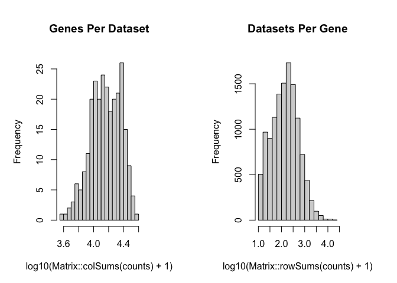

    ## [1] "Calculating variance fit ..."
    ## [1] "Using gam with k=5..."
    ## [1] "171 overdispersed genes ... "


    ## - Using top 100 overdispersed genes. 
    ## - Check that each pixel has at least 1 non-zero gene count entry.. 
    ## Final corpus: 
    ## A 260x100 simple triplet matrix.
    ## Preprocess complete.

``` r
mobCorpus1$pos <- pos[rownames(mobCorpus1$corpus), ] # because positions were not available in the counts matrix itself, append after.
```

``` r
mobCorpus1$slm
```

    ## A 260x100 simple triplet matrix.

``` r
print(mobCorpus1$corpus[1:10,1:10])
```

    ##                    Bpifb9a Bpifb9b Col1a1 Dcn Cyp2a5 Sox11 Omp Ogn Prokr2 Ptn
    ## ACAACTATGGGTTGGCGG       0       0      1   0      0     1   0   0      0   2
    ## ACACAGATCCTGTTCTGA       1       1      0   0      0     0   6   0      0  22
    ## ACATCACCTGCGCGCTCT       0       0      1   2      0     6   0   0      0   0
    ## ACATTTAAGGCGCATGAT       0       0      0   1      0     0   1   0      1   1
    ## ACCACTGTAATCTCCCAT       0       0      0   1      1     0   1   0      0   1
    ## ACCAGAGCCGTTGAGCAA       0       0      0   0      0     1   3   0      0   2
    ## ACCCGGCGTAACTAGATA       0       1      0   1      0     3   0   0      1   2
    ## ACCGGAGTAAATTAGCGG       0       0      0   0      0     2   2   0      0   2
    ## ACCTGACAGCGGAAACTT       0       0      1   1      0     0   8   0      0   7
    ## ACGGAAATCAGTGGTATT       0       1      0   1      0     4   3   0      1   0

``` r
print(mobCorpus1$pos[1:10,])
```

    ##                         x      y
    ## ACAACTATGGGTTGGCGG 16.001 16.036
    ## ACACAGATCCTGTTCTGA 26.073 15.042
    ## ACATCACCTGCGCGCTCT 13.048 21.079
    ## ACATTTAAGGCGCATGAT 13.963 18.117
    ## ACCACTGTAATCTCCCAT 24.104 13.074
    ## ACCAGAGCCGTTGAGCAA  9.040 12.046
    ## ACCCGGCGTAACTAGATA 15.941 12.112
    ## ACCGGAGTAAATTAGCGG  7.949 16.058
    ## ACCTGACAGCGGAAACTT  9.039 13.047
    ## ACGGAAATCAGTGGTATT 20.959 15.073

preprocess can also be used to build a corpus using a specific list of
genes:

``` r
## get list of genes of interest, for an example.
counts <- cleanCounts(counts = cd,
                      min.lib.size = 100,
                      min.reads = 1,
                      min.detected = 1)
```

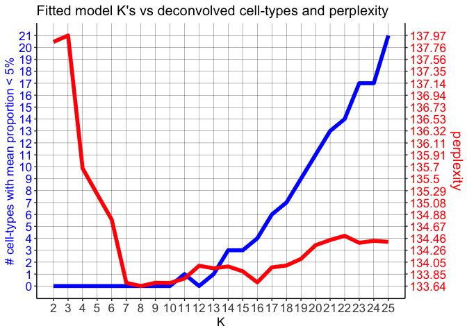

``` r
odGenes <- getOverdispersedGenes(as.matrix(counts),
                      gam.k=5,
                      alpha=0.05,
                      plot=FALSE,
                      use.unadjusted.pvals=FALSE,
                      do.par=TRUE,
                      max.adjusted.variance=1e3,
                      min.adjusted.variance=1e-3,
                      verbose=FALSE, details=TRUE)
genes <- odGenes$ods
length(genes)
```

    ## [1] 345

``` r
head(genes)
```

    ## [1] "1700015F17Rik" "1700101I11Rik" "1810020O05Rik" "1810062O18Rik" "2010300C02Rik" "2210408F21Rik"

``` r
## build corpus using just the selected genes
mobCorpus2 <- preprocess(t(cd),
                       selected.genes = genes,
                       # can then proceed to filter this list, if desired
                       # min.reads = 1, 
                       min.lib.size = 1, # can still filter pixels
                       min.detected = 1, # can still filter to make sure the selected genes are present in at least 1 pixel
                       ODgenes = FALSE, # don't select the over dispersed genes
                       verbose = TRUE)
```

    ## Initial genes: 15928 Initial pixels: 262 
    ## - Using genes in `selected.genes` for corpus. 
    ##   345 genes are present in dataset. 
    ## - Removing poor pixels with <= 1 reads 
    ## - Removing genes with <= 1 reads across pixels and detected in <= 1 pixels

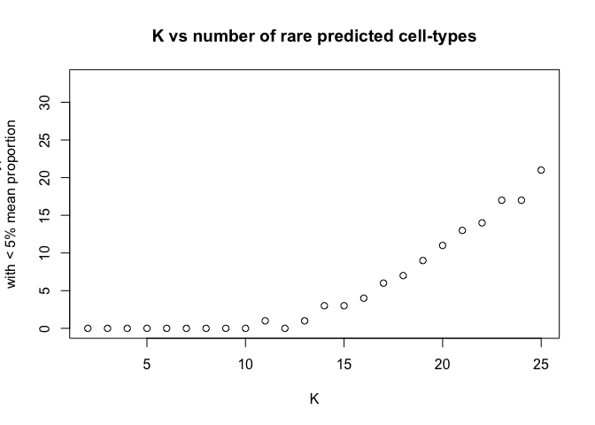

    ##   Remaining genes: 345 and remaining pixels: 260 
    ## - Check that each pixel has at least 1 non-zero gene count entry.. 
    ## Final corpus: 
    ## A 260x345 simple triplet matrix.
    ## Preprocess complete.

Selecting Optimal K
===================

One limitation of LDA is that one must select the number of predicted
cell-types (K) to be returned, a priori. Thus, one must either have
knowledge of the number of cell-types present in the dataset of
interest, or a way to select the model with the “optimal K”, or the
model that best describes the dataset and captures the latent
cell-types.

To do this, STdeconvolve fits a number of different LDA models with
different K’s to the dataset and computes several different metrics to
help guide users in the choice of K.

First, the perplexity of each fitted model is computed with respect to
it’s K. This can be done using the entire real dataset the model was
fitted to, or, users can chose a certain fraction of randomly selected
pixels to be held out and used as a test set to compute model
perplexity. The optimal K can either be the model with the K that
returns the lowest perplexity (“min”), or we compute a “knee” metric
(similar to choosing the number of principle components in PCA), which
is the maximum second derivative, a reasonable choice for the inflection
point (the elbow or knee).

Second, as K increases, the additional cell-types that are predicted
tend to be represented present at small proportions in the pixels and
thus contribute little to the predicted pixel cell-type profiles. To
help put an upper limit on K, we also measure the number of predicted
cell-types with mean pixel proportion less than 5%. After a certain K,
the number of “rare” predicted cell-types, or those with low proportions
across the pixels, steadily increases, suggesting that increasing K is
no longer returning informative topics, or cell-types.

``` r
## fit LDA models to the corpus
ks <- seq(from = 2, to = 18, by = 1) # range of K's to fit LDA models with given the input corpus
ldas <- fitLDA(as.matrix(mobCorpus2$corpus),
               Ks = ks,
               ncores = parallel::detectCores(logical = TRUE) - 1, # number of cores to fit LDA models in parallel
               testSize = 0.2, # fraction of pixels to set aside for test corpus when computing perplexity
               plot=TRUE, verbose=FALSE)
```

    ## Splitting pixels into 20 % and 80 % testing and fitting corpuses

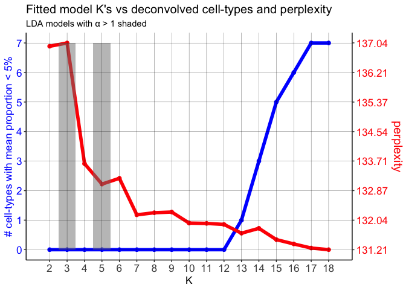

While technically the lowest perplexity computed is when K=8, perplexity
appears to be relatively stable between K=7 and K=15. Additionally, we
expect there to be more than 4 cell-types and thus K should be greater
than 4 (based on “knee” metric).

However, the number of cell-types with mean proportion \<5% doesn’t
start steadily increasing until around K=15, suggesting that the number
of predicted cell-types are likely informative until this chosen K.

Once the LDA models are fitted, beta and theta matrices can be extracted
for a given model. The simplest way to do this is with `optimalModel()`
to get the specific model of interest:

``` r
## `optimalModel()` can take as arguments:
optimalModel(models = ldas, opt = "min") # "min" = K that resulted in minimum perplexity
```

    ## A LDA_VEM topic model with 8 topics.

``` r
optimalModel(models = ldas, opt = "kneed") # "kneed" = K that resulted in inflection perplexity
```

    ## A LDA_VEM topic model with 4 topics.

``` r
optimalModel(models = ldas, opt = 15) # or extract the model for any K that was used
```

    ## A LDA_VEM topic model with 15 topics.

Then, `getBetaTheta()` can be used to get the beta (cell-type gene
expression profiles) and theta (pixel cell-type proportions) matrices.

``` r
results <- getBetaTheta(lda = optimalModel(models = ldas, opt = "15"),
                        corpus = mobCorpus2$corpus)
print(names(results))
```

    ## [1] "beta"  "theta"

Alternatively, `buildLDAobject()` is a wrapper around `getBetaTheta()`,
`clusterTopics()`, and `combineTopics()`. Cell-types with similar gene
expression profiles are clustered, and an alternative set of “cell-type
clusters” is provided, where a cell-type cluster is an aggregated beta
and theta matrix of the cell-types within the given cluster.

``` r
results <- buildLDAobject(LDAmodel = optimalModel(models = ldas, opt = "15"),
                          corpus = mobCorpus2$corpus,
                          deepSplit = 4,
                          colorScheme = "rainbow")
```

    ##  ..cutHeight not given, setting it to 1.74  ===>  99% of the (truncated) height range in dendro.
    ##  ..done.

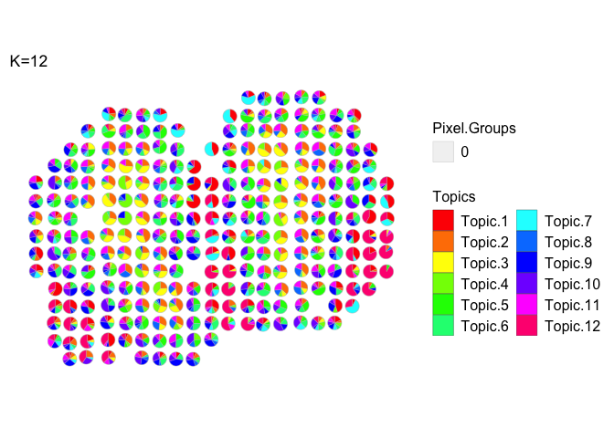

    ## [1] "cell-types combined."
    ## [1] "cell-types combined."

``` r
print(names(results))
```

    ## [1] "beta"       "theta"      "clusters"   "dendro"     "cols"       "betaCombn"  "thetaCombn" "clustCols"  "k"

Here, `results` is a list that contains the beta and theta matrix for
the individual predicted cell-types, combined beta and theta matrices of
the cell-type clusters. “clusters” is a factor indicating the assigned
cluster of each predicted cell-type, “dendro” is a dendrogram of the
clustered cell-types with respect to their predicted gene expression
profiles. “cols” and “clustCols” are factors indicating color labels for
either the cell-types or the clusters that can be used optionally for
visualization purposes.

Clustering Cell-types
=====================

As indicated above, predicted cell-types can be clustered into
“cell-type clusters” based on their predicted gene expression profiles
(beta matrix). A set of predicted cell-types may represent components of
a larger cell-layer in a tissue and thus it may be useful to cluster the
cell-types together to visualize and assess this layer as a single
feature.

As shown previously in this tutorial, the easiest way to do this is with
`buildLDAobject()`, which not only returns beta and theta matrices for
the individual cell-types, but also returns cell-type clusters and their
associated beta and theta matrices.

However, with the beta matrix of the cell-types in hand, one can cluster
the cell-types by making a call to `clusterTopics()` directly, which
allows one to specify the type of clustering that is performed.
Assignment of cell-types to specific clusters in done using dynamic tree
splitting using the R package `dynamicTreeCut`.

``` r
results <- getBetaTheta(lda = optimalModel(models = ldas, opt = "15"),
                        corpus = mobCorpus2$corpus)
clust <- clusterTopics(beta = results$beta,
                       clustering = "ward.D", # type of clustering
                       dynamic = "hybrid", # method to assign cell-types to clusters (see `dynamicTreeCut` options)
                       deepSplit = 4, # dynamic tree cutting sensitivity parameter
                       plot = TRUE)
```

    ##  ..cutHeight not given, setting it to 1.74  ===>  99% of the (truncated) height range in dendro.
    ##  ..done.


``` r
clust
```

    ## $clusters
    ##  1  2  3  4  5  6  7  8  9 10 11 12 13 14 15 
    ##  2  1  5  1  3  4  3  5  2  3  4  2  1  1  1 
    ## Levels: 1 2 3 4 5
    ## 
    ## $order
    ##  [1]  6 11  3  8 15  4 13  2 14  9  1 12  7  5 10
    ## 
    ## $dendro
    ## 'dendrogram' with 2 branches and 15 members total, at height 1.753303

To get the beta and theta matrices of the cell-type clusters,
`combineTopics()` is used to aggregate the beta or theta matrices of the
cell-types within assigned clusters:

``` r
betaCombn <- combineTopics(results$beta, clusters = clust$clusters, type = "b")
```

    ## [1] "cell-types combined."

``` r
thetaCombn <- combineTopics(results$theta, clusters = clust$clusters, type = "t")
```

    ## [1] "cell-types combined."

``` r
clust$clusters
```

    ##  1  2  3  4  5  6  7  8  9 10 11 12 13 14 15 
    ##  2  1  5  1  3  4  3  5  2  3  4  2  1  1  1 
    ## Levels: 1 2 3 4 5

``` r
dim(betaCombn)
```

    ## [1]   5 345

``` r
dim(thetaCombn)
```

    ## [1] 260   5

Visualization
=============

``` r
results <- buildLDAobject(LDAmodel = optimalModel(models = ldas, opt = "15"),
                          corpus = mobCorpus2$corpus,
                          deepSplit = 4,
                          colorScheme = "rainbow",
                          plot = FALSE)
```

    ##  ..cutHeight not given, setting it to 1.74  ===>  99% of the (truncated) height range in dendro.
    ##  ..done.
    ## [1] "cell-types combined."
    ## [1] "cell-types combined."

``` r
print(names(results))
```

    ## [1] "beta"       "theta"      "clusters"   "dendro"     "cols"       "betaCombn"  "thetaCombn" "clustCols"  "k"

All Cell-types or Cell-type clusters
------------------------------------

``` r
m <- results$theta
p <- pos
plt <- vizAllTopics(theta = m,
             pos = p,
             topicOrder=seq(ncol(m)),
             topicCols=rainbow(ncol(m)),
             groups = NA,
             group_cols = NA,
             r = 0.4, # size of scatterpies; adjust depending on the coordinates of the pixels
             lwd = 0.1,
             showLegend = TRUE,
             plotTitle = "K=15")
plt <- plt + ggplot2::guides(fill=ggplot2::guide_legend(ncol=2))
plt
```

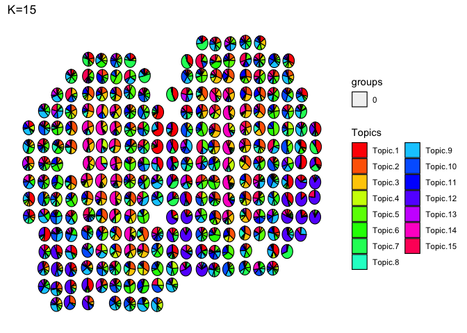

Scatterpie borders can be colored, either custom, or based on group
membership

``` r
m <- results$theta
p <- pos
plt <- vizAllTopics(theta = m,
             pos = p,
             topicOrder=seq(ncol(m)),
             topicCols=rainbow(ncol(m)),
             groups = rep("0", dim(m)[1]),
             group_cols = c("0" = "black"),
             r = 0.4,
             lwd = 0.4, # adjust thickness of the scatterpie borders
             showLegend = TRUE,
             plotTitle = "K=15")
plt <- plt + ggplot2::guides(fill=ggplot2::guide_legend(ncol=2))
plt
```


Based on group membership (let’s use the coarse cell layers of the MOB)

``` r
m <- results$theta
p <- pos
plt <- vizAllTopics(theta = m,
             pos = p,
             topicOrder=seq(ncol(m)),
             topicCols=rainbow(ncol(m)),
             groups = annot, 
             group_cols = rainbow(length(levels(annot))),
             r = 0.4,
             lwd = 0.4, # adjust thickness of the scatterpie borders
             showLegend = TRUE,
             plotTitle = "K=15")
plt <- plt + ggplot2::guides(fill=ggplot2::guide_legend(ncol=2))
plt
```


Now let’s visualize the cell-type clusters:

``` r
m <- results$thetaCombn
p <- pos
plt <- vizAllTopics(theta = m,
             pos = p,
             topicOrder=seq(ncol(m)),
             topicCols=rainbow(ncol(m)),
             groups = rep("0", dim(m)[1]),
             group_cols = c("0" = "black"),
             r = 0.4,
             lwd = 0.2,
             showLegend = TRUE,
             plotTitle = "K=15 cell-type clusters")
# plt <- plt + ggplot2::guides(fill=guide_legend(ncol=2))
plt
```


Individual Cell-types and Cell-type clusters
--------------------------------------------

``` r
m <- results$theta
p <- pos[rownames(results$theta),]
vizTopicClusters(theta = m,
                 pos = p,
                 clusters = results$cols,
                 sharedCol = TRUE, # cell-types in a cluster share the same color
                 groups = rep("0", dim(m)[1]),
                 group_cols = c("0" = "black"),
                 r = 0.4,
                 lwd = 0.3,
                 showLegend = TRUE)
```

    ## [1] "Topic cluster members:"
    ## #FF0000 : 2 4 13 14 15


    ## #CCFF00 : 1 9 12

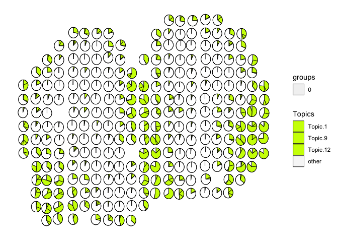

    ## #00FF66 : 5 7 10

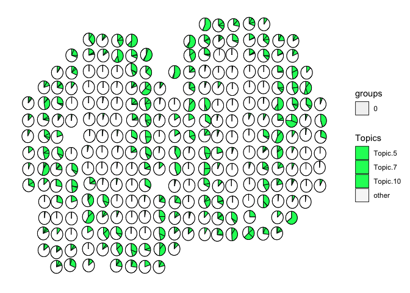

    ## #0066FF : 6 11

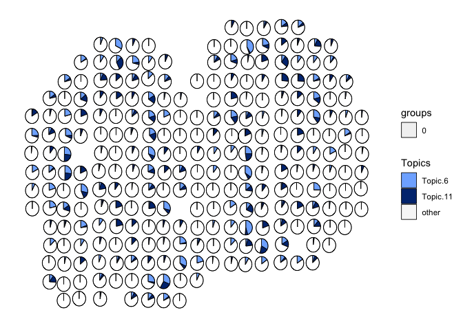

    ## #CC00FF : 3 8

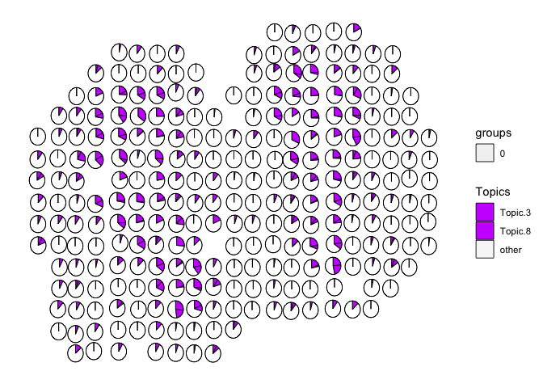

``` r
m <- results$theta
p <- pos[rownames(results$theta),]
vizTopicClusters(theta = m,
                 pos = p,
                 clusters = results$cols,
                 sharedCol = FALSE, # cell-types in a cluster on a color gradient
                 groups = rep("0", dim(m)[1]),
                 group_cols = c("0" = "black"),
                 r = 0.4,
                 lwd = 0.3,
                 showLegend = TRUE)
```

    ## [1] "Topic cluster members:"
    ## #FF0000 : 2 4 13 14 15


    ## #CCFF00 : 1 9 12

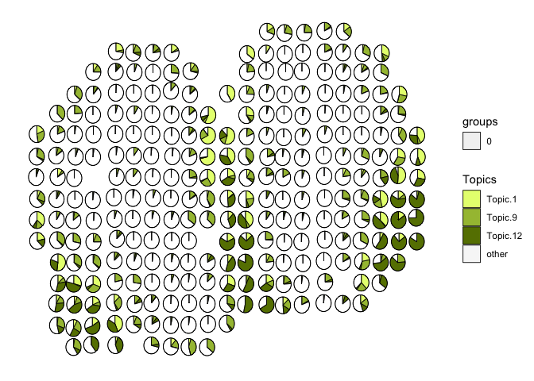

    ## #00FF66 : 5 7 10

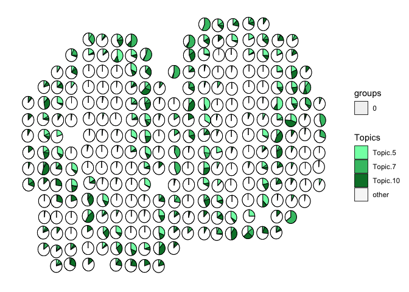

    ## #0066FF : 6 11


    ## #CC00FF : 3 8

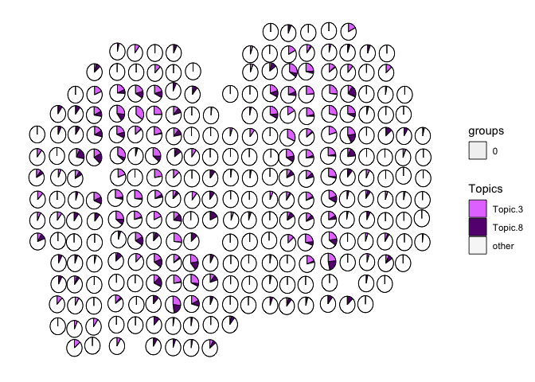

Or just plot each cell-type, or a group of selected cell-types
individually

``` r
m <- results$theta[,c("14", "12")]
p <- pos
other <- 1 - rowSums(m)
m <- cbind(m, other)
colnames(m) <- c("14", "12", "Other")
vizAllTopics(theta = m,
             pos = p,
             topicOrder=seq(ncol(m)),
             topicCols=c(transparentCol("red", percent = 50), # bonus: can make colors transparent if overlaying on top pf an image
                         "black",
                         "white"), 
             groups = rep("0", dim(m)[1]),
             group_cols = c("0" = "white"), # make scatterpie borders white to focus directly on the cell-type.
             r = 0.4,
             lwd = 0.1,
             showLegend = TRUE,
             overlay = NA) # BONUS: plot the scatterpies on top of a raster image of the H&E tissue, if set equal to the rgb matrix
```


