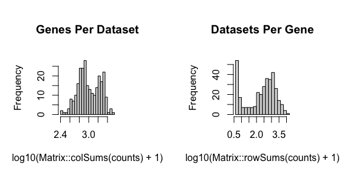
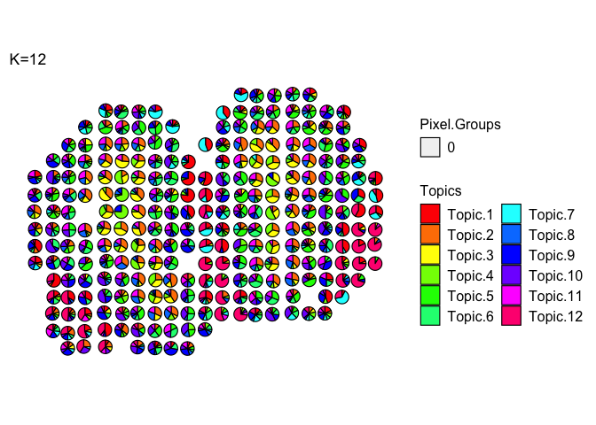
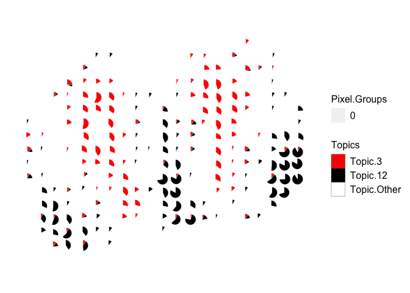
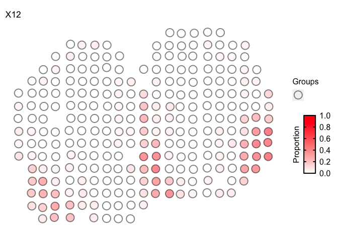

In this tutorial, we will describe additional functionality and features
of `STdeconvolve`.

These are organized as additional options for **pre-processing and
feature selection of genes**, and useful ways to **visualize the
predicted cell-type pixel proportions**.

# Pre-processing

For LDA model fitting, `STdeconvolve` requires a “corpus of documents”,
which is represented as a pixel (rows) x feature/gene (columns) matrix
of non-negative integer gene counts. To effectively deconvolve latent
cell-types, the features in the corpus should be limited to genes that
are variable across cell-types. Without prior knowledge of cell-types
and their marker genes, one could look for **overdispersed genes**
across the pixels, assuming that the underlying cell-types are present
at variable proportions.

It is useful to reduce the number of features in the corpus to those
which are the most informative, to improve deconvolution and increase
speed of model fitting. **Removing genes that are present in most or all
pixels** will help restrict to genes that are cell-type specific,
assuming that cell-types are variable across pixels. Conversely, **genes
that are present in only a few pixels may not actually represent robust
cell-type specific signatures**.

As previously mentioned, a set of marker genes may be known *a priori*
and a user may want to include these in the final corpus.

We include 2 different functions with `STdeconvolve`:

1.  `restrictCorpus()`

The first is `restrictCorpus()`, which is highlighted in the
`getting_started` tutorial. This function first feature selects for
overdispersed genes in the corpus and then allows a user to restrict the
overdispersed genes to those present in less than or more than specified
fractions of pixels in the dataset. This function does not filter for
poor pixels or genes itself.

1.  `preprocess()`

The second is `preprocess()`, which is a wrapper function and allows for
more feature selection options.

``` r
library(STdeconvolve)
```

``` r
data(mOB)
pos <- mOB$pos
cd <- mOB$counts
annot <- mOB$annot
```

In general, `preprocess()` includes options for:

-   a step to remove poor pixels and genes,

-   select specific genes to include or remove,

-   select for overdispersed genes,

-   and options to remove top expressed genes, or genes present in less
    than or more than specified fractions of pixels in the dataset.

Further, it returns a list object that contains the filtered corpus, and
the positions of the pixels retained in the filtered corpus if the
information is present in the pixel names originally (for example, if
the name of a pixel is in the format “XxY”). Otherwise these pixel
positions can be appended after.

Lastly, `preprocess()` can take as input a pixel (row) x gene (columns)
matrix or a path to the file.

The order of filtering options in which they occur in `preprocess()`:

1.  Option to use specific genes only

2.  `cleanCounts` to remove poor pixels and genes

3.  Remove top expressed genes in matrix

4.  Remove specific genes based on pattern matching

5.  Remove genes that appear in more/less than a percentage of pixels

6.  Option to use the overdispersed genes computed from the remaining
    genes after filtering steps 1-5

7.  Choice to use the top overdispersed genes based on -log10(adjusted
    p-value)

``` r
mobCorpus1 <- preprocess(t(cd),
                       alignFile = NA, # if there is a file to adjust pixel coordinates this can be included.
                       extractPos = FALSE, # optional argument
                       selected.genes = NA, # 
                       nTopGenes = 3, # remove the top 3 expressed genes (genes with most counts) in dataset
                       genes.to.remove = c("^Trmt"), # ex: remove tRNA methyltransferase genes (gene names that begin with "Trmt")
                       removeAbove = 0.95, # remove genes present in 95% or more of pixels
                       removeBelow = 0.05, # remove genes present in 5% or less of pixels
                       min.reads = 10, # minimum number of reads a gene must have across pixels
                       min.lib.size = 100, # minimum number of reads a pixel must have to keep (before gene filtering)
                       min.detected = 1, # minimum number of pixels a gene needs to have been detected in
                       ODgenes = TRUE, # feature select for over dispersed genes
                       nTopOD = 100, # number of top over dispersed genes to use, otherwise use all that pass filters if `NA`
                       od.genes.alpha = 0.05, # alpha param for over dispersed genes
                       gam.k = 5, # gam param for over dispersed genes
                       verbose = TRUE)
```

    ## Initial genes: 15928 Initial pixels: 262

    ## - Removing poor pixels with <= 100 reads

    ## - Removing genes with <= 10 reads across pixels and detected in <= 1 pixels

    ##   Remaining genes: 12292 and remaining pixels: 260

    ## - Removing the top 3 expressed genes.

    ## - After filtering for `genes.to.remove`:
    ##  Remaining genes: 12274

    ## - Removed genes present in 95% or more of pixels
    ##  Remaining genes: 11589

    ## - Removed genes present in 5% or less of pixels
    ##  Remaining genes: 11116

    ## - Capturing only the overdispersed genes...

    ## Converting to sparse matrix ...

    ## Calculating variance fit ...

    ## Using gam with k=5...

    ## 171 overdispersed genes ...


    ## - Using top 100 overdispersed genes.

    ## - Check that each pixel has at least 1 non-zero gene count entry..

    ## Final corpus:

    ## A 260x100 simple triplet matrix.

    ## Preprocess complete.


``` r
mobCorpus1$pos <- pos[rownames(mobCorpus1$corpus), ] # because positions were not available in the counts matrix itself, append after.
```

``` r
mobCorpus1$slm
```

    ## A 260x100 simple triplet matrix.

``` r
print(mobCorpus1$corpus[1:10,1:10])
```

    ##                    Bpifb9a Bpifb9b Col1a1 Dcn Cyp2a5 Sox11 Omp Ogn Prokr2 Ptn
    ## ACAACTATGGGTTGGCGG       0       0      1   0      0     1   0   0      0   2
    ## ACACAGATCCTGTTCTGA       1       1      0   0      0     0   6   0      0  22
    ## ACATCACCTGCGCGCTCT       0       0      1   2      0     6   0   0      0   0
    ## ACATTTAAGGCGCATGAT       0       0      0   1      0     0   1   0      1   1
    ## ACCACTGTAATCTCCCAT       0       0      0   1      1     0   1   0      0   1
    ## ACCAGAGCCGTTGAGCAA       0       0      0   0      0     1   3   0      0   2
    ## ACCCGGCGTAACTAGATA       0       1      0   1      0     3   0   0      1   2
    ## ACCGGAGTAAATTAGCGG       0       0      0   0      0     2   2   0      0   2
    ## ACCTGACAGCGGAAACTT       0       0      1   1      0     0   8   0      0   7
    ## ACGGAAATCAGTGGTATT       0       1      0   1      0     4   3   0      1   0

``` r
print(mobCorpus1$pos[1:10,])
```

    ##                         x      y
    ## ACAACTATGGGTTGGCGG 16.001 16.036
    ## ACACAGATCCTGTTCTGA 26.073 15.042
    ## ACATCACCTGCGCGCTCT 13.048 21.079
    ## ACATTTAAGGCGCATGAT 13.963 18.117
    ## ACCACTGTAATCTCCCAT 24.104 13.074
    ## ACCAGAGCCGTTGAGCAA  9.040 12.046
    ## ACCCGGCGTAACTAGATA 15.941 12.112
    ## ACCGGAGTAAATTAGCGG  7.949 16.058
    ## ACCTGACAGCGGAAACTT  9.039 13.047
    ## ACGGAAATCAGTGGTATT 20.959 15.073

preprocess can also be used to build a corpus using a specific list of
genes:

``` r
## get list of genes of interest, for an example.
counts <- cleanCounts(counts = cd,
                      min.lib.size = 100,
                      min.reads = 1,
                      min.detected = 1)
```



``` r
odGenes <- getOverdispersedGenes(as.matrix(counts),
                      gam.k=5,
                      alpha=0.05,
                      plot=FALSE,
                      use.unadjusted.pvals=FALSE,
                      do.par=TRUE,
                      max.adjusted.variance=1e3,
                      min.adjusted.variance=1e-3,
                      verbose=FALSE, details=TRUE)
genes <- odGenes$ods
length(genes)
```

    ## [1] 345

``` r
head(genes)
```

    ## [1] "1700015F17Rik" "1700101I11Rik" "1810020O05Rik" "1810062O18Rik"
    ## [5] "2010300C02Rik" "2210408F21Rik"

``` r
## build corpus using just the selected genes
mobCorpus2 <- preprocess(t(cd),
                       selected.genes = genes,
                       # can then proceed to filter this list, if desired
                       # min.reads = 1, 
                       min.lib.size = 1, # can still filter pixels
                       min.detected = 1, # can still filter to make sure the selected genes are present in at least 1 pixel
                       ODgenes = FALSE, # don't select the over dispersed genes
                       verbose = TRUE)
```

    ## Initial genes: 15928 Initial pixels: 262

    ## - Using genes in `selected.genes` for corpus.

    ##  345 genes are present in dataset.

    ## - Removing poor pixels with <= 1 reads

    ## - Removing genes with <= 1 reads across pixels and detected in <= 1 pixels

    ##   Remaining genes: 345 and remaining pixels: 260

    ## - Check that each pixel has at least 1 non-zero gene count entry..

    ## Final corpus:

    ## A 260x345 simple triplet matrix.

    ## Preprocess complete.


# Selecting Optimal K

One limitation of LDA is that one must select the number of predicted
cell-types (K) to be returned, *a priori*. Thus, one must either have
knowledge of the number of cell-types present in the dataset of
interest, or a way to select the model with the “optimal K”, i.e., the
model that best describes the dataset and captures the latent
cell-types.

To do this, `STdeconvolve` fits a number of different LDA models with
different K’s to the dataset and computes several different metrics to
help guide users in the choice of K.

First, the **perplexity** of each fitted model is computed with respect
to it’s K. The optimal K can either be the model with the K that returns
the lowest perplexity (“min”), or we compute a “knee” metric (similar to
choosing the number of principle components in PCA), which is the
maximum second derivative, a reasonable choice for the inflection point
(the elbow or knee).

Second, as K increases, the additional cell-types that are predicted
tend to be represented at small proportions in the pixels and thus
contribute little to the predicted pixel cell-type profiles. To help put
an upper limit on K, we measure the number of predicted cell-types with
mean pixel proportion less than 5% (by default). After a certain K, the
number of “rare” predicted cell-types, or those with low proportions
across the pixels, steadily increases, suggesting that increasing K is
no longer returning informative topics, or cell-types.

``` r
## fit LDA models to the corpus
ks <- seq(from = 2, to = 18, by = 1) # range of K's to fit LDA models with given the input corpus
ldas <- fitLDA(as.matrix(mobCorpus2$corpus),
               Ks = ks,
               ncores = parallel::detectCores(logical = TRUE) - 1, # number of cores to fit LDA models in parallel
               plot=TRUE, verbose=FALSE)
```

    ## Warning in serialize(data, node$con): 'package:stats' may not be available when
    ## loading

    ## Warning in serialize(data, node$con): 'package:stats' may not be available when
    ## loading

    ## Warning in serialize(data, node$con): 'package:stats' may not be available when
    ## loading

    ## Warning in serialize(data, node$con): 'package:stats' may not be available when
    ## loading

    ## Warning in serialize(data, node$con): 'package:stats' may not be available when
    ## loading

    ## Warning in serialize(data, node$con): 'package:stats' may not be available when
    ## loading

    ## Warning in serialize(data, node$con): 'package:stats' may not be available when
    ## loading

    ## Loading required package: topicmodels

    ## Warning in serialize(data, node$con): 'package:stats' may not be available when
    ## loading

    ## Warning in serialize(data, node$con): 'package:stats' may not be available when
    ## loading

    ## Warning in serialize(data, node$con): 'package:stats' may not be available when
    ## loading

    ## Warning in serialize(data, node$con): 'package:stats' may not be available when
    ## loading

    ## Warning in serialize(data, node$con): 'package:stats' may not be available when
    ## loading

    ## Warning in serialize(data, node$con): 'package:stats' may not be available when
    ## loading

    ## Warning in serialize(data, node$con): 'package:stats' may not be available when
    ## loading


While technically the lowest perplexity computed is when K=8, perplexity
appears to be relatively stable between K=7 and K=18. Additionally, we
expect there to be more than 4 cell-types and thus K should be greater
than 4 (based on “knee” metric).

However, the number of cell-types with mean proportion \<5% doesn’t
start steadily increasing until around K=15, suggesting that the number
of predicted cell-types are likely informative until this chosen K.

Once the LDA models are fitted, **beta** and **theta** matrices can be
extracted for a given model. The simplest way to do this is with
`optimalModel()` to get the specific model of interest:

``` r
## `optimalModel()` can take as arguments:
optimalModel(models = ldas, opt = "min") # "min" = K that resulted in minimum perplexity
```

    ## A LDA_VEM topic model with 18 topics.

``` r
optimalModel(models = ldas, opt = "kneed") # "kneed" = K that resulted in inflection perplexity
```

    ## A LDA_VEM topic model with 4 topics.

``` r
optimalModel(models = ldas, opt = 15) # or extract the model for any K that was used
```

    ## A LDA_VEM topic model with 15 topics.

Then, `getBetaTheta()` can be used to get the **beta** (cell-type gene
expression profiles) and **theta** (pixel cell-type proportions)
matrices.

``` r
optLDA <- optimalModel(models = ldas, opt = 15)
results <- getBetaTheta(lda = optLDA,
                        perc.filt = 0.05, # remove cell-types from pixels that are predicted to be present at less than 5%. Then readjusut pixel proportions to 100%
                        betaScale = 1000) # scale the cell-type transcriptional profiles
```

    ## Filtering out cell-types in pixels that contribute less than 0.05 of the pixel proportion.

``` r
print(names(results))
```

    ## [1] "beta"  "theta"

``` r
deconProp <- results$theta
deconGexp <- results$beta

head(deconProp)
```

    ##                            1          2          3          4         5
    ## ACAACTATGGGTTGGCGG 0.0000000 0.00000000 0.09877049 0.00000000 0.3669842
    ## ACACAGATCCTGTTCTGA 0.3795298 0.00000000 0.00000000 0.00000000 0.0000000
    ## ACATCACCTGCGCGCTCT 0.0000000 0.23480323 0.23094005 0.18747491 0.0000000
    ## ACATTTAAGGCGCATGAT 0.0000000 0.40600112 0.45147559 0.00000000 0.0000000
    ## ACCACTGTAATCTCCCAT 0.0000000 0.09781962 0.00000000 0.07592254 0.4726266
    ## ACCAGAGCCGTTGAGCAA 0.1455119 0.09222134 0.00000000 0.08147018 0.0000000
    ##                            6          7          8          9        10
    ## ACAACTATGGGTTGGCGG 0.0000000 0.00000000 0.00000000 0.12934265 0.1179165
    ## ACACAGATCCTGTTCTGA 0.0000000 0.06380371 0.00000000 0.00000000 0.0000000
    ## ACATCACCTGCGCGCTCT 0.0000000 0.00000000 0.10238042 0.00000000 0.0000000
    ## ACATTTAAGGCGCATGAT 0.0000000 0.00000000 0.00000000 0.00000000 0.0000000
    ## ACCACTGTAATCTCCCAT 0.0000000 0.00000000 0.00000000 0.06012275 0.1282183
    ## ACCAGAGCCGTTGAGCAA 0.1168926 0.00000000 0.05348205 0.09486906 0.0000000
    ##                           11        12         13         14         15
    ## ACAACTATGGGTTGGCGG 0.1850434 0.0000000 0.00000000 0.00000000 0.10194263
    ## ACACAGATCCTGTTCTGA 0.0000000 0.4683944 0.00000000 0.00000000 0.08827213
    ## ACATCACCTGCGCGCTCT 0.1535078 0.0000000 0.00000000 0.00000000 0.09089356
    ## ACATTTAAGGCGCATGAT 0.0000000 0.0000000 0.00000000 0.14252329 0.00000000
    ## ACCACTGTAATCTCCCAT 0.0000000 0.0000000 0.06288875 0.00000000 0.10240142
    ## ACCAGAGCCGTTGAGCAA 0.0000000 0.3240389 0.00000000 0.09151396 0.00000000

``` r
head(deconGexp)
```

    ##   1700015F17Rik 1700101I11Rik 1810020O05Rik 1810062O18Rik 2010300C02Rik
    ## 1  1.973035e-04  9.732345e-23  4.786066e-30  1.046848e-01      1.204107
    ## 2  1.669860e-55  1.228452e-05  2.740037e-04  7.339284e-06      8.436378
    ##   2210408F21Rik 2310022B05Rik 3110070M22Rik 3830408C21Rik 4833424O15Rik
    ## 1  9.233001e-18     9.7767762  4.866953e-04  1.422445e-06     3.1984343
    ## 2  1.641277e-23     0.2272523  5.629960e-03  9.160841e-06     3.5082280
    ##   4932415G12Rik 5031410I06Rik 5830454E08Rik        Aaed1      Abl2     Ablim3
    ## 1  4.310118e-02  8.937396e-90  2.775035e-38 1.357590e-26 0.6903514 0.13491754
    ## 2  1.062701e-36  4.039100e-08  2.007244e-07 2.986706e-02 0.3157885 4.76952138
    ##          Acta2        Adam4    Afap1l2     Agap2         Agr3        Agt
    ## 1 0.2014407038 1.624720e-03 2.64098486  4.162209 8.345507e-02 2.42564877
    ## 2 0.0088595523 2.486235e-10 0.02064038 11.628017 9.017374e-92 0.22615791
    ##        Ahnak   AI593442 AI848285     Ampd2       Ankfn1   Ankrd29    Ankrd63
    ## 1 1.83193070 0.60865966 1.463429 2.9587196 1.022336e-95 1.0586226 0.04057512
    ## 2 0.30611558 0.05087273 7.319686 3.9897890 5.438276e-07 3.6355607 0.51197250
    ##        Ano3       Apod       Aqp1       Arc   Arhgap33        Arl11
    ## 1 0.5856769 141.229129 4.90160788 2.1230069 0.05238435 2.741515e-15
    ## 2 0.7630580   5.938878 0.14339916 7.1689314 1.11374528 7.501193e-22
    ##         Arl4d        Armc3    Arpp21      Atat1       Atf5     Atp1a1
    ## 1 0.005709859 9.456857e-05  2.256797 1.24362379 2.01895095  3.6317463
    ## 2 0.278009258 6.094709e-09 10.853057 0.01621392 0.09496337 15.3764975
    ##      Atp1b1    Atp2b1 B230209K01Rik         Bag2     Bai2     Baiap2
    ## 1  6.524362  6.951959  1.798389e-12 1.643894e-08 0.750768  0.9107292
    ## 2 34.625318 13.473816  6.914593e-03 3.602961e-07 2.103337  3.5763460
    ##         Barhl2    Beta-s        Bglap         Bmp4      Bpifb9a      Bpifb9b
    ## 1 5.073591e-03 12.464097 2.592690e-15 1.175364e-01 1.359414e-01 3.063209e-06
    ## 2 5.125804e-04  2.869896 1.056265e-08 1.284784e-01 9.345116e-05 1.615695e-02
    ##     C1qtnf4    Cacnb3    Cacnb4    Calm2    Camk1d     Camk2a    Camk2b
    ## 1  1.751650  3.416683  1.701747 21.56464 0.3349554  0.8453266  4.296116
    ## 2 10.238609  1.739731  1.958359 40.41487 1.5132432  1.0379035  9.422294
    ##     Camk2n1     Camk4   Ccdc109b       Cck     Ccnd1        Ccnd2         Ccr2
    ## 1  5.066446 0.9125744 0.23460455  7.411335 1.1672024 1.6858606790 1.662523e-12
    ## 2 23.586604 1.8238813 0.28982085  1.450626 0.1213867 0.2190485902 9.105607e-09
    ##        Cd24a         Cd74        Cd79b        Cdh19         Cdh6      Cdhr1
    ## 1 0.85718860 8.549949e-02 1.301361e-12 6.706381e-01 2.860439e-18  4.2259048
    ## 2 0.38415992 5.765326e-05 9.867465e-27 1.944893e-23 4.239723e-17  1.5997273
    ##        Cdo1       Cdr1    Celf1       Chrna4       Clca1     Cldn11
    ## 1 1.3225456  1.2545526 1.853614 1.795848e-23 1.316118184  1.3349142
    ## 2 0.9152166  1.7768255 4.799601 4.328728e-12 0.381815493  0.9874464
    ##         Cldn20      Cldn5        Clic3    Clstn2        Cnp      Col12a1
    ## 1 9.917537e-30 0.09756693 1.283125e-72 0.8764314  2.0448263 1.930765e-01
    ## 2 4.147472e-10 0.33788346 7.547808e-09 1.8382074  0.1500153 4.576859e-03
    ##       Col1a1       Col1a2     Cplx1    Cplx2     Cpne4      Cpne6         Crb3
    ## 1 0.51985538 0.7132108075  3.591093 1.470018  2.828947  1.1816501 6.315510e-83
    ## 2 0.28168865 0.2347172426 15.592828 1.028973 13.759316 12.6821732 6.191076e-05
    ##          Ctgf     Ctxn1     Ctxn3   Cx3cl1       Cyp2a5        Cyr61     Dclk1
    ## 1 0.144864734  2.193903 0.6166057 4.576989 1.755410e-02 1.552892e-01  8.267641
    ## 2 0.163965217  4.006807 0.8659926 6.060630 4.312615e-02 3.389590e-03 14.434535
    ##          Dcn       Dcx       Dio3os    Dlgap4     Dlx1as       Dlx5    Dnajb5
    ## 1 0.69670654 2.6955420 1.579297e-05 1.6865395 0.23081912 1.09297368 1.5744796
    ## 2 0.20612385 3.9488596 5.068556e-15 1.7749874 0.50586691 0.08186228 0.6139864
    ##         Doc2g         Dok7      Dpf1        Dtx4  Dync1i1    Dynll1
    ## 1  8.57336834 2.151308e-88 0.6460884 2.907907546 2.385408  6.200736
    ## 2  0.96128298 1.685449e-06 2.5501823 0.219035152 8.889735 16.320271
    ##   E130003G02Rik     Efemp1       Egr1     Elavl2       Eno2      Eomes
    ## 1  2.334173e-28 1.35127580  0.1717098 0.98874035  2.4509466 1.09081731
    ## 2  5.142470e-03 0.04909957 13.8082425 0.08199117 19.2792260 0.02965890
    ##        Epha5         Evpl         Exd1     Fabp7   Fam131b   Fam163b
    ## 1 0.02808598 1.367289e-19 9.152792e-24 62.208921 1.1118741 0.6761675
    ## 2 0.27781559 2.549313e-03 1.792278e-05  2.418017 5.1790685 7.6556729
    ##        Fam19a3     Fam212b     Fancd2os         Fbp1      Fbxo32         Fgl2
    ## 1 4.284822e-19 1.204033856 4.401019e-96 1.681259e-01 0.232629708 5.290672e-01
    ## 2 7.126216e-27 0.226313285 2.194208e-06 2.820879e-15 0.010998558 7.194963e-05
    ##      Fkbp1a       Fmod      Fosb        Foxd3     Frmd7       Frzb
    ## 1  6.649130 0.10609506 0.8695735 3.7919662862 0.5467612 16.3642109
    ## 2  7.328553 0.22462984 1.9413739 0.0337972130 0.8353576  2.0526820
    ##           Gab3    Gabra5     Gabrb2      Gad1       Gap43     Gcnt1        Gda
    ## 1 4.290749e-02 0.9280481  2.5972446  4.255123 0.032409065 1.0524590  0.5629991
    ## 2 2.792123e-25 0.7718697  0.6697622 32.538466 0.007608959 1.7871527  3.9407422
    ##          Gfod1         Ghdc      Gm10664      Gm13629    Gm13889       Gm2516
    ## 1 0.2828380963 5.335148e-02 1.434950e-13 9.480103e-12  4.8855955 4.383398e-16
    ## 2 0.8789429858 2.118829e-87 8.296785e-36 4.620014e-15  2.5297236 1.318843e-06
    ##         Gm5176        Gm525        Gna12      Gng4        Gnrh1        Gpr18
    ## 1 6.175661e-36 6.453223e-13 1.007821e-01 2.4054518 0.0037014191 1.562837e-14
    ## 2 6.322288e-08 7.065629e-03 6.898797e-33 9.9231370 0.0287918196 7.333773e-17
    ##      Gprin1      Gpsm1     Grasp      Grb2        Grem1     Gria3     Grin1
    ## 1 0.6970254  2.0362026 0.4505015  3.002685 1.081146e-07 0.4758886  1.401500
    ## 2 2.2859279  3.0553651 1.7578912 11.416304 1.289175e-33 2.4984602 10.027313
    ##         Grin2d        Gsta1     Hba-a2     Hbb-b2        Hcls1         Heyl
    ## 1 6.046584e-21 3.972401e-02 0.32250689 1.16210269 9.992693e-03 1.7528646927
    ## 2 2.841017e-09 6.489601e-08 0.21377531 0.19403302 2.060748e-13 0.0001055574
    ##          Hkdc1     Hmgcs2       Hn1    Hpcal4    Icam5        Igf2     Igfbp4
    ## 1 2.539684e-22 3.63602650 1.0540884 0.2656711 1.336092 0.806675941 2.36051174
    ## 2 4.818294e-23 0.07123307 0.4839555 3.0619955 8.603133 0.163630263 0.01695944
    ##      Igfbp5      Igfbp6    Igfbpl1     Igsf3      Il12rb2    Inpp5j
    ## 1 3.6489139 0.341851715 0.02074676 0.2481642 8.602997e-12 0.7931821
    ## 2 0.7864235 0.169831132 0.11773347 0.3602166 1.550078e-04 4.5649565
    ##          Islr2       Itpr3     Kalrn      Kcna2     Kcnd2       Kcnh3    Kcnj4
    ## 1 0.1121684958 1.832651378 0.5509720  1.3721762 1.9519796 0.001455096 1.368749
    ## 2 0.0048845204 0.065387425 0.4298442  0.9438996 7.7358673 2.507283456 6.580572
    ##          Kcnt2     Kctd12      Kctd4        Khdc3      Khdrbs2       Kitl
    ## 1 1.782204e-02 97.8916844 0.01759659 1.504086e-23 1.169047e-19 0.36977290
    ## 2 3.415396e-97  3.3733930 0.81995193 5.588564e-06 1.419418e-09 0.69073413
    ##         Klf16     Limd2      Lrrn4cl        Ly6c2        Lyve1         Mag
    ## 1 0.003031078 2.1431086 2.392495e-11 5.762757e-01 3.297266e-10  0.57445904
    ## 2 0.568519414 4.8813866 6.355951e-02 8.445706e-02 5.501745e-21  0.35350452
    ##          Mal    Map2k1     Mapk1        Mbp     Mef2c     Meis2        Mertk
    ## 1 0.17315136  8.842698  6.526550  7.7494280  1.641981  3.390311 1.172356e-12
    ## 2 0.64886240  9.223622 25.544835 34.6603141 12.188597  0.678519 2.331502e-98
    ##         Mgp         Mib1         Mmp13         Mobp         Mpp4       Mustn1
    ## 1 0.4214764 0.0003531571  1.758829e-21 1.813921e-09 7.309720e-15 5.586623e-06
    ## 2 0.3930664 0.0820514659 1.354937e-100 2.332370e-04 5.911700e-10 1.044498e-10
    ##          Myh11        Myl9    Nat8l      Ncdn      Necab2       Nefh      Nefl
    ## 1 3.257568e-01 0.410000949 1.696002  1.774766 0.001212144 0.87744959 0.3215364
    ## 2 1.291472e-09 0.003805485 5.031628  7.707077 0.715792441 0.06913574 0.1423868
    ##        Nefm      Neurog2        Nhlh2     Npm3-ps1       Nppa        Npr1
    ## 1 0.1263868 2.187125e-05 2.584465e-21 6.564818e-02 0.49539949 0.960577391
    ## 2 0.3785003 1.317336e-23 1.415477e-06 1.374889e-02 0.01922777 0.005421143
    ##       Nptx1        Npy       Nr2f2     Nr4a1     Nrep      Nrgn       Nrn1
    ## 1 0.3685066 29.6580311 13.49507839 1.0795218 2.149760  1.364749 0.00712299
    ## 2 0.2073789  0.5082245  0.03786859 4.2518157 2.207274  3.563227 0.17122513
    ##       Nrxn3      Nsg2       Nsun5      Ntng1        Nxnl2          Ogn
    ## 1  2.097976  7.961275 0.245008300 0.51682181 2.355816e-01 1.304671e+00
    ## 2  1.220485  6.538820 0.030299433 0.05948575 6.147978e-31 1.283405e-02
    ##           Oit3     Olfr1357       Omp    Pcdh20      Pcdhb11      Pcp4
    ## 1 6.269509e-09 1.173247e-01 1.0440738 1.3451859 8.263207e-02  8.681358
    ## 2 8.335792e-02 1.097248e-08 0.3354904 0.1998223 1.207172e-14 44.081484
    ##      Pcp4l1       Penk   Phyhipl         Pifo    Plcb1       Plce1     Plcxd2
    ## 1 10.001078  2.6831003 1.3162391 1.867427e-01 1.789929 3.229327809  3.6192577
    ## 2  7.518884  7.2567680 2.8149699 3.431563e-72 3.531409 0.006599835  0.3914598
    ##      Plekha2       Plp1    Ppfia2      Ppia     Ppm1e    Prkca    Prkcb
    ## 1 0.42284314 28.9354596 0.6647598  8.310354  3.835976 3.941509 1.321308
    ## 2 2.08296376  0.2914342 6.0351253 26.594901 10.895976 9.348061 3.649296
    ##         Prokr2       Psd     Ptgds      Ptges3l        Ptgfr     Ptk2b
    ## 1 5.042435e-10 2.5065911 42.891173 9.150105e-02 2.261577e-04 0.7186701
    ## 2 1.975750e-01 8.3652697 16.097551 5.904675e-07 2.639280e-07 1.5095054
    ##            Ptn    Ptpro    R3hdm4        Rab25     Rab3b    Rab40b   Rasl11b
    ## 1 20.015430828 2.861369 1.1623263 1.934812e-19 2.4100058 0.6425370  1.708202
    ## 2  0.084564893 5.814775 1.7350505 4.880706e-06 0.1801980 0.9990624  4.688526
    ##         Rassf8    Rbfox3       Reln      Rgs12         Rnls      Rprml
    ## 1 1.071999e-01 0.7229803  2.1568367 1.04148948 1.669495e-07 0.82046070
    ## 2 5.139415e-02 4.2105313  1.2755721 0.29172360 2.233586e-07 1.61105121
    ##      Rragd        Rtkn2  S100a10    S100a5       S100a8       S100a9
    ## 1 1.428395 1.562633e-07 2.148896 6.4768870 1.560319e-06 1.453327e-05
    ## 2 3.404622 6.205413e-08 3.402449 0.9563719 4.312280e-02 5.397654e-02
    ##        Sash1      Scd1      Scgb1c1      Sec14l3    Sema3c     Sept4
    ## 1 21.7003012 15.839415 4.988105e-04 1.273443e-02 1.0061459 0.9268303
    ## 2  0.5511083  1.452013 8.499853e-02 3.140692e-02 2.3885892 1.2956701
    ##    Serpinb1a      Sez6     Shisa3      Shisa6    Slc13a4    Slc17a7
    ## 1 0.09892425 1.7677525  0.2273728 0.009101673 1.98014746  1.7210725
    ## 2 0.01340851 9.5882435  0.1023829 0.032555303 0.12520449  0.3766426
    ##        Slc17a8    Slc32a1    Slc8a1     Smap2  Smarcd1         Smpx
    ## 1 8.230740e-14  2.4770428 2.8691782 1.0536945 1.271365 1.962792e-90
    ## 2 1.056075e-36 10.8017347 6.4068154 5.0561939 4.020172 2.777708e-14
    ##          Smyd1     Snca      Snn      Sox11       Sp9    Spock3   Stard10
    ## 1 1.106291e-20 1.881559 4.005585 0.22490998 0.3409041 1.2901651 0.9581118
    ## 2 5.973523e-09 1.145081 6.813546 0.35477832 0.2261598 1.5325882 2.5872567
    ##        Stmn2   Stxbp6        Sv2b       Syn1     Synpr      Syt6        Tbx21
    ## 1 2.14344537 3.961968  0.22276823  0.5146826  7.717090 0.8525023 0.1542718951
    ## 2 0.04035822 3.800784  0.04988066 10.9268098 14.732001 3.1154792 0.0000953753
    ##      Tcp11l2    Tiam1      Tmem116     Tmem198b     Tmem255b      Tmprss6
    ## 1 0.07517693 5.253471 9.893785e-08 2.119174e-01 1.061014e-16 1.131987e-13
    ## 2 0.91908298 7.318934 9.512977e-11 3.053161e-29 2.778093e-33 1.026697e-22
    ##       Tmsb10        Trh        Trpc6     Tshz1      Tspan2        Ttc25
    ## 1 14.2013362 1.89387201 9.508741e-04  6.713672  0.91181713 9.308389e-82
    ## 2  0.3112763 0.04483351 1.180537e-02  6.691701  0.25470007 9.042065e-17
    ##      Tubb2b     Tubb5        Txnip     Tyro3    Ube2ql1      Ubtf      Uchl1
    ## 1 2.3325945 0.7515159 1.780102e-01 0.2129027  3.1297581 0.9087913  2.6826300
    ## 2 4.0412837 3.7951889 3.143006e-02 1.0675479 16.1191906 2.4103303  0.7842370
    ##        Unc13c       Utp14b     Vamp2         Vip        Vtn     Wisp1    Ypel5
    ## 1 0.056167183 3.766663e-07  7.213682 0.400071734 12.5106283 0.1768811 2.085378
    ## 2 0.309228033 3.139231e-07 14.066532 0.010803233  0.9632952 0.7101875 5.215199
    ##         Zdhhc2     Zfp704      Zmynd15
    ## 1 1.650230e-01 0.56010366 2.796447e-17
    ## 2 6.489638e-02 1.56293210 5.085792e-93
    ##  [ reached getOption("max.print") -- omitted 4 rows ]

# Visualization

## Visualization of all topics via `vizAllTopics()`

``` r
m <- deconProp
p <- pos
plt <- vizAllTopics(theta = m,
             pos = p,
             topicOrder=seq(ncol(m)),
             topicCols=rainbow(ncol(m)),
             groups = NA,
             group_cols = NA,
             r = 0.4, # size of scatterpies; adjust depending on the coordinates of the pixels
             lwd = 0.1,
             showLegend = TRUE,
             plotTitle = "K=15")
```

    ## Plotting scatterpies for 260 pixels with 15 cell-types...this could take a while if the dataset is large.

``` r
plt <- plt + ggplot2::guides(fill=ggplot2::guide_legend(ncol=2))
plt
```


Scatterpies can be labeled as belonging to different groups and their
borders colored to designate the group membership.

Custom colors can be used for the arguments `groups` and `group_cols`

``` r
m <- deconProp
p <- pos
plt <- vizAllTopics(theta = m,
             pos = p,
             topicOrder=seq(ncol(m)),
             topicCols=rainbow(ncol(m)),
             groups = rep("0", dim(m)[1]),
             group_cols = c("0" = "black"),
             r = 0.4,
             lwd = 0.4, # adjust thickness of the scatterpie borders
             showLegend = TRUE,
             plotTitle = "K=15")
```

    ## Plotting scatterpies for 260 pixels with 15 cell-types...this could take a while if the dataset is large.

``` r
plt <- plt + ggplot2::guides(fill=ggplot2::guide_legend(ncol=2))
plt
```



Color scatter pies based on group membership (let’s use the coarse cell
layers of the MOB)

``` r
m <- deconProp
p <- pos
plt <- vizAllTopics(theta = m,
             pos = p,
             topicOrder=seq(ncol(m)),
             topicCols=rainbow(ncol(m)),
             groups = annot, 
             group_cols = rainbow(length(levels(annot))),
             r = 0.4,
             lwd = 0.4, # adjust thickness of the scatterpie borders
             showLegend = TRUE,
             plotTitle = "K=15")
```

    ## Plotting scatterpies for 260 pixels with 15 cell-types...this could take a while if the dataset is large.

``` r
plt <- plt + ggplot2::guides(fill=ggplot2::guide_legend(ncol=2))
plt
```


Can filter the `theta` matrix to only visualize certain cell-types:

``` r
m <- deconProp[,c("14", "12")]
p <- pos
other <- 1 - rowSums(m)
m <- cbind(m, other)
colnames(m) <- c("14", "12", "Other")
vizAllTopics(theta = m,
             pos = p,
             topicOrder=seq(ncol(m)),
             topicCols=c(transparentCol("red", percent = 50), # BONUS: can make colors transparent if overlaying on top of an image
                         "black",
                         "white"), 
             groups = rep("0", dim(m)[1]),
             group_cols = c("0" = "white"), # make scatterpie borders white to focus directly on the cell-type.
             r = 0.4,
             lwd = 0.1,
             showLegend = TRUE,
             overlay = NA) # BONUS: plot the scatterpies on top of a raster image of the H&E tissue, if this argument is equal to the rgb matrix of the image
```

    ## Plotting scatterpies for 260 pixels with 3 cell-types...this could take a while if the dataset is large.



## Faster plotting via `vizTopic`

For very large datasets with many pixels and cell-types, it can take a
long time to render each individual scatterpie. To speed this up, we can
visualize the pixel proportion of one cell-type at a time via
`vizTopic()`

``` r
m <- deconProp
p <- pos

vizTopic(theta = m, pos = p, topic = "14", plotTitle = "X14",
         size = 5, stroke = 1, alpha = 0.5,
         low = "white",
         high = "red")
```



Again, we can also label the coarse cell layers for which the pixels
were assigned to

``` r
m <- deconProp
p <- pos

vizTopic(theta = m, pos = p, topic = "14", plotTitle = "X14",
         size = 5, stroke = 1, alpha = 0.5,
         groups = annot,
         group_cols = rainbow(length(levels(annot))),
         low = "white",
         high = "red")
```


One last note: `vizAllTopics()` and `vizTopic()` return `ggplot2`
objects, and so additional `ggplot2` aesthetics and themes can be added
on for further customization.
