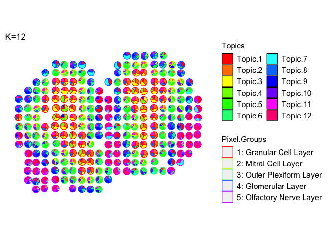
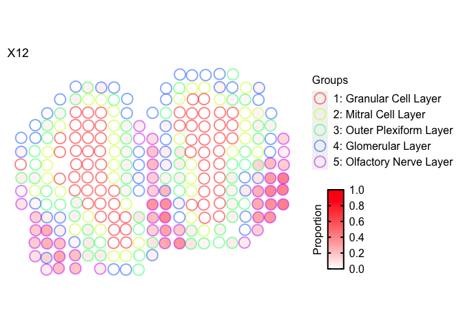

In this tutorial, we will describe additional functionality and features
of `STdeconvolve`.

These are organized as additional options for **pre-processing and
feature selection of genes**, and useful ways to **visualize the
predicted cell-type pixel proportions**.

# Pre-processing

For LDA model fitting, `STdeconvolve` requires a “corpus of documents”,
which is represented as a pixel (rows) x feature/gene (columns) matrix
of non-negative integer gene counts. To effectively deconvolve latent
cell-types, the features in the corpus should be limited to genes that
are variable across cell-types. Without prior knowledge of cell-types
and their marker genes, one could look for **overdispersed genes**
across the pixels, assuming that the underlying cell-types are present
at variable proportions.

It is useful to reduce the number of features in the corpus to those
which are the most informative, to improve deconvolution and increase
speed of model fitting. **Removing genes that are present in most or all
pixels** will help restrict to genes that are cell-type specific,
assuming that cell-types are variable across pixels. Conversely, **genes
that are present in only a few pixels may not actually represent robust
cell-type specific signatures**.

As previously mentioned, a set of marker genes may be known *a priori*
and a user may want to include these in the final corpus.

We include 2 different functions with `STdeconvolve`:

## `restrictCorpus()`

The first is `restrictCorpus()`, which is highlighted in the
`getting_started` tutorial. This function first feature selects for
overdispersed genes in the corpus and then allows a user to restrict the
overdispersed genes to those present in less than or more than specified
fractions of pixels in the dataset. This function does not filter for
poor pixels or genes itself.

## `preprocess()`

The second is `preprocess()`, which is a wrapper function and allows for
more feature selection options.

In general, `preprocess()` includes options for:

-   a step to remove poor pixels and genes,

-   select specific genes to include or remove,

-   select for overdispersed genes,

-   and options to remove top expressed genes, or genes present in less
    than or more than specified fractions of pixels in the dataset.

Further, it returns a list object that contains the filtered corpus, and
the positions of the pixels retained in the filtered corpus if the
information is present in the pixel names originally (for example, if
the name of a pixel is in the format “XxY”). Otherwise these pixel
positions can be appended after.

Lastly, `preprocess()` can take as input a pixel (row) x gene (columns)
matrix or a path to the file.

The order of filtering options in which they occur in `preprocess()`:

1.  Option to use specific genes only

2.  `cleanCounts` to remove poor pixels and genes

3.  Remove top expressed genes in matrix

4.  Remove specific genes based on pattern matching

5.  Remove genes that appear in more/less than a percentage of pixels

6.  Option to use the overdispersed genes computed from the remaining
    genes after filtering steps 1-5

7.  Choice to use the top overdispersed genes based on -log10(adjusted
    p-value)

To demonstrate, let’s use the mouse olfactory bulb (mOB) dataset
provided with `STdeconvolve`:

``` r
library(STdeconvolve)
```

``` r
data(mOB)
pos <- mOB$pos
cd <- mOB$counts
annot <- mOB$annot
```

``` r
mobCorpus1 <- preprocess(t(cd),
                       alignFile = NA, # if there is a file to adjust pixel coordinates this can be included.
                       extractPos = FALSE, # optional argument
                       selected.genes = NA, # 
                       nTopGenes = 3, # remove the top 3 expressed genes (genes with most counts) in dataset
                       genes.to.remove = c("^Trmt"), # ex: remove tRNA methyltransferase genes (gene names that begin with "Trmt")
                       removeAbove = 0.95, # remove genes present in 95% or more of pixels
                       removeBelow = 0.05, # remove genes present in 5% or less of pixels
                       min.reads = 10, # minimum number of reads a gene must have across pixels
                       min.lib.size = 100, # minimum number of reads a pixel must have to keep (before gene filtering)
                       min.detected = 1, # minimum number of pixels a gene needs to have been detected in
                       ODgenes = TRUE, # feature select for over dispersed genes
                       nTopOD = 100, # number of top over dispersed genes to use, otherwise use all that pass filters if `NA`
                       od.genes.alpha = 0.05, # alpha param for over dispersed genes
                       gam.k = 5, # gam param for over dispersed genes
                       verbose = TRUE)
```

    ## Initial genes: 15928 Initial pixels: 262

    ## - Removing poor pixels with <= 100 reads

    ## - Removing genes with <= 10 reads across pixels and detected in <= 1 pixels

    ##   Remaining genes: 12292 and remaining pixels: 260

    ## - Removing the top 3 expressed genes.

    ## - After filtering for `genes.to.remove`:
    ##  Remaining genes: 12274

    ## - Removed genes present in 95% or more of pixels
    ##  Remaining genes: 11589

    ## - Removed genes present in 5% or less of pixels
    ##  Remaining genes: 11116

    ## - Capturing only the overdispersed genes...

    ## Converting to sparse matrix ...

    ## Calculating variance fit ...

    ## Using gam with k=5...

    ## 171 overdispersed genes ...


    ## - Using top 100 overdispersed genes.

    ## - Check that each pixel has at least 1 non-zero gene count entry..

    ## Final corpus:

    ## A 260x100 simple triplet matrix.

    ## Preprocess complete.


``` r
mobCorpus1$pos <- pos[rownames(mobCorpus1$corpus), ] # because positions were not available in the counts matrix itself, append after.
```

Let’s check out the different objects stored in the output list
`mobCorpus1`:

`$slm` is the corpus as a simple triplet matrix.

`$corpus` is the corpus as a matrix.

`$pos` is a matrix of the x and y coordinates of the pixels.

``` r
mobCorpus1$slm
```

    ## A 260x100 simple triplet matrix.

``` r
print(mobCorpus1$corpus[1:10,1:10])
```

    ##                    Bpifb9a Bpifb9b Col1a1 Dcn Cyp2a5 Sox11 Omp Ogn Prokr2
    ## ACAACTATGGGTTGGCGG       0       0      1   0      0     1   0   0      0
    ## ACACAGATCCTGTTCTGA       1       1      0   0      0     0   6   0      0
    ## ACATCACCTGCGCGCTCT       0       0      1   2      0     6   0   0      0
    ## ACATTTAAGGCGCATGAT       0       0      0   1      0     0   1   0      1
    ## ACCACTGTAATCTCCCAT       0       0      0   1      1     0   1   0      0
    ## ACCAGAGCCGTTGAGCAA       0       0      0   0      0     1   3   0      0
    ## ACCCGGCGTAACTAGATA       0       1      0   1      0     3   0   0      1
    ## ACCGGAGTAAATTAGCGG       0       0      0   0      0     2   2   0      0
    ## ACCTGACAGCGGAAACTT       0       0      1   1      0     0   8   0      0
    ## ACGGAAATCAGTGGTATT       0       1      0   1      0     4   3   0      1
    ##                    Ptn
    ## ACAACTATGGGTTGGCGG   2
    ## ACACAGATCCTGTTCTGA  22
    ## ACATCACCTGCGCGCTCT   0
    ## ACATTTAAGGCGCATGAT   1
    ## ACCACTGTAATCTCCCAT   1
    ## ACCAGAGCCGTTGAGCAA   2
    ## ACCCGGCGTAACTAGATA   2
    ## ACCGGAGTAAATTAGCGG   2
    ## ACCTGACAGCGGAAACTT   7
    ## ACGGAAATCAGTGGTATT   0

``` r
print(mobCorpus1$pos[1:10,])
```

    ##                         x      y
    ## ACAACTATGGGTTGGCGG 16.001 16.036
    ## ACACAGATCCTGTTCTGA 26.073 15.042
    ## ACATCACCTGCGCGCTCT 13.048 21.079
    ## ACATTTAAGGCGCATGAT 13.963 18.117
    ## ACCACTGTAATCTCCCAT 24.104 13.074
    ## ACCAGAGCCGTTGAGCAA  9.040 12.046
    ## ACCCGGCGTAACTAGATA 15.941 12.112
    ## ACCGGAGTAAATTAGCGG  7.949 16.058
    ## ACCTGACAGCGGAAACTT  9.039 13.047
    ## ACGGAAATCAGTGGTATT 20.959 15.073

`preprocess()` can also be used to build a corpus using a specific list
of genes. As an example, we will take the cleaned count matrix of the
entire transcriptome of the mOB dataset and filter for just the
overdispersed genes. We can use this vector of genes to select for only
these genes in the corpus. (Note that this is for demonstration
purposes. Overdispersed gene can be obtained in `preprocess()` by
setting the parameter `ODgenes = TRUE`. In reality, one may already have
a list of marker genes in mind and can select for these genes
specifically).

``` r
## get list of genes of interest, for an example.
counts <- cleanCounts(counts = cd,
                      min.lib.size = 100,
                      min.reads = 1,
                      min.detected = 1)
```


``` r
odGenes <- getOverdispersedGenes(as.matrix(counts),
                      gam.k=5,
                      alpha=0.05,
                      plot=FALSE,
                      use.unadjusted.pvals=FALSE,
                      do.par=TRUE,
                      max.adjusted.variance=1e3,
                      min.adjusted.variance=1e-3,
                      verbose=FALSE, details=TRUE)
genes <- odGenes$ods
length(genes)
```

    ## [1] 345

``` r
head(genes)
```

    ## [1] "1700015F17Rik" "1700101I11Rik" "1810020O05Rik" "1810062O18Rik"
    ## [5] "2010300C02Rik" "2210408F21Rik"

``` r
## build corpus using just the selected genes
mobCorpus2 <- preprocess(t(cd),
                       selected.genes = genes,
                       # can then proceed to filter this list, if desired
                       # min.reads = 1, 
                       min.lib.size = 1, # can still filter pixels
                       min.detected = 1, # can still filter to make sure the selected genes are present in at least 1 pixel
                       ODgenes = FALSE, # don't select the over dispersed genes
                       verbose = TRUE)
```

    ## Initial genes: 15928 Initial pixels: 262

    ## - Using genes in `selected.genes` for corpus.

    ##  345 genes are present in dataset.

    ## - Removing poor pixels with <= 1 reads

    ## - Removing genes with <= 1 reads across pixels and detected in <= 1 pixels

    ##   Remaining genes: 345 and remaining pixels: 260

    ## - Check that each pixel has at least 1 non-zero gene count entry..

    ## Final corpus:

    ## A 260x345 simple triplet matrix.

    ## Preprocess complete.


# Selecting Optimal K

One limitation of LDA is that one must select the number of predicted
cell-types (K) to be returned, *a priori*. Thus, one must either have
knowledge of the number of cell-types present in the dataset of
interest, or a way to select the model with the “optimal K”, i.e., the
model that best describes the dataset and captures the latent
cell-types.

To do this, `STdeconvolve` fits a number of different LDA models with
different K’s to the dataset and computes several different metrics to
help guide users in the choice of K.

First, the **perplexity** of each fitted model is computed with respect
to it’s K. The optimal K can either be the model with the K that returns
the lowest perplexity (“min”), or we compute a “knee” metric (similar to
choosing the number of principle components in PCA), which is the
maximum second derivative, a reasonable choice for the inflection point
(the elbow or knee).

Second, as K increases, the additional cell-types that are predicted
tend to be represented at small proportions in the pixels and thus
contribute little to the predicted pixel cell-type profiles. To help put
an upper limit on K, we measure the number of predicted cell-types with
mean pixel proportion less than 5% (by default). After a certain K,
**the number of “rare” predicted cell-types**, or those with low
proportions across the pixels, steadily increases, suggesting that
increasing K is no longer returning informative topics, or cell-types.

``` r
## fit LDA models to the corpus
ks <- seq(from = 2, to = 18, by = 1) # range of K's to fit LDA models with given the input corpus
ldas <- fitLDA(as.matrix(mobCorpus2$corpus),
               Ks = ks,
               ncores = parallel::detectCores(logical = TRUE) - 1, # number of cores to fit LDA models in parallel
               plot=TRUE, verbose=FALSE)
```

    ## Warning in serialize(data, node$con): 'package:stats' may not be available
    ## when loading

    ## Warning in serialize(data, node$con): 'package:stats' may not be available
    ## when loading

    ## Warning in serialize(data, node$con): 'package:stats' may not be available
    ## when loading

    ## Warning in serialize(data, node$con): 'package:stats' may not be available
    ## when loading

    ## Warning in serialize(data, node$con): 'package:stats' may not be available
    ## when loading

    ## Warning in serialize(data, node$con): 'package:stats' may not be available
    ## when loading

    ## Warning in serialize(data, node$con): 'package:stats' may not be available
    ## when loading

    ## Warning in serialize(data, node$con): 'package:stats' may not be available
    ## when loading

    ## Warning in serialize(data, node$con): 'package:stats' may not be available
    ## when loading

    ## Warning in serialize(data, node$con): 'package:stats' may not be available
    ## when loading

    ## Warning in serialize(data, node$con): 'package:stats' may not be available
    ## when loading

    ## Warning in serialize(data, node$con): 'package:stats' may not be available
    ## when loading

    ## Warning in serialize(data, node$con): 'package:stats' may not be available
    ## when loading

    ## Warning in serialize(data, node$con): 'package:stats' may not be available
    ## when loading



While technically the lowest perplexity computed here is when K=18,
perplexity appears to stabilize and decreases gradually after K=7.

We could use the “knee” metric (maximum second derivative) to determine
the optimal K. But in this case, using the “knee” method, the optimal K
would be 4. However, we expect there to be more than 4 cell-types.

Finally, the number of cell-types with mean proportion \<5% doesn’t
start steadily increasing until around K=12, suggesting that the number
of predicted cell-types are likely informative until this chosen K.

Once the LDA models are fitted, **beta** and **theta** matrices can be
extracted for a given model. The simplest way to do this is with
`optimalModel()` to get the specific model of interest:

``` r
## `optimalModel()` can take as arguments:
optimalModel(models = ldas, opt = "min") # "min" = K that resulted in minimum perplexity
```

    ## A LDA_VEM topic model with 18 topics.

``` r
optimalModel(models = ldas, opt = "kneed") # "kneed" = K that resulted in inflection perplexity
```

    ## A LDA_VEM topic model with 4 topics.

``` r
optimalModel(models = ldas, opt = 12) # or extract the model for any K that was used
```

    ## A LDA_VEM topic model with 12 topics.

Then, `getBetaTheta()` can be used to get the **beta** (cell-type gene
expression profiles) and **theta** (pixel cell-type proportions)
matrices.

``` r
optLDA <- optimalModel(models = ldas, opt = 12)
results <- getBetaTheta(lda = optLDA,
                        perc.filt = 0.05, # remove cell-types from pixels that are predicted to be present at less than 5%. Then readjust pixel proportions to 100%
                        betaScale = 1000) # scale the cell-type transcriptional profiles
```

    ## Filtering out cell-types in pixels that contribute less than 0.05 of the pixel proportion.

``` r
print(names(results))
```

    ## [1] "beta"  "theta"

``` r
deconProp <- results$theta
deconGexp <- results$beta

head(deconProp)
```

    ##                            1          2         3          4         5
    ## ACAACTATGGGTTGGCGG 0.0000000 0.00000000 0.0000000 0.00000000 0.3753789
    ## ACACAGATCCTGTTCTGA 0.4142656 0.00000000 0.0000000 0.00000000 0.0000000
    ## ACATCACCTGCGCGCTCT 0.0000000 0.23431750 0.1811553 0.13988628 0.0000000
    ## ACATTTAAGGCGCATGAT 0.0000000 0.37756487 0.3953213 0.00000000 0.0000000
    ## ACCACTGTAATCTCCCAT 0.0000000 0.14123112 0.0000000 0.06897838 0.4642933
    ## ACCAGAGCCGTTGAGCAA 0.1665213 0.06325533 0.0000000 0.11304888 0.0000000
    ##                             6          7          8          9        10
    ## ACAACTATGGGTTGGCGG 0.00000000 0.00000000 0.07789951 0.09685039 0.1802519
    ## ACACAGATCCTGTTCTGA 0.00000000 0.07295572 0.00000000 0.00000000 0.0000000
    ## ACATCACCTGCGCGCTCT 0.00000000 0.00000000 0.20243136 0.00000000 0.0000000
    ## ACATTTAAGGCGCATGAT 0.08546443 0.00000000 0.07073303 0.00000000 0.0000000
    ## ACCACTGTAATCTCCCAT 0.00000000 0.00000000 0.00000000 0.00000000 0.1670547
    ## ACCAGAGCCGTTGAGCAA 0.16841514 0.00000000 0.00000000 0.10886146 0.0000000
    ##                            11         12
    ## ACAACTATGGGTTGGCGG 0.20188560 0.06773367
    ## ACACAGATCCTGTTCTGA 0.00000000 0.51277872
    ## ACATCACCTGCGCGCTCT 0.24220959 0.00000000
    ## ACATTTAAGGCGCATGAT 0.07091637 0.00000000
    ## ACCACTGTAATCTCCCAT 0.06585669 0.09258578
    ## ACCAGAGCCGTTGAGCAA 0.05451990 0.32537800

``` r
deconGexp[1:5,1:5]
```

    ##   1700015F17Rik 1700101I11Rik 1810020O05Rik 1810062O18Rik 2010300C02Rik
    ## 1  2.264072e-02  5.293112e-16  1.814762e-21  1.514845e-01      1.459033
    ## 2  2.586919e-13  2.819724e-05  6.525866e-05  5.433541e-03      8.924009
    ## 3  1.294980e-15  3.789561e-07  1.671843e-04  1.405851e-01      2.292141
    ## 4  2.963250e-12  3.847094e-14  4.911490e-11  5.908545e-02      2.053822
    ## 5  8.011525e-02  6.606647e-02  1.291824e-65  9.117617e-11      2.240910

# Visualization

## Visualization of all topics via `vizAllTopics()`

``` r
m <- deconProp
p <- pos
plt <- vizAllTopics(theta = m,
             pos = p,
             topicOrder=seq(ncol(m)),
             topicCols=rainbow(ncol(m)),
             groups = NA,
             group_cols = NA,
             r = 0.4, # size of scatterpies; adjust depending on the coordinates of the pixels
             lwd = 0.1,
             showLegend = TRUE,
             plotTitle = "K=12")
```

    ## Plotting scatterpies for 260 pixels with 12 cell-types...this could take a while if the dataset is large.

``` r
## function returns a `ggplot2` object, so other aesthetics can be added on:
plt <- plt + ggplot2::guides(fill=ggplot2::guide_legend(ncol=2))
plt
```



Scatterpies can be labeled as belonging to different groups and their
borders colored to designate the group membership.

Custom colors can be used for the arguments `groups` and `group_cols`

``` r
m <- deconProp
p <- pos
plt <- vizAllTopics(theta = m,
             pos = p,
             topicOrder=seq(ncol(m)),
             topicCols=rainbow(ncol(m)),
             groups = rep("0", dim(m)[1]),
             group_cols = c("0" = "black"),
             r = 0.4,
             lwd = 0.4, # adjust thickness of the scatterpie borders
             showLegend = TRUE,
             plotTitle = "K=12")
```

    ## Plotting scatterpies for 260 pixels with 12 cell-types...this could take a while if the dataset is large.

``` r
## function returns a `ggplot2` object, so other aesthetics can be added on:
plt <- plt + ggplot2::guides(fill=ggplot2::guide_legend(ncol=2))
plt
```


Color scatter pies based on group membership (let’s use the coarse cell
layers of the MOB)

``` r
m <- deconProp
p <- pos
plt <- vizAllTopics(theta = m,
             pos = p,
             topicOrder=seq(ncol(m)),
             topicCols=rainbow(ncol(m)),
             groups = annot, 
             group_cols = rainbow(length(levels(annot))),
             r = 0.4,
             lwd = 0.4, # adjust thickness of the scatterpie borders
             showLegend = TRUE,
             plotTitle = "K=12")
```

    ## Plotting scatterpies for 260 pixels with 12 cell-types...this could take a while if the dataset is large.

``` r
## function returns a `ggplot2` object, so other aesthetics can be added on:
plt <- plt + ggplot2::guides(fill=ggplot2::guide_legend(ncol=2))
plt
```


Can filter the `theta` matrix to only visualize certain cell-types:

``` r
m <- deconProp[,c("3", "12")]
p <- pos
other <- 1 - rowSums(m)
m <- cbind(m, other)
colnames(m) <- c("3", "12", "Other")
vizAllTopics(theta = m,
             pos = p,
             topicOrder=seq(ncol(m)),
             # BONUS: `transparentCol` can make colors transparent, perhaps if overlaying scatterpies on top of an H&E image
             topicCols=c(transparentCol("red", percent = 50), "black", "white"), # colors for cell-type 3, 12, and "other"
             groups = rep("0", dim(m)[1]),
             group_cols = c("0" = "white"), # make scatterpie borders white to only show the cell-type proportions.
             r = 0.4,
             lwd = 0.1,
             showLegend = TRUE,
             # BONUS: plot the scatterpies on top of a raster image of the H&E tissue, if this argument is equal to the rgb matrix representing the image
             overlay = NA) 
```

    ## Plotting scatterpies for 260 pixels with 3 cell-types...this could take a while if the dataset is large.


## Faster plotting via `vizTopic`

For very large datasets with many pixels and cell-types, it can take a
long time to render each individual scatterpie. To speed this up, we can
visualize the pixel proportion of one cell-type at a time via
`vizTopic()`

``` r
m <- deconProp
p <- pos

vizTopic(theta = m, pos = p, topic = "12", plotTitle = "X12",
         size = 5, stroke = 1, alpha = 0.5,
         low = "white",
         high = "red")
```


Again, we can also label the coarse cell layers for which the pixels
were assigned to.

``` r
m <- deconProp
p <- pos

vizTopic(theta = m, pos = p, topic = "12", plotTitle = "X12",
         size = 5, stroke = 1, alpha = 0.5,
         groups = annot,
         group_cols = rainbow(length(levels(annot))),
         low = "white",
         high = "red")
```


One last note: `vizAllTopics()` and `vizTopic()` return `ggplot2`
objects, and so additional `ggplot2` aesthetics and themes can be added
on for further customization.
