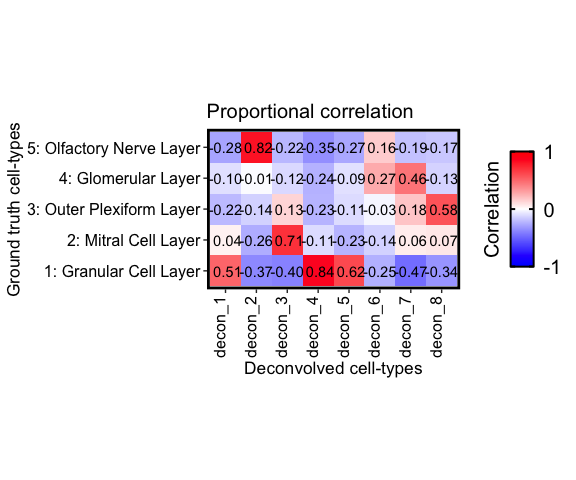
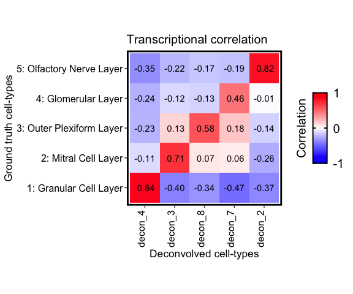

In this tutorial, we will go over two different strategies for
annotating the deconvolved cell-types.

Recall that `STdeconvolve` does not require a reference to deconvolve
cell-types in multi-cellular spatially-resolved pixels. However, we
would still like some way to identify the deconvolved cell-types to
determine if they may represent known cell-types.

In addition to the predicted pixel proportions, `STdeconvolve` also
returns predicted transcriptional profiles of the deconvolved cell-types
as the `beta` matrix. We can use these transcriptional profiles to
compare to known cell-type transcriptional profiles and see if we can
annotate them.

As an example, let’s first apply `STdeconvolve` to identify cell-types
in the MOB ST dataset

``` r
library(STdeconvolve)
## load built in data
data(mOB)
pos <- mOB$pos
cd <- mOB$counts
annot <- mOB$annot
## remove pixels with too few genes
counts <- cleanCounts(cd, min.lib.size = 100)
```


``` r
## feature select for genes
corpus <- restrictCorpus(counts, removeAbove=1.0, removeBelow = 0.05)
```

    ## Removing 124 genes present in 100% or more of pixels...

    ## 14704 genes remaining...

    ## Removing 3009 genes present in 5% or less of pixels...

    ## 11695 genes remaining...

    ## Restricting to overdispersed genes with alpha = 0.05...

    ## Calculating variance fit ...

    ## Using gam with k=5...

    ## 232 overdispersed genes ...

    ##  Using top 1000 overdispersed genes.

    ##  number of top overdispersed genes available: 232

``` r
## choose optimal number of cell-types
ldas <- fitLDA(t(as.matrix(corpus)), Ks = seq(2, 9, by = 1))
```

    ## Warning in serialize(data, node$con): 'package:stats' may not be available
    ## when loading

    ## Warning in serialize(data, node$con): 'package:stats' may not be available
    ## when loading

    ## Warning in serialize(data, node$con): 'package:stats' may not be available
    ## when loading

    ## Warning in serialize(data, node$con): 'package:stats' may not be available
    ## when loading

    ## Warning in serialize(data, node$con): 'package:stats' may not be available
    ## when loading

    ## Warning in serialize(data, node$con): 'package:stats' may not be available
    ## when loading

    ## Warning in serialize(data, node$con): 'package:stats' may not be available
    ## when loading

    ## Time to fit LDA models was 0.43 mins

    ## Computing perplexity for each fitted model...

    ## Warning in serialize(data, node$con): 'package:stats' may not be available
    ## when loading

    ## Warning in serialize(data, node$con): 'package:stats' may not be available
    ## when loading

    ## Warning in serialize(data, node$con): 'package:stats' may not be available
    ## when loading

    ## Warning in serialize(data, node$con): 'package:stats' may not be available
    ## when loading

    ## Warning in serialize(data, node$con): 'package:stats' may not be available
    ## when loading

    ## Warning in serialize(data, node$con): 'package:stats' may not be available
    ## when loading

    ## Warning in serialize(data, node$con): 'package:stats' may not be available
    ## when loading

    ## Time to compute perplexities was 0.15 mins

    ## Getting predicted cell-types at low proportions...

    ## Time to compute cell-types at low proportions was 0 mins

    ## Plotting...


``` r
## get best model results
optLDA <- optimalModel(models = ldas, opt = "min")
## extract deconvolved cell-type proportions (theta) and transcriptional profiles (beta)
results <- getBetaTheta(optLDA, perc.filt = 0.05, betaScale = 1000)
```

    ## Filtering out cell-types in pixels that contribute less than 0.05 of the pixel proportion.

``` r
deconProp <- results$theta
deconGexp <- results$beta
## visualize deconvolved cell-type proportions
vizAllTopics(deconProp, pos,
             groups = annot, 
             group_cols = rainbow(length(levels(annot))),
             r=0.4)
```

    ## Plotting scatterpies for 260 pixels with 8 cell-types...this could take a while if the dataset is large.


For demonstration purposes, let’s use the 5 annotated tissue layer
labels (i.e. “Granular Cell Layer”, “Mitral Cell Layer”, etc) assigned
to each pixel and use these to make transcriptional profiles for each of
the annotated tissue layers in the MOB.

``` r
# proxy theta for the annotated layers
mobProxyTheta <- model.matrix(~ 0 + annot)
rownames(mobProxyTheta) <- names(annot)
# fix names
colnames(mobProxyTheta) <- unlist(lapply(colnames(mobProxyTheta), function(x) {
  unlist(strsplit(x, "annot"))[2]
}))

mobProxyGexp <- counts %*% mobProxyTheta
```

## Strategy 1: Transcriptional correlations

First, we can find the Pearson’s correlation between the transcriptional
profiles of the deconvolved cell-types and those of a ground truth
reference.

``` r
corMtx_beta <- getCorrMtx(m1 = as.matrix(deconGexp), # the deconvolved cell-type `beta` (celltypes x genes)
                          m2 = t(as.matrix(mobProxyGexp)), # the reference `beta` (celltypes x genes)
                          type = "b") # "b" = comparing beta matrices, "t" for thetas
```

    ## cell-type correlations based on 232 shared genes between m1 and m2.

``` r
## row and column names need to be characters
rownames(corMtx_beta) <- paste0("decon_", seq(nrow(corMtx_beta)))

correlationPlot(mat = corMtx_beta,
                colLabs = "Deconvolved cell-types", # aka x-axis, and rows of matrix
                rowLabs = "Ground truth cell-types", # aka y-axis, and columns of matrix
                title = "Transcriptional correlation", annotation = TRUE) +
  
  ## this function returns a `ggplot2` object, so can add additional aesthetics
  ggplot2::theme(axis.text.x = ggplot2::element_text(angle = 90, vjust = 0))
```


Notice that cell-type 1, 4, and 5 correlate the strongest with the
Granular cell layer, cell-type 2 with the Olfactory nerve layer, etc.
These agree with there predicted spatial proportions in the MOB dataset.
We can also confirm this by also computing the correlation between the
predicted and ground truth cell-type proportions via comparing the
`theta` matrices.

``` r
corMtx_theta <- getCorrMtx(m1 = as.matrix(deconProp), # the deconvolved cell-type `theta` (pixels x celltypes)
                          m2 = as.matrix(mobProxyTheta), # the reference `theta` (pixels x celltypes)
                          type = "t") # "b" = comparing beta matrices, "t" for thetas
```

    ## cell-type correlations based on 260 shared pixels between m1 and m2.

``` r
## row and column names need to be characters
rownames(corMtx_theta) <- paste0("decon_", seq(nrow(corMtx_theta)))

correlationPlot(mat = corMtx_theta,
                colLabs = "Deconvolved cell-types", # aka x-axis, and rows of matrix
                rowLabs = "Ground truth cell-types", # aka y-axis, and columns of matrix
                title = "Proportional correlation", annotation = TRUE) +
  
  ## this function returns a `ggplot2` object, so can add additional aesthetics
  ggplot2::theme(axis.text.x = ggplot2::element_text(angle = 90, vjust = 0))
```



Finally, we can also pair up each reference cell-type with the
deconvolved cell-type that has the highest correlation.

``` r
## order the cell-types rows based on best match (highest correlation) with each community
## cannot have more rows than columns for this pairing, so transpose
pairs <- lsatPairs(t(corMtx_theta))
m <- t(corMtx_theta)[pairs$rowix, pairs$colsix]

correlationPlot(mat = t(m), # transpose back
                colLabs = "Deconvolved cell-types", # aka x-axis, and rows of matrix
                rowLabs = "Ground truth cell-types", # aka y-axis, and columns of matrix
                title = "Transcriptional correlation", annotation = TRUE) +
  
  ## this function returns a `ggplot2` object, so can add additional aesthetics
  ggplot2::theme(axis.text.x = ggplot2::element_text(angle = 90, vjust = 0))
```



Note that only the paired deconvolved cell-types remain. Ones that
paired less strongly with a given ground truth are dropped after
assigning pairs.

## Strategy 2: GSEA

Next, given a list of reference gene sets for different cell types, we
can performed gene set enrichment analysis on the deconvolved
transcriptional profiles to test for significant enrichment of any known
ground truth cell-types.

First, let’s identify marker genes for each tissue layer based on
log2(fold-change) compared to the other tissue layers. This will be our
list of gene sets for each tissue layer.

``` r
mobProxyLayerMarkers <- list()

## make the tissue layers the rows and genes the columns
gexp <- t(as.matrix(mobProxyGexp))

for (i in seq(length(rownames(gexp)))){
  celltype <- i
  ## log2FC relative to other cell-types
  ## highly expressed in cell-type of interest
  highgexp <- names(which(gexp[celltype,] > 10))
  ## high log2(fold-change) compared to other deconvolved cell-types and limit to top 200
  log2fc <- sort(log2(gexp[celltype,highgexp]/colMeans(gexp[-celltype,highgexp])), decreasing=TRUE)[1:200]
  
  ## for gene set of the ground truth cell-type, get the genes
  ## with log2FC > 1 (so FC > 2 over the mean exp of the other cell-types)
  markers <- names(log2fc[log2fc > 1])
  mobProxyLayerMarkers[[ rownames(gexp)[celltype] ]] <- markers
}
```

``` r
celltype_annotations <- annotateCellTypesGSEA(beta = results$beta, gset = mobProxyLayerMarkers, qval = 0.05)
```

    ## initial: [1e+02 - 3] [1e+03 - 3] [1e+04 - 3] done
    ## initial: [1e+02 - 3] [1e+03 - 2] [1e+04 - 2] done
    ## initial: [1e+02 - 4] [1e+03 - 4] [1e+04 - 4] done
    ## initial: [1e+02 - 4] [1e+03 - 4] [1e+04 - 4] done
    ## initial: [1e+02 - 4] [1e+03 - 4] [1e+04 - 4] done
    ## initial: [1e+02 - 4] [1e+03 - 2] [1e+04 - 1] done
    ## initial: [1e+02 - 3] [1e+03 - 3] [1e+04 - 2] done
    ## initial: [1e+02 - 4] [1e+03 - 3] [1e+04 - 3] done

`annotateCellTypesGSEA` returns a list where the first entry,
`$results`, contains a list of matrices that show any reference
cell-types that had a significant positive enrichment score in each of
the deconvolved cell-types.

For example, here are the reference cell-types that were significantly
enriched in deconvolved cell-type 2:

``` r
celltype_annotations$results$`2`
```

    ##                              p.val      q.val    sscore     edge
    ## 5: Olfactory Nerve Layer 9.999e-05 0.00019998  2.258666 4.660299
    ## 1: Granular Cell Layer   9.999e-05 0.00019998 -1.860806 1.369958

Note that the “5: Olfactory Nerve Layer” is significantly positively
enriched in the transcriptional profiles of cell-type 2 whereas “1:
Granular Cell Layer” is negatively enriched.

`annotateCellTypesGSEA` also contains `$predictions`, which is a named
vector of the most significant matched reference cell-type with the
highest positive enrichment score for each deconvolved cell-type. Note
that if there were no significant reference cell-types with positive
enrichment, then the deconvolved cell-type will have no matches.

``` r
celltype_annotations$predictions
```

    ##                          1                          2 
    ##                         NA "5: Olfactory Nerve Layer" 
    ##                          3                          4 
    ##     "2: Mitral Cell Layer"   "1: Granular Cell Layer" 
    ##                          5                          6 
    ##   "1: Granular Cell Layer"      "4: Glomerular Layer" 
    ##                          7                          8 
    ##     "2: Mitral Cell Layer"     "2: Mitral Cell Layer"

Note how the best matches are closely associated with the
transcriptional and pixel proportion correlations.
