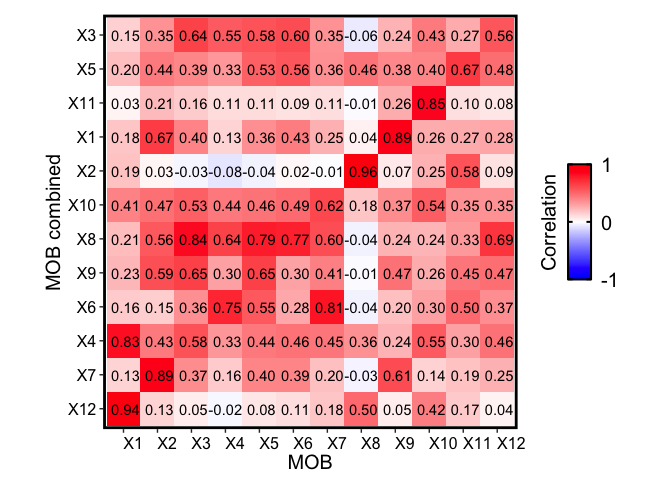

In this tutorial, we will discuss when it may be appropriate to combine
multiple spatial transcriptomics datasets and how to do so. Likewise, we
will also discuss examples of processing different datasets separately
and then comparing the deconvolved cell types.

For this, we will use ST datasets originally generated by Stahl et al
2016 and available on
[https://www.spatialresearch.org](https://www.spatialresearch.org/resources-published-datasets/doi-10-1126science-aaf2403/).

We will focus on multiple mouse olfactory bulb (MOB) datasets also
available on
[https://www.spatialresearch.org](https://www.spatialresearch.org/resources-published-datasets/doi-10-1126science-aaf2403/).

In the original `STdeconvolve` paper, we focused on MOB biological
replicate 8, which we already provide as a data object in the
`STdeconvolve` package.

Let’s load in this object and deconvolve 12 cell types as was done in
the publication:

``` r
library(STdeconvolve)
## load built in data
data(mOB)
pos <- mOB$pos
cd <- mOB$counts
annot <- mOB$annot

mobCorpus <- preprocess(t(mOB$counts),
                       extractPos = FALSE,
                       selected.genes = NA,
                       nTopGenes = NA,
                       genes.to.remove = NA,
                       removeAbove = NA,
                       removeBelow = NA,
                       min.reads = 100,
                       min.lib.size = 100,
                       min.detected = 1,
                       ODgenes = TRUE,
                       nTopOD = NA,
                       od.genes.alpha = 0.05,
                       gam.k = 5,
                       verbose = TRUE)
```

    ## Initial genes: 15928 Initial pixels: 262

    ## - Removing poor pixels with <= 100 reads

    ## - Removing genes with <= 100 reads across pixels and detected in <= 1 pixels

    ##   Remaining genes: 7365 and remaining pixels: 260

    ## - Capturing only the overdispersed genes...

    ## Converting to sparse matrix ...

    ## Calculating variance fit ...

    ## Using gam with k=5...

    ## 255 overdispersed genes ...


    ## - Check that each pixel has at least 1 non-zero gene count entry..

    ## Final corpus:

    ## A 260x255 simple triplet matrix.

    ## Preprocess complete.


``` r
## choose optimal number of cell-types
ldas <- fitLDA(t(as.matrix(corpus)), Ks = seq(2, 15, by = 1), ncores = 7)
```

    ## Warning in serialize(data, node$con): 'package:stats' may not be available when loading

    ## Warning in serialize(data, node$con): 'package:stats' may not be available when loading

    ## Warning in serialize(data, node$con): 'package:stats' may not be available when loading

    ## Warning in serialize(data, node$con): 'package:stats' may not be available when loading

    ## Warning in serialize(data, node$con): 'package:stats' may not be available when loading

    ## Warning in serialize(data, node$con): 'package:stats' may not be available when loading

    ## Warning in serialize(data, node$con): 'package:stats' may not be available when loading

    ## Time to fit LDA models was 2.57 mins

    ## Computing perplexity for each fitted model...

    ## Warning in serialize(data, node$con): 'package:stats' may not be available when loading

    ## Warning in serialize(data, node$con): 'package:stats' may not be available when loading

    ## Warning in serialize(data, node$con): 'package:stats' may not be available when loading

    ## Warning in serialize(data, node$con): 'package:stats' may not be available when loading

    ## Warning in serialize(data, node$con): 'package:stats' may not be available when loading

    ## Warning in serialize(data, node$con): 'package:stats' may not be available when loading

    ## Warning in serialize(data, node$con): 'package:stats' may not be available when loading

    ## Time to compute perplexities was 0.17 mins

    ## Getting predicted cell-types at low proportions...

    ## Time to compute cell-types at low proportions was 0 mins

    ## Plotting...


``` r
## get best model results
optLDA <- optimalModel(models = ldas, opt = 12)
## extract deconvolved cell-type proportions (theta) and transcriptional profiles (beta)
results <- getBetaTheta(optLDA, perc.filt = 0.05, betaScale = 1000)
```

    ## Filtering out cell-types in pixels that contribute less than 0.05 of the pixel proportion.

``` r
deconProp <- results$theta
deconGexp <- results$beta
## visualize deconvolved cell-type proportions
vizAllTopics(deconProp, pos,
             groups = annot,
             group_cols = rainbow(length(levels(annot))),
             r=0.4)
```

    ## Plotting scatterpies for 260 pixels with 12 cell-types...this could take a while if the dataset is large.


Notice that on the perplexity plot, after K=12 deconvolved cell types,
the number of deconvolved cell types with mean pixel proportions less
than 5% steadily increases, so it’s possible that this is indicating
“oversplitting” of the data into additional deconvolved cell types.
Let’s stick with K=12 deconvolved cell types for now.

Also, recall from the publication that many of the deconvolved cell
types further partition the granular cell layer, for example. We can see
that together, these deconvolved cell types are also transcriptionally
similar to each other, but different from deconvolved cell types that
make up other cell layers:

``` r
m1 <- deconGexp
m2 <- deconGexp

rownames(m1) <- paste0("X", rownames(m1))
rownames(m2) <- paste0("X", rownames(m2))

corMtx <- STdeconvolve::getCorrMtx(m1 = as.matrix(m1),
                                   m2 = as.matrix(m2),
                                   type = "b")
```

    ## NOTE: using type='b' and comparing betas where the cell-types are
    ##             the rows (cell-types x genes)

    ## cell-type correlations based on 255 shared genes between m1 and m2.

``` r
pairs <- STdeconvolve::lsatPairs(corMtx)

plt <- STdeconvolve::correlationPlot(mat = corMtx[,pairs$colsix],
                                     colLabs = "MOB", # aka x-axis, and rows of matrix
                                     rowLabs = "MOB", # aka y-axis, and columns of matrix
                                     title = "Transcriptional profile correlation",
                                     annotation = TRUE) +
                    ggplot2::theme(axis.text.x = ggplot2::element_text(size=12, color = "black", hjust = 0, vjust = 0.5),
                                   axis.text.y = ggplot2::element_text(size=12, color = "black"),
                                   axis.title.y = ggplot2::element_text(size=15),
                                   axis.title.x = ggplot2::element_text(size=15),
                                   plot.title = ggplot2::element_text(size=0),
                                   legend.text = ggplot2::element_text(size = 15, colour = "black"),
                                   legend.title = ggplot2::element_text(size = 15, colour = "black", angle = 90),
                                   panel.background = ggplot2::element_blank(),
                                   ## border around plot
                                   panel.border = ggplot2::element_rect(fill = NA, color = "black", size = 2),
                                   plot.background = ggplot2::element_blank()
                                   # legend.position="none"
                                   )

plt
```


Next, let’s download the ST datasets for other MOB biological replicates
(note that these are the datasets that were compared to the original MOB
dataset for Supplementary Figure S7).

``` r
f <- "mobCombinedVignette/"

if(!file.exists(f)){
      dir.create(f)
}


if(!file.exists(paste0(f, "Rep2_MOB_count_matrix-1.tsv"))){
  tsv_file <- "https://www.spatialresearch.org/wp-content/uploads/2016/07/Rep2_MOB_count_matrix-1.tsv"
  download.file(tsv_file, 
                destfile = paste0(f, "Rep2_MOB_count_matrix-1.tsv"), 
                method = "auto")
}

if(!file.exists(paste0(f, "Rep5_MOB_count_matrix-1.tsv"))){
  tsv_file <- "https://www.spatialresearch.org/wp-content/uploads/2016/07/Rep5_MOB_count_matrix-1.tsv"
  download.file(tsv_file, 
                destfile = paste0(f, "Rep5_MOB_count_matrix-1.tsv"), 
                method = "auto")
}

if(!file.exists(paste0(f, "Rep12_MOB_count_matrix-1.tsv"))){
  tsv_file <- "https://www.spatialresearch.org/wp-content/uploads/2016/07/Rep12_MOB_count_matrix-1.tsv"
  download.file(tsv_file, 
                destfile = paste0(f, "Rep12_MOB_count_matrix-1.tsv"), 
                method = "auto")
}
```

Because each dataset was generated from a different MOB tissue source,
it is probably a good idea to deconvolve each dataset separately. The
reason for this is that there may exist technical or biological noise
between each dataset. Differences between two datasets may manifest as
differences in deconvolved cell types between the pixels of the
different datasets that were combined, but it is unclear if these
differences are a result of technical noise between the different
datasets or biological differences.

However, even if the datasets are deconvolved separately, we can see
that `STdeconvolve` is still able to detect similar cell type
signatures, which makes sense given that these samples are ultimately
from the same brain region, albeit independent samples.

``` r
mobRepPaths <- c(
  paste0(f, "Rep2_MOB_count_matrix-1.tsv"),
  paste0(f, "Rep5_MOB_count_matrix-1.tsv"),
  paste0(f, "Rep12_MOB_count_matrix-1.tsv")
)

names(mobRepPaths) <- c("Rep2", "Rep5", "Rep12")
```

``` r
mobCorpusReps <- lapply(mobRepPaths, function(p) {
  dat <- preprocess(p,
                   extractPos = TRUE,
                   selected.genes = NA,
                   nTopGenes = NA,
                   genes.to.remove = NA,
                   removeAbove = NA,
                   removeBelow = NA,
                   min.reads = 100,
                   min.lib.size = 100,
                   min.detected = 1,
                   ODgenes = TRUE,
                   nTopOD = NA,
                   od.genes.alpha = 0.05,
                   gam.k = 5) # ODgenes ignored; so is this
  dat
})
```

    ## Initial genes: 15981 Initial pixels: 280

    ## - Removing poor pixels with <= 100 reads

    ## - Removing genes with <= 100 reads across pixels and detected in <= 1 pixels

    ##   Remaining genes: 6002 and remaining pixels: 279

    ## - Capturing only the overdispersed genes...

    ## Converting to sparse matrix ...

    ## Calculating variance fit ...

    ## Using gam with k=5...

    ## 385 overdispersed genes ...


    ## - Check that each pixel has at least 1 non-zero gene count entry..

    ## Final corpus:

    ## A 279x385 simple triplet matrix.

    ## Extracting positions from pixel names.

    ## Preprocess complete.

    ## Initial genes: 15290 Initial pixels: 267

    ## - Removing poor pixels with <= 100 reads

    ## - Removing genes with <= 100 reads across pixels and detected in <= 1 pixels


    ##   Remaining genes: 4217 and remaining pixels: 267

    ## - Capturing only the overdispersed genes...

    ## Converting to sparse matrix ...

    ## Calculating variance fit ...

    ## Using gam with k=5...

    ## 162 overdispersed genes ...


    ## - Check that each pixel has at least 1 non-zero gene count entry..

    ## Final corpus:

    ## A 267x162 simple triplet matrix.

    ## Extracting positions from pixel names.

    ## Preprocess complete.

    ## Initial genes: 16034 Initial pixels: 282

    ## - Removing poor pixels with <= 100 reads

    ## - Removing genes with <= 100 reads across pixels and detected in <= 1 pixels


    ##   Remaining genes: 6264 and remaining pixels: 278

    ## - Capturing only the overdispersed genes...

    ## Converting to sparse matrix ...

    ## Calculating variance fit ...

    ## Using gam with k=5...

    ## 177 overdispersed genes ...


    ## - Check that each pixel has at least 1 non-zero gene count entry..

    ## Final corpus:

    ## A 278x177 simple triplet matrix.

    ## Extracting positions from pixel names.

    ## Preprocess complete.


``` r
names(mobCorpusReps) <- c("Rep2", "Rep5", "Rep12")
```

``` r
mobLDAsRep2 <- fitLDA(counts = mobCorpusReps$Rep2$corpus,
                                    Ks = seq(3,20),
                                    perc.rare.thresh = 0.05,
                                    seed = 0,
                                    ncores = 7,
                                    plot = TRUE)
```

    ## Warning in serialize(data, node$con): 'package:stats' may not be available when loading

    ## Warning in serialize(data, node$con): 'package:stats' may not be available when loading

    ## Warning in serialize(data, node$con): 'package:stats' may not be available when loading

    ## Warning in serialize(data, node$con): 'package:stats' may not be available when loading

    ## Warning in serialize(data, node$con): 'package:stats' may not be available when loading

    ## Warning in serialize(data, node$con): 'package:stats' may not be available when loading

    ## Time to fit LDA models was 4.86 mins

    ## Computing perplexity for each fitted model...

    ## Warning in serialize(data, node$con): 'package:stats' may not be available when loading

    ## Warning in serialize(data, node$con): 'package:stats' may not be available when loading

    ## Warning in serialize(data, node$con): 'package:stats' may not be available when loading

    ## Warning in serialize(data, node$con): 'package:stats' may not be available when loading

    ## Warning in serialize(data, node$con): 'package:stats' may not be available when loading

    ## Warning in serialize(data, node$con): 'package:stats' may not be available when loading

    ## Time to compute perplexities was 0.14 mins

    ## Getting predicted cell-types at low proportions...

    ## Time to compute cell-types at low proportions was 0 mins

    ## Plotting...


``` r
## ------------------------------------------------------------------
mobLDAsRep5 <- fitLDA(counts = mobCorpusReps$Rep5$corpus,
                                    Ks = seq(3,20),
                                    perc.rare.thresh = 0.05,
                                    seed = 0,
                                    ncores = 7,
                                    plot = TRUE)
```

    ## Warning in serialize(data, node$con): 'package:stats' may not be available when loading

    ## Warning in serialize(data, node$con): 'package:stats' may not be available when loading

    ## Warning in serialize(data, node$con): 'package:stats' may not be available when loading

    ## Warning in serialize(data, node$con): 'package:stats' may not be available when loading

    ## Warning in serialize(data, node$con): 'package:stats' may not be available when loading

    ## Warning in serialize(data, node$con): 'package:stats' may not be available when loading

    ## Time to fit LDA models was 2.38 mins

    ## Computing perplexity for each fitted model...

    ## Warning in serialize(data, node$con): 'package:stats' may not be available when loading

    ## Warning in serialize(data, node$con): 'package:stats' may not be available when loading

    ## Warning in serialize(data, node$con): 'package:stats' may not be available when loading

    ## Warning in serialize(data, node$con): 'package:stats' may not be available when loading

    ## Warning in serialize(data, node$con): 'package:stats' may not be available when loading

    ## Warning in serialize(data, node$con): 'package:stats' may not be available when loading

    ## Time to compute perplexities was 0.14 mins

    ## Getting predicted cell-types at low proportions...

    ## Time to compute cell-types at low proportions was 0 mins

    ## Plotting...


``` r
## ------------------------------------------------------------------
mobLDAsRep12 <- fitLDA(counts = mobCorpusReps$Rep12$corpus,
                                    Ks = seq(3,20),
                                    perc.rare.thresh = 0.05,
                                    seed = 0,
                                    ncores = 7,
                                    plot = TRUE)
```

    ## Warning in serialize(data, node$con): 'package:stats' may not be available when loading

    ## Warning in serialize(data, node$con): 'package:stats' may not be available when loading

    ## Warning in serialize(data, node$con): 'package:stats' may not be available when loading

    ## Warning in serialize(data, node$con): 'package:stats' may not be available when loading

    ## Warning in serialize(data, node$con): 'package:stats' may not be available when loading

    ## Warning in serialize(data, node$con): 'package:stats' may not be available when loading

    ## Time to fit LDA models was 3.18 mins

    ## Computing perplexity for each fitted model...

    ## Warning in serialize(data, node$con): 'package:stats' may not be available when loading

    ## Warning in serialize(data, node$con): 'package:stats' may not be available when loading

    ## Warning in serialize(data, node$con): 'package:stats' may not be available when loading

    ## Warning in serialize(data, node$con): 'package:stats' may not be available when loading

    ## Warning in serialize(data, node$con): 'package:stats' may not be available when loading

    ## Warning in serialize(data, node$con): 'package:stats' may not be available when loading

    ## Time to compute perplexities was 0.14 mins

    ## Getting predicted cell-types at low proportions...

    ## Time to compute cell-types at low proportions was 0 mins

    ## Plotting...


``` r
optLDA <- optimalModel(models = mobLDAsRep2, opt = 12)
mobRep2_results <- getBetaTheta(lda = optLDA,
                        perc.filt = 0.05,
                        betaScale = 1000)
```

    ## Filtering out cell-types in pixels that contribute less than 0.05 of the pixel proportion.

``` r
optLDA <- optimalModel(models = mobLDAsRep5, opt = 12)
mobRep5_results <- getBetaTheta(lda = optLDA,
                        perc.filt = 0.05,
                        betaScale = 1000)
```

    ## Filtering out cell-types in pixels that contribute less than 0.05 of the pixel proportion.

``` r
optLDA <- optimalModel(models = mobLDAsRep12, opt = 12)
mobRep12_results <- getBetaTheta(lda = optLDA,
                        perc.filt = 0.05,
                        betaScale = 1000)
```

    ## Filtering out cell-types in pixels that contribute less than 0.05 of the pixel proportion.

``` r
m1 <- deconGexp
m2 <- mobRep2_results$beta

rownames(m1) <- paste0("X", rownames(m1))
rownames(m2) <- paste0("X", rownames(m2))

corMtx <- STdeconvolve::getCorrMtx(m1 = as.matrix(m1),
                                   m2 = as.matrix(m2),
                                   type = "b")
```

    ## NOTE: using type='b' and comparing betas where the cell-types are
    ##             the rows (cell-types x genes)

    ## cell-type correlations based on 168 shared genes between m1 and m2.

``` r
pairs <- STdeconvolve::lsatPairs(corMtx)

plt <- STdeconvolve::correlationPlot(mat = corMtx[,pairs$colsix],
                                     colLabs = "MOB", # aka x-axis, and rows of matrix
                                     rowLabs = "MOB 2", # aka y-axis, and columns of matrix
                                     title = "Transcriptional profile correlation",
                                     annotation = TRUE) +
                    ggplot2::theme(axis.text.x = ggplot2::element_text(size=12, color = "black", hjust = 0, vjust = 0.5),
                                   axis.text.y = ggplot2::element_text(size=12, color = "black"),
                                   axis.title.y = ggplot2::element_text(size=15),
                                   axis.title.x = ggplot2::element_text(size=15),
                                   plot.title = ggplot2::element_text(size=0),
                                   legend.text = ggplot2::element_text(size = 15, colour = "black"),
                                   legend.title = ggplot2::element_text(size = 15, colour = "black", angle = 90),
                                   panel.background = ggplot2::element_blank(),
                                   ## border around plot
                                   panel.border = ggplot2::element_rect(fill = NA, color = "black", size = 2),
                                   plot.background = ggplot2::element_blank()
                                   # legend.position="none"
                                   )

plt
```


We see that the deconvolution of this independent MOB biological
replicate 2 also recovers transcriptionally similar cell types to the
original MOB replicate. For instance, we see a block of
transcriptionally similar cell types that correspond to the granule cell
layer (indicated previously in the original biological replicate) as
well as distinctive olfactory nerve layer cell type (X3 in MOB
biological replicate 2, X8 in the original MOB).

We can also visualize these as well:

``` r
vizAllTopics(mobRep2_results$theta, mobCorpusReps$Rep2$pos,
             r=0.4)
```

    ## Plotting scatterpies for 279 pixels with 12 cell-types...this could take a while if the dataset is large.


Likewise, we come to similar conclusions looking at the other two
independent MOB biological replicates:

``` r
m1 <- deconGexp
m2 <- mobRep5_results$beta

rownames(m1) <- paste0("X", rownames(m1))
rownames(m2) <- paste0("X", rownames(m2))

corMtx <- STdeconvolve::getCorrMtx(m1 = as.matrix(m1),
                                   m2 = as.matrix(m2),
                                   type = "b")
```

    ## NOTE: using type='b' and comparing betas where the cell-types are
    ##             the rows (cell-types x genes)

    ## cell-type correlations based on 109 shared genes between m1 and m2.

``` r
pairs <- STdeconvolve::lsatPairs(corMtx)

plt <- STdeconvolve::correlationPlot(mat = corMtx[,pairs$colsix],
                                     colLabs = "MOB", # aka x-axis, and rows of matrix
                                     rowLabs = "MOB 5", # aka y-axis, and columns of matrix
                                     title = "Transcriptional profile correlation",
                                     annotation = TRUE) +
                    ggplot2::theme(axis.text.x = ggplot2::element_text(size=12, color = "black", hjust = 0, vjust = 0.5),
                                   axis.text.y = ggplot2::element_text(size=12, color = "black"),
                                   axis.title.y = ggplot2::element_text(size=15),
                                   axis.title.x = ggplot2::element_text(size=15),
                                   plot.title = ggplot2::element_text(size=0),
                                   legend.text = ggplot2::element_text(size = 15, colour = "black"),
                                   legend.title = ggplot2::element_text(size = 15, colour = "black", angle = 90),
                                   panel.background = ggplot2::element_blank(),
                                   ## border around plot
                                   panel.border = ggplot2::element_rect(fill = NA, color = "black", size = 2),
                                   plot.background = ggplot2::element_blank()
                                   # legend.position="none"
                                   )

plt
```


``` r
vizAllTopics(mobRep5_results$theta, mobCorpusReps$Rep5$pos,
             r=0.4)
```

    ## Plotting scatterpies for 267 pixels with 12 cell-types...this could take a while if the dataset is large.


``` r
m1 <- deconGexp
m2 <- mobRep12_results$beta

rownames(m1) <- paste0("X", rownames(m1))
rownames(m2) <- paste0("X", rownames(m2))

corMtx <- STdeconvolve::getCorrMtx(m1 = as.matrix(m1),
                                   m2 = as.matrix(m2),
                                   type = "b")
```

    ## NOTE: using type='b' and comparing betas where the cell-types are
    ##             the rows (cell-types x genes)

    ## cell-type correlations based on 119 shared genes between m1 and m2.

``` r
pairs <- STdeconvolve::lsatPairs(corMtx)

plt <- STdeconvolve::correlationPlot(mat = corMtx[,pairs$colsix],
                                     colLabs = "MOB", # aka x-axis, and rows of matrix
                                     rowLabs = "MOB 12", # aka y-axis, and columns of matrix
                                     title = "Transcriptional profile correlation",
                                     annotation = TRUE) +
                    ggplot2::theme(axis.text.x = ggplot2::element_text(size=12, color = "black", hjust = 0, vjust = 0.5),
                                   axis.text.y = ggplot2::element_text(size=12, color = "black"),
                                   axis.title.y = ggplot2::element_text(size=15),
                                   axis.title.x = ggplot2::element_text(size=15),
                                   plot.title = ggplot2::element_text(size=0),
                                   legend.text = ggplot2::element_text(size = 15, colour = "black"),
                                   legend.title = ggplot2::element_text(size = 15, colour = "black", angle = 90),
                                   panel.background = ggplot2::element_blank(),
                                   ## border around plot
                                   panel.border = ggplot2::element_rect(fill = NA, color = "black", size = 2),
                                   plot.background = ggplot2::element_blank()
                                   # legend.position="none"
                                   )

plt
```


``` r
vizAllTopics(mobRep12_results$theta, mobCorpusReps$Rep12$pos,
             r=0.4)
```

    ## Plotting scatterpies for 278 pixels with 12 cell-types...this could take a while if the dataset is large.


The cell types in the MOB are known to be distinct, so it probably is
not that surprising we are able to recover them in multiple independent
samples from the same tissue type. Likewise, we should still be able to
recover them even if we combined all of the independent datasets and
deconvolved them together in the same model.

In terms of selecting informative features, or overdispersed genes, for
this combined dataset, a reasonable strategy is to identify the
overdispersed genes for each tissue section separately, and then take
the union of these genes across all of the datasets (this was the
approach we took in the publication when assessing the Breast Cancer
Layer ST datasets)

``` r
combinedMOBgenes <- Reduce(union, list(colnames(mobCorpusReps$Rep2$corpus),
                                       colnames(mobCorpusReps$Rep5$corpus),
                                       colnames(mobCorpusReps$Rep12$corpus))
                           )
length(combinedMOBgenes)
```

    ## [1] 447

``` r
combinedMOBcorpus <- dplyr::bind_rows(read.table(mobRepPaths[1])[rownames(mobCorpusReps$Rep2$pos),combinedMOBgenes],
                                      read.table(mobRepPaths[2])[rownames(mobCorpusReps$Rep5$pos),combinedMOBgenes],
                                      read.table(mobRepPaths[3])[rownames(mobCorpusReps$Rep12$pos),combinedMOBgenes])

dim(combinedMOBcorpus)
```

    ## [1] 824 447

``` r
combinedMOBldas <- fitLDA(counts = combinedMOBcorpus,
                                    Ks = seq(6,20),
                                    perc.rare.thresh = 0.05,
                                    seed = 0,
                                    ncores = 7,
                                    plot = TRUE)
```

    ## Warning in serialize(data, node$con): 'package:stats' may not be available when loading

    ## Warning in serialize(data, node$con): 'package:stats' may not be available when loading

    ## Warning in serialize(data, node$con): 'package:stats' may not be available when loading

    ## Warning in serialize(data, node$con): 'package:stats' may not be available when loading

    ## Warning in serialize(data, node$con): 'package:stats' may not be available when loading

    ## Time to fit LDA models was 17.12 mins

    ## Computing perplexity for each fitted model...

    ## Warning in serialize(data, node$con): 'package:stats' may not be available when loading

    ## Warning in serialize(data, node$con): 'package:stats' may not be available when loading

    ## Warning in serialize(data, node$con): 'package:stats' may not be available when loading

    ## Warning in serialize(data, node$con): 'package:stats' may not be available when loading

    ## Warning in serialize(data, node$con): 'package:stats' may not be available when loading

    ## Time to compute perplexities was 0.14 mins

    ## Getting predicted cell-types at low proportions...

    ## Time to compute cell-types at low proportions was 0 mins

    ## Plotting...


Again, let’s stuck with K=12 cell types

``` r
optLDA <- optimalModel(models = combinedMOBldas, opt = 12)
combinedMOB_results <- getBetaTheta(lda = optLDA,
                        perc.filt = 0.05,
                        betaScale = 1000)
```

    ## Filtering out cell-types in pixels that contribute less than 0.05 of the pixel proportion.

``` r
m1 <- deconGexp
m2 <- combinedMOB_results$beta

rownames(m1) <- paste0("X", rownames(m1))
rownames(m2) <- paste0("X", rownames(m2))

corMtx <- STdeconvolve::getCorrMtx(m1 = as.matrix(m1),
                                   m2 = as.matrix(m2),
                                   type = "b")
```

    ## NOTE: using type='b' and comparing betas where the cell-types are
    ##             the rows (cell-types x genes)

    ## cell-type correlations based on 186 shared genes between m1 and m2.

``` r
pairs <- STdeconvolve::lsatPairs(corMtx)

plt <- STdeconvolve::correlationPlot(mat = corMtx[,pairs$colsix],
                                     colLabs = "MOB", # aka x-axis, and rows of matrix
                                     rowLabs = "MOB combined", # aka y-axis, and columns of matrix
                                     title = "Transcriptional profile correlation",
                                     annotation = TRUE) +
                    ggplot2::theme(axis.text.x = ggplot2::element_text(size=12, color = "black", hjust = 0, vjust = 0.5),
                                   axis.text.y = ggplot2::element_text(size=12, color = "black"),
                                   axis.title.y = ggplot2::element_text(size=15),
                                   axis.title.x = ggplot2::element_text(size=15),
                                   plot.title = ggplot2::element_text(size=0),
                                   legend.text = ggplot2::element_text(size = 15, colour = "black"),
                                   legend.title = ggplot2::element_text(size = 15, colour = "black", angle = 90),
                                   panel.background = ggplot2::element_blank(),
                                   ## border around plot
                                   panel.border = ggplot2::element_rect(fill = NA, color = "black", size = 2),
                                   plot.background = ggplot2::element_blank()
                                   # legend.position="none"
                                   )

plt
```



``` r
vizAllTopics(combinedMOB_results$theta[rownames(mobCorpusReps$Rep2$pos),], mobCorpusReps$Rep2$pos,
             r=0.4)
```

    ## Plotting scatterpies for 279 pixels with 12 cell-types...this could take a while if the dataset is large.


``` r
vizAllTopics(combinedMOB_results$theta[rownames(mobCorpusReps$Rep5$pos),], mobCorpusReps$Rep5$pos,
             r=0.4)
```

    ## Plotting scatterpies for 267 pixels with 12 cell-types...this could take a while if the dataset is large.


``` r
vizAllTopics(combinedMOB_results$theta[rownames(mobCorpusReps$Rep12$pos),], mobCorpusReps$Rep12$pos,
             r=0.4)
```

    ## Plotting scatterpies for 278 pixels with 12 cell-types...this could take a while if the dataset is large.


Compared to the original MOB biological replicate, we still see
transcriptionally similar cell type signatures being detected, even if
we combine all 3 of the additional MOB biological replicates. However,
the correlations may not be as distinct as compared to analyzing each
dataset separately.

In conclusion, if analyzing multiple independent biological replicates
of the same tissue type, it is reasonable to deconvolve each one
separately. `STdeconvolve` should still be able to detect
transcriptional signatures of cell types specific to the tissue of
interest. If the datasets were generated from the same tissue sample,
then it is reasonable to combine them (as was done for the BCL datasets)
as it is reasonable to assume that at least some cell types in the given
tissue sample should be present across sections.
