# Overview of `STdeconvolve` assumptions

`STdeconvolve` is built around latent Dirichlet allocation (LDA), which
seeks to represent latent “topics”, or cell-types, as ideally
non-overlapping groups of co-expressed, or frequently co-occurring,
genes in different pixels. In this manner, successful application of LDA
in deconvolving latent cell-types relies on several key assumptions that
can be reasonably met in ST data:

1.  It assumes that a few cell-types are present in each pixel. Given
    the micron-resolution pixel size in ST data and the average size of
    cells, we can generally assume that a single cell-type or a mixture
    of a few cell-types are present in each ST pixel
2.  We can assume that the proportional distribution of cell-types
    across pixels is heterogeneous within tissues profiled by ST such
    that some pixels will have more of one cell-type and other pixels
    will have more of another cell-type.
3.  As LDA represents latent cell-types as groups of co-expressed or
    frequently co-occurring genes, it assumes that there will be
    multiple genes informative of each underlying cell-type. While we
    can generally assume this to be true for transcriptionally distinct
    cell-types, this does mean that LDA, and subsequently
    `STdeconvolve`, would not be suitable for resolving cell subtypes
    that are defined by very subtle combinations of minimally
    upregulated or downregulated genes with respect to other cell
    subtypes.
4.  LDA, and subsequently `STdeconvolve`, would not be able to
    differentiate between cell-types that cannot be distinguished
    through distinct differences in proportional gene expression such as
    volume or morphology.
5.  LDA works best with a large number of documents. Consistent with
    this assumption, ST data measures the gene expression profiles of
    hundreds to thousands of spatially resolved pixels. Further, LDA
    works best when there are more documents than topics, else each
    document may be assigned to a different topic. For ST data, we can
    generally assume that there are more pixels than cell-types.

# Selection of an appropriate model

Although `STdeconvolve` is a reference-free based deconvolution
approach, the number of cell-types, ***K***, needs to be chosen *a
priori*. To determine the optimal number of cell-types *K* to choose for
a given dataset, we fit a set of LDA models using different values for
*K* over a user defined range of positive integers greater than 1.

For each LDA model, we compute it’s perplexity. The lower the
perplexity, the better the model represents the real dataset. Thus, the
trend between choice of *K* and the respective model perplexity can then
serve as a guide. `STdeconvolve` also reports the trend between *K* and
the number of deconvolved cell-types with mean pixel proportions \< 5%
(as default). We chose this default threshold based on the difficulty of
`STdeconvolve` and reference-based deconvolution approaches to
deconvolve cell-types at low proportions, (i.e., “rare” cell-types). We
note that as *K* is increased for fitted LDA models, the number of such
“rare” cell-types generally increases. Such rare deconvolved cell-types
are often distinguished by fewer distinct transcriptional patterns in
the data and may represent non-relevant or spurious subdivisions of
primary cell-types. We can use this metric to help set an upper bound on
*K*.

Generally, perplexity decreases and the number of “rare” deconvolved
cell-types increases as *K* increases. Given these model perplexities
and number of “rare” deconvolved cell-types for each tested *K*, the
optimal *K* can then be determined by choosing the maximum *K* with the
lowest perplexity while minimizing number of “rare” deconvolved
cell-types.

Still, for a given *K*, the fitted LDA model may fail to identify
distinct cell-types e.g., **the distribution of cell-type proportions in
each pixel is uniform**. In such a situation, the Dirichlet distribution
shape parameter ***α*** of the LDA model will be \>= 1 and
`STdeconvolve` will indicate to the user that the fitted LDA model for a
particular *K* has an α above this threshold by graying out these *Ks*
in the trend plot.

# Examples of different Dirichlet ***α***’s

For an LDA model with a given *K*, the distribution of cell-type
proportions for each pixel is drawn from a Dirichlet distribution with
shape parameter ***α***.

Assume we have a spatial transcriptomics dataset with 3 cell-types, (A,
B, and C) and 100 pixels. The cell-type proportions of the pixels can be
represented as 100 draws from the Dirichlet distribution, where a given
draw is a 3-dimensional multinomial distribution, representing the
probability of each cell-type in the pixel.

The cell-type probabilities of each multinomial distribution can be
visualized on a probability simplex. In this case we have 3 dimensions
so the simplex can be represented as a triangle and each multinomial
distribution is a point on the triangle. The position of each point is
dictated by it’s cell-type probabilities. For example, if we consider
each multinomial probability distribution as a vector (A, B, C), then a
point at the “A” corner of the simplex would be a multinomial
probability distribution of (1, 0, 0), and have 100% probability of
cell-type A and 0 for B and C. A point at the center of the simplex
would have equal probability of each cell-type and it’s distribution
would be (0.3, 0.3, 0.3).

The Dirichlet distribution ***α*** controls the shape of the
distribution of multinomials over the simplex. When ***α*** = 1, the
Dirichlet distribution is uniform, which means that the multinomial
distributions are drawn with equal chance across the simplex:

``` r
library(ggtern)
library(MCMCpack)
library(ggplot2)
```

``` r
set.seed(888)

alpha <- 1 ## Dirichlet shape parameter
pixels <- 100 ## i.e., number of draws
K <- 3 ## number of cell-types, i.e., number of dimensions

x <- MCMCpack::rdirichlet(pixels, rep(alpha, K))
colnames(x) <- LETTERS[1:K]
dat <- as.data.frame(x)
head(dat)
```

    ##           A          B         C
    ## 1 0.8190780 0.03810206 0.1428200
    ## 2 0.4621263 0.33841595 0.1994578
    ## 3 0.1977927 0.36243198 0.4397753
    ## 4 0.2738019 0.61970186 0.1064962
    ## 5 0.1389670 0.39962647 0.4614065
    ## 6 0.4382720 0.13209504 0.4296330

``` r
plt <- ggtern::ggtern(data = dat, ggplot2::aes(x = A, y = B, z = C))

plt + ggplot2::geom_point()
```

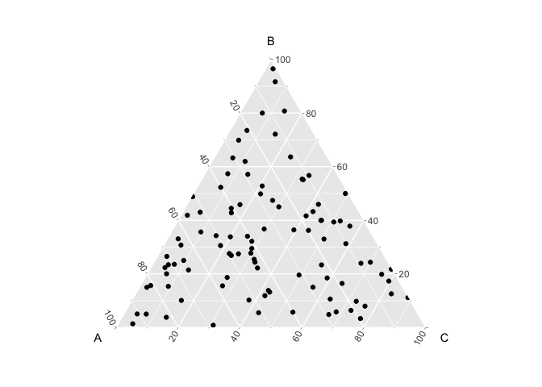

If ***α*** is \> 1, then the multinomial distributions become centered
in the simplex, which means that they tend to have equal probability of
all three cell-types

``` r
set.seed(888)

alpha <- 10 ## Dirichlet shape parameter
pixels <- 100 ## i.e., number of draws
K <- 3 ## number of cell-types, i.e., number of dimensions

x <- MCMCpack::rdirichlet(pixels, rep(alpha, K))
colnames(x) <- LETTERS[1:K]
dat <- as.data.frame(x)
head(dat)
```

    ##           A         B         C
    ## 1 0.6018716 0.2158573 0.1822711
    ## 2 0.1741015 0.4102815 0.4156170
    ## 3 0.3489248 0.2775204 0.3735548
    ## 4 0.4025727 0.3427215 0.2547057
    ## 5 0.2057593 0.2783482 0.5158925
    ## 6 0.2881756 0.2905016 0.4213228

``` r
plt <- ggtern::ggtern(data = dat, ggplot2::aes(x = A, y = B, z = C))

plt + ggplot2::geom_point()
```

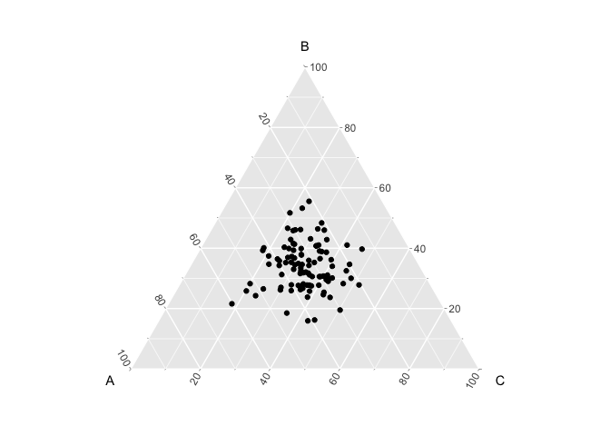

In this example, let’s visualize the probability of each cell-type for
the first 10 pixels:

``` r
set.seed(888)

alpha <- 10 ## Dirichlet shape parameter
pixels <- 10 ## i.e., number of draws
K <- 3 ## number of cell-types, i.e., number of dimensions

x <- MCMCpack::rdirichlet(pixels, rep(alpha, K))

dat2 <- data.frame(item = factor(rep(1:K, pixels)), 
                   draw = factor(rep(1:pixels, each = K)), 
                   value = as.vector(t(x))
                   )

ggplot2::ggplot(data = dat2,
                ggplot2::aes(x=item, y=value, ymin=0, ymax=value)) + 
                ggplot2::geom_point(colour=I("blue"))       + 
                ggplot2::geom_linerange(colour=I("blue"))   + 
                ggplot2::facet_wrap(~draw, ncol=5)          + 
                ggplot2::scale_y_continuous(lim=c(0,1))     +
                ggplot2::theme(panel.border = ggplot2::element_rect(fill=0, colour="black")) +
                ggplot2::scale_x_discrete(labels=c("1" = "A", "2" = "B", "3" = "C")) +
                ggplot2::labs(x = "Cell-type", y = "probability", title = "Cell-type probability distribution of each pixel")
```

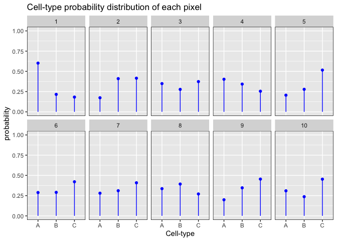

We can see that the cell-type probabilities are relatively the same
within and between pixels.

If ***α*** \< 1, then the multinomial distributions become concentrated
towards the edges of the simplex.

``` r
set.seed(888)

alpha <- 0.1 ## Dirichlet shape parameter
pixels <- 100 ## i.e., number of draws
K <- 3 ## number of cell-types, i.e., number of dimensions

x <- MCMCpack::rdirichlet(pixels, rep(alpha, K))
colnames(x) <- LETTERS[1:K]
dat <- as.data.frame(x)
head(dat)
```

    ##              A            B            C
    ## 1 1.649651e-15 1.051135e-11 1.000000e+00
    ## 2 1.000000e+00 9.310912e-10 7.633010e-15
    ## 3 1.602978e-01 8.086178e-01 3.108447e-02
    ## 4 5.071938e-02 2.610649e-05 9.492545e-01
    ## 5 9.999947e-01 1.721919e-15 5.326931e-06
    ## 6 9.948597e-01 5.140343e-03 3.819135e-14

``` r
plt <- ggtern::ggtern(data = dat, ggplot2::aes(x = A, y = B, z = C))

plt + ggplot2::geom_point()
```

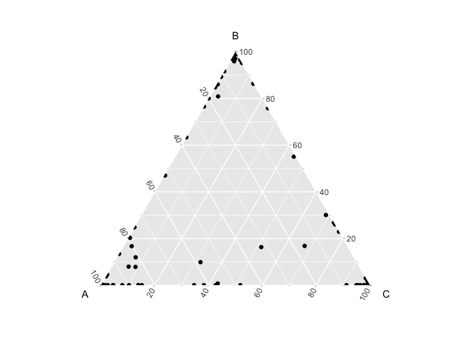

Now when we look at the probability distributions of the first 10
pixels, we see that each pixel is enriched for a given cell-type at
different probabilities.

``` r
set.seed(888)

alpha <- 0.1 ## Dirichlet shape parameter
pixels <- 10 ## i.e., number of draws
K <- 3 ## number of cell-types, i.e., number of dimensions

x <- MCMCpack::rdirichlet(pixels, rep(alpha, K))

dat2 <- data.frame(item = factor(rep(1:K, pixels)), 
                   draw = factor(rep(1:pixels, each = K)), 
                   value = as.vector(t(x))
                   )

ggplot2::ggplot(data = dat2,
                ggplot2::aes(x=item, y=value, ymin=0, ymax=value)) + 
                ggplot2::geom_point(colour=I("blue"))       + 
                ggplot2::geom_linerange(colour=I("blue"))   + 
                ggplot2::facet_wrap(~draw, ncol=5)          + 
                ggplot2::scale_y_continuous(lim=c(0,1))     +
                ggplot2::theme(panel.border = ggplot2::element_rect(fill=0, colour="black")) +
                ggplot2::scale_x_discrete(labels=c("1" = "A", "2" = "B", "3" = "C")) +
                ggplot2::labs(x = "Cell-type", y = "probability", title = "Cell-type probability distribution of each pixel")
```

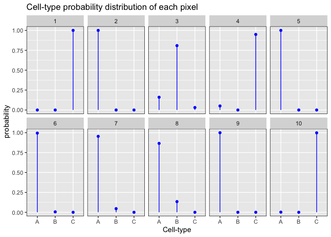

This fits with our assumption that the proportional distribution of
cell-types across pixels is heterogeneous within tissues profiled by ST
such that some pixels will have more of one cell-type and other pixels
will have more of another cell-type.

If we expand our example to a scenario in which we have 10 cell-types,
we can see more clearly that when ***α*** \> 1, each pixel is predicted
to have an equal proportion of each cell-type, in which case the model
is unable to deconvolve distinct cell-types in the pixels, compared to
models where ***α*** \< 1, and we are able to recover distinct
cell-types in the pixels.

``` r
set.seed(888)

alpha <- 10 ## Dirichlet shape parameter
pixels <- 10 ## i.e., number of draws
K <- 10 ## number of cell-types, i.e., number of dimensions

x <- MCMCpack::rdirichlet(pixels, rep(alpha, K))

dat2 <- data.frame(item = factor(rep(1:K, pixels)), 
                   draw = factor(rep(1:pixels, each = K)), 
                   value = as.vector(t(x))
                   )

ggplot2::ggplot(data = dat2,
                ggplot2::aes(x=item, y=value, ymin=0, ymax=value)) + 
                ggplot2::geom_point(colour=I("blue"))       + 
                ggplot2::geom_linerange(colour=I("blue"))   + 
                ggplot2::facet_wrap(~draw, ncol=5)          + 
                ggplot2::scale_y_continuous(lim=c(0,1))     +
                ggplot2::theme(panel.border = ggplot2::element_rect(fill=0, colour="black")) +
                ggplot2::labs(x = "Cell-type", y = "probability", title = "Cell-type probability distribution of each pixel")
```

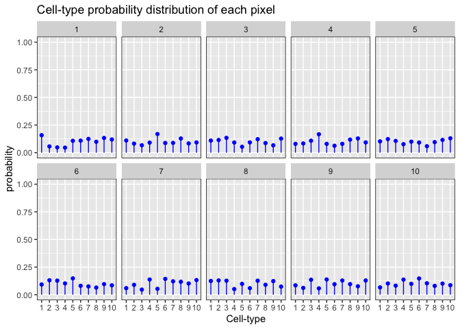

``` r
set.seed(888)

alpha <- 0.1 ## Dirichlet shape parameter
pixels <- 10 ## i.e., number of draws
K <- 10 ## number of cell-types, i.e., number of dimensions

x <- MCMCpack::rdirichlet(pixels, rep(alpha, K))

dat2 <- data.frame(item = factor(rep(1:K, pixels)), 
                   draw = factor(rep(1:pixels, each = K)), 
                   value = as.vector(t(x))
                   )

ggplot2::ggplot(data = dat2,
                ggplot2::aes(x=item, y=value, ymin=0, ymax=value)) + 
                ggplot2::geom_point(colour=I("blue"))       + 
                ggplot2::geom_linerange(colour=I("blue"))   + 
                ggplot2::facet_wrap(~draw, ncol=5)          + 
                ggplot2::scale_y_continuous(lim=c(0,1))     +
                ggplot2::theme(panel.border = ggplot2::element_rect(fill=0, colour="black")) +
                ggplot2::labs(x = "Cell-type", y = "probability", title = "Cell-type probability distribution of each pixel")
```

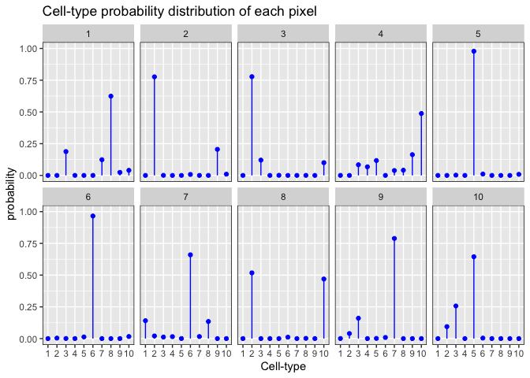

Therefore, when choosing an optimal model for a given *K*, we also want
models in which ***α*** \< 1. When fitting LDA models, `STdeconvolve`
not only tracks the perplexity and % of rare cell-types, but will also
indicate to users models in which ***α*** \> 1 by shading them out on
the plot returned by `fitLDA()`.

# `STdeconvolve` failures

## model where ***α*** \> 1

To illustrate the above point, let’s fit several LDA models to the `mOB`
test data that result in some models with an ***α*** \> 1.

An ***α*** \> 1 is indicates that the LDA was not able to deconvolve
distinct cell-types in the pixels. The most likely reason for this is
that the selected features (genes) included in the input dataset were
not sufficient to distinguish between transcirptionally distinct
cell-types.

To illustrate this point, let’s create an input dataset just using
randomly sampled genes. Here, we are not selecting for overdispersed
genes as a means to detect cell-type specific transcriptional profiles.
We do not expect the random genes to provide enough information for the
model to identify latent cell-types (i.e., non-overlapping groups of
co-expressed, or frequently co-occurring, genes) in different pixels.

``` r
library(STdeconvolve)
data(mOB)
pos <- mOB$pos
cd <- mOB$counts
annot <- mOB$annot
```

``` r
set.seed(888)

## filter genes
counts <- cleanCounts(counts = cd,
                      min.lib.size = 100,
                      min.reads = 1,
                      min.detected = 1,
                      plot = FALSE)

## random genes
genes <- sample(x = rownames(as.matrix(counts)), size = 100)

## build corpus using just the selected genes
mobCorpus2 <- preprocess(t(cd),
                       selected.genes = genes,
                       # can then proceed to filter this list, if desired
                       # min.reads = 1, 
                       min.lib.size = 1, # can still filter pixels
                       min.detected = 1, # can still filter to make sure the selected genes are present in at least 1 pixel
                       ODgenes = FALSE, # don't select the over dispersed genes
                       verbose = FALSE)
```

    ## Final corpus:

    ## A 260x100 simple triplet matrix.

    ## Preprocess complete.

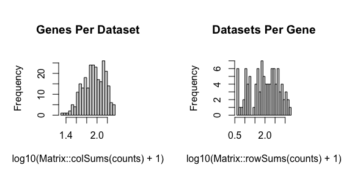

``` r
## fit LDA models to the corpus
ks <- seq(from = 2, to = 12, by = 1) # range of K's to fit LDA models with given the input corpus
ldas <- fitLDA(as.matrix(mobCorpus2$corpus),
               Ks = ks,
               ncores = parallel::detectCores(logical = TRUE) - 1, # number of cores to fit LDA models in parallel
               plot=TRUE, verbose=TRUE)
```

    ## Warning in serialize(data, node$con): 'package:stats' may not be available
    ## when loading

    ## Warning in serialize(data, node$con): 'package:stats' may not be available
    ## when loading

    ## Warning in serialize(data, node$con): 'package:stats' may not be available
    ## when loading

    ## Warning in serialize(data, node$con): 'package:stats' may not be available
    ## when loading

    ## Warning in serialize(data, node$con): 'package:stats' may not be available
    ## when loading

    ## Warning in serialize(data, node$con): 'package:stats' may not be available
    ## when loading

    ## Warning in serialize(data, node$con): 'package:stats' may not be available
    ## when loading

    ## Time to fit LDA models was 0.11 mins

    ## Computing perplexity for each fitted model...

    ## Warning in serialize(data, node$con): 'package:stats' may not be available
    ## when loading

    ## Warning in serialize(data, node$con): 'package:stats' may not be available
    ## when loading

    ## Warning in serialize(data, node$con): 'package:stats' may not be available
    ## when loading

    ## Warning in serialize(data, node$con): 'package:stats' may not be available
    ## when loading

    ## Warning in serialize(data, node$con): 'package:stats' may not be available
    ## when loading

    ## Warning in serialize(data, node$con): 'package:stats' may not be available
    ## when loading

    ## Warning in serialize(data, node$con): 'package:stats' may not be available
    ## when loading

    ## Time to compute perplexities was 0.17 mins

    ## Getting predicted cell-types at low proportions...

    ## Time to compute cell-types at low proportions was 0 mins

    ## Plotting...

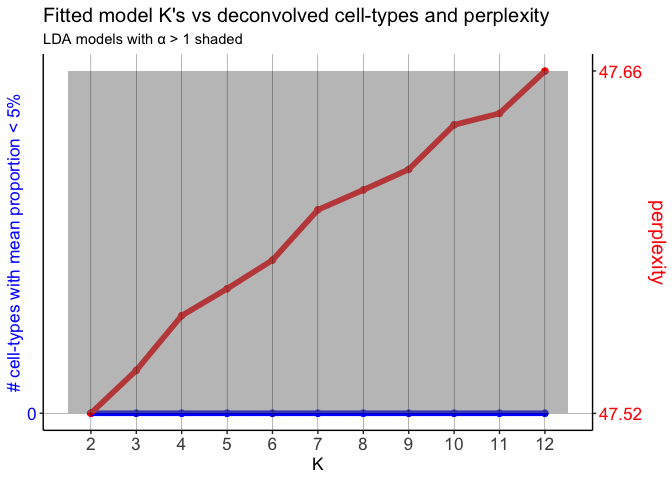

Here, the LDA models have ***α***’s \> 1.

We can obtain the ***α***’s for each model via:

``` r
unlist(sapply(ldas$models, slot, "alpha"))
```

    ##         2         3         4         5         6         7         8 
    ##  80.18376 141.21467 137.74855 141.81926 137.81350 124.85134 122.69297 
    ##         9        10        11        12 
    ## 119.42429 109.37748 108.52553 100.51034

Let’s check out the results for *K* = 12.

``` r
optLDA <- optimalModel(models = ldas, opt = 12)
results <- getBetaTheta(optLDA, perc.filt = 0.05, betaScale = 1000)
```

    ## Filtering out cell-types in pixels that contribute less than 0.05 of the pixel proportion.

``` r
deconProp <- results$theta
deconGexp <- results$beta
vizAllTopics(deconProp, pos, r=0.4, lwd = 0.1)
```

    ## Plotting scatterpies for 260 pixels with 12 cell-types...this could take a while if the dataset is large.

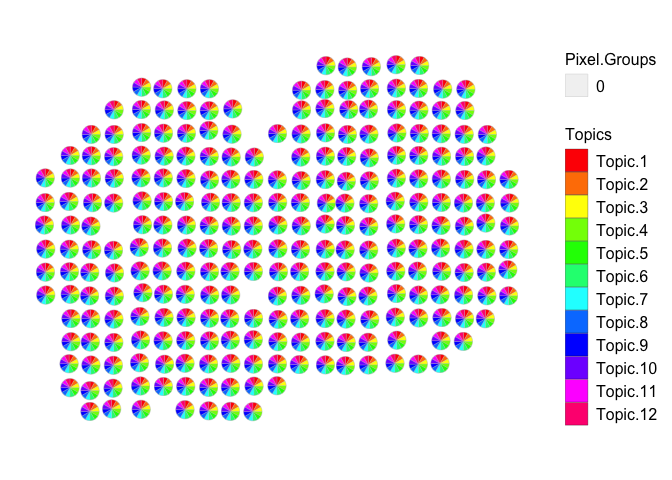

As expected, using only random genes did not provide enough information
for the model to identify latent cell-types (i.e., non-overlapping
groups of co-expressed, or frequently co-occurring, genes) in the
pixels. As a result, the ***α***’s are very large for all of the fitted
LDA models. `STdeconvolve` indicates this by shading the models for
which ***α*** \> 1. Again, note that the cell-type distributions are
uniform in the pixels.

Instead, let’s try fitting LDA models using feature selected
overdispersed genes to serve as a proxy for identifying cell-type
transcriptional profiles. We will limit the overdispersed genes to the
top 100 to be consistent with the number of randomly selected genes.

``` r
counts <- cleanCounts(counts = cd,
                      min.lib.size = 100,
                      min.reads = 1,
                      min.detected = 1,
                      plot = FALSE)

odGenes <- getOverdispersedGenes(as.matrix(counts),
                      gam.k=5,
                      alpha=0.05,
                      plot=FALSE,
                      use.unadjusted.pvals=FALSE,
                      do.par=TRUE,
                      max.adjusted.variance=1e3,
                      min.adjusted.variance=1e-3,
                      verbose=FALSE, details=FALSE)

# limit the number of overdispersed genes when building the input corpus
genes <- odGenes[1:100]

## build corpus using just the selected genes
mobCorpus2 <- preprocess(t(cd),
                       selected.genes = genes,
                       # can then proceed to filter this list, if desired
                       # min.reads = 1, 
                       min.lib.size = 1, # can still filter pixels
                       min.detected = 1, # can still filter to make sure the selected genes are present in at least 1 pixel
                       ODgenes = FALSE, # don't select the over dispersed genes
                       verbose = FALSE)
```

    ## Final corpus:

    ## A 260x100 simple triplet matrix.

    ## Preprocess complete.

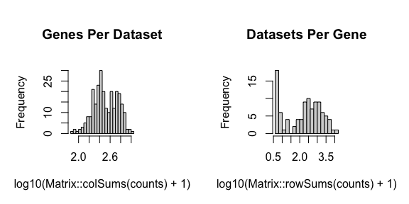

``` r
## fit LDA models to the corpus
ks <- seq(from = 2, to = 12, by = 1) # range of K's to fit LDA models with given the input corpus
ldas <- fitLDA(as.matrix(mobCorpus2$corpus),
               Ks = ks,
               ncores = parallel::detectCores(logical = TRUE) - 1, # number of cores to fit LDA models in parallel
               plot=TRUE, verbose=TRUE)
```

    ## Warning in serialize(data, node$con): 'package:stats' may not be available
    ## when loading

    ## Warning in serialize(data, node$con): 'package:stats' may not be available
    ## when loading

    ## Warning in serialize(data, node$con): 'package:stats' may not be available
    ## when loading

    ## Warning in serialize(data, node$con): 'package:stats' may not be available
    ## when loading

    ## Warning in serialize(data, node$con): 'package:stats' may not be available
    ## when loading

    ## Warning in serialize(data, node$con): 'package:stats' may not be available
    ## when loading

    ## Warning in serialize(data, node$con): 'package:stats' may not be available
    ## when loading

    ## Time to fit LDA models was 0.4 mins

    ## Computing perplexity for each fitted model...

    ## Warning in serialize(data, node$con): 'package:stats' may not be available
    ## when loading

    ## Warning in serialize(data, node$con): 'package:stats' may not be available
    ## when loading

    ## Warning in serialize(data, node$con): 'package:stats' may not be available
    ## when loading

    ## Warning in serialize(data, node$con): 'package:stats' may not be available
    ## when loading

    ## Warning in serialize(data, node$con): 'package:stats' may not be available
    ## when loading

    ## Warning in serialize(data, node$con): 'package:stats' may not be available
    ## when loading

    ## Warning in serialize(data, node$con): 'package:stats' may not be available
    ## when loading

    ## Time to compute perplexities was 0.16 mins

    ## Getting predicted cell-types at low proportions...

    ## Time to compute cell-types at low proportions was 0 mins

    ## Plotting...

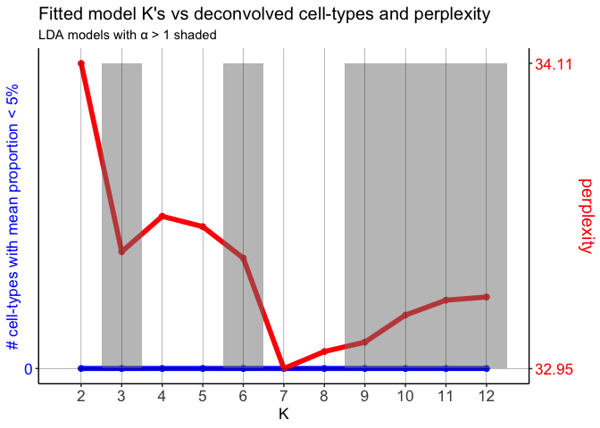

``` r
unlist(sapply(ldas$models, slot, "alpha"))
```

    ##         2         3         4         5         6         7         8 
    ## 0.9233002 1.0155469 0.9646652 0.9967726 1.0883712 0.9445329 0.9750063 
    ##         9        10        11        12 
    ## 1.0340109 1.0559614 1.1231159 1.1946524

Here, let’s choose the model *K* = 7, because it has the lowest
perplexity, number of rare cell-types is 0, and the ***α*** \< 1.

``` r
optLDA <- optimalModel(models = ldas, opt = 7)
results <- getBetaTheta(optLDA, perc.filt = 0.05, betaScale = 1000)
```

    ## Filtering out cell-types in pixels that contribute less than 0.05 of the pixel proportion.

``` r
deconProp <- results$theta
deconGexp <- results$beta
vizAllTopics(deconProp, pos, r=0.4, lwd = 0.1)
```

    ## Plotting scatterpies for 260 pixels with 7 cell-types...this could take a while if the dataset is large.

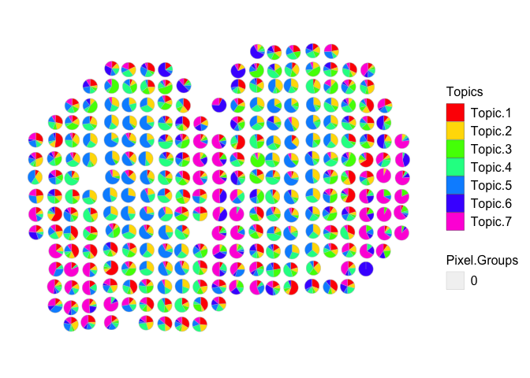

Now we are able to see distinct cell-types across the pixels.
Importantly, most pixels are enriched for just a few cell-types, as we
would expect.
