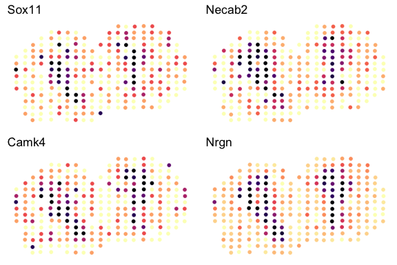
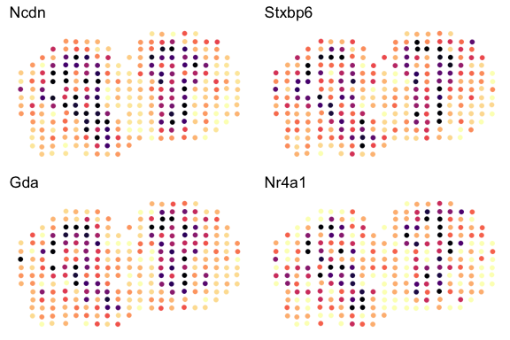

Load package

``` r
library(STdeconvolve)
```

Load built in data

``` r
data(mOB)
pos <- mOB$pos
cd <- mOB$counts
annot <- mOB$annot
```

Feature select

``` r
## remove pixels with too few genes
counts <- cleanCounts(cd)
```

    ## Converting to sparse matrix ...

    ## Filtering matrix with 262 cells and 15928 genes ...

    ## Resulting matrix has 260 cells and 14828 genes


``` r
## feature select for genes
corpus <- restrictCorpus(counts, t1=0.05, t2 = 1)
```

    ## [1] "Restricting to overdispersed genes with alpha=0.05..."
    ## [1] "Calculating variance fit ..."
    ## [1] "Using gam with k=5..."
    ## [1] "345 overdispersed genes ... "
    ## [1] "Removing 81 genes present in less than 5% of datasets..."
    ## [1] "Removing 16 genes present in more than 100% of datasets..."
    ## [1] "248 genes remaining..."

Choose optimal number of cell-types

``` r
lda <- fitLDA(corpus, Ks = seq(2, 9, by = 1), plot=TRUE, verbose=FALSE)
```


Get best model results

``` r
results <- getBetaTheta(lda$models[[lda$kOpt2]])
deconProp <- results$theta
deconGexp <- results$beta*1000
```

Visualize deconvolved cell-type proportions

``` r
vizAllTopics(deconProp, pos, 
             groups = annot, 
             group_cols = rainbow(length(levels(annot))),
             r=0.4)
```


Visualize deconvolved cell-type gene expression

``` r
celltype <- 7
highgexp <- names(which(deconGexp[celltype,] > 5))
log2fc <- sort(log2(deconGexp[celltype,highgexp]/colMeans(deconGexp[-celltype,highgexp])), decreasing=TRUE)
markers <- names(log2fc)[1:4]

df <- merge(as.data.frame(pos), 
            as.data.frame(t(as.matrix(counts[markers,]))), 
            by = 0)
ps <- lapply(markers, function(marker) {
  vizGeneCounts(df = df,
              gene = marker,
              size = 2, stroke = 0.1,
              plotTitle = marker,
              winsorize = 0.05)
})
gridExtra::grid.arrange(
  grobs = ps,
  layout_matrix = rbind(c(1, 2),
                        c(3, 4))
)
```



``` r
celltype <- 2
highgexp <- names(which(deconGexp[celltype,] > 5))
log2fc <- sort(log2(deconGexp[celltype,highgexp]/colMeans(deconGexp[-celltype,highgexp])), decreasing=TRUE)
markers <- names(log2fc)[1:4]

df <- merge(as.data.frame(pos), 
            as.data.frame(t(as.matrix(counts[markers,]))), 
            by = 0)
ps <- lapply(markers, function(marker) {
  vizGeneCounts(df = df,
              gene = marker,
              size = 2, stroke = 0.1,
              plotTitle = marker,
              winsorize = 0.05)
})
gridExtra::grid.arrange(
  grobs = ps,
  layout_matrix = rbind(c(1, 2),
                        c(3, 4))
)
```


