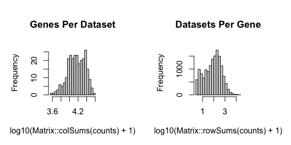
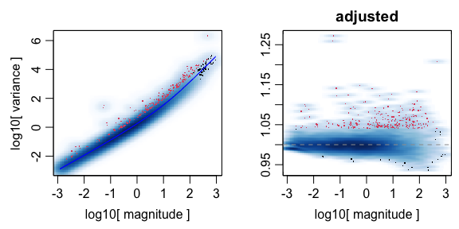
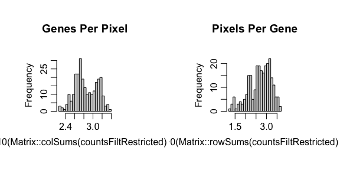
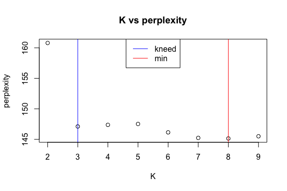
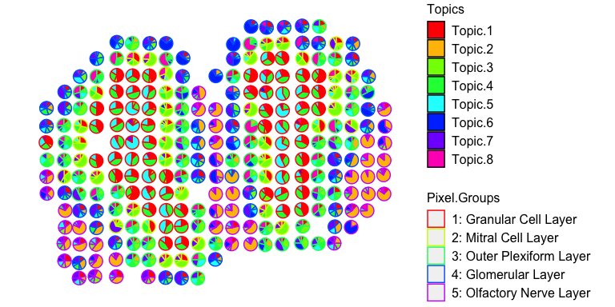
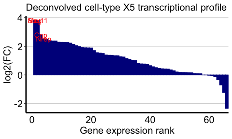
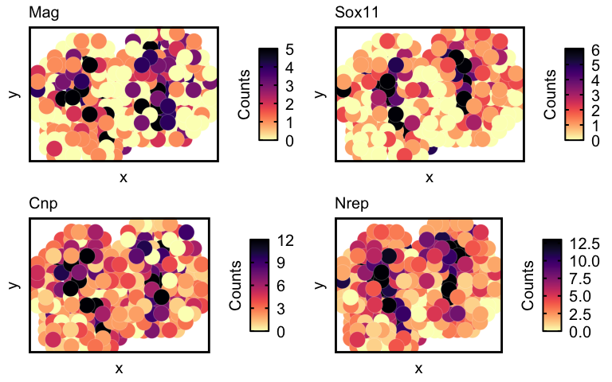
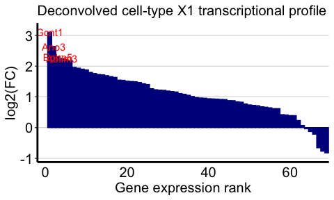
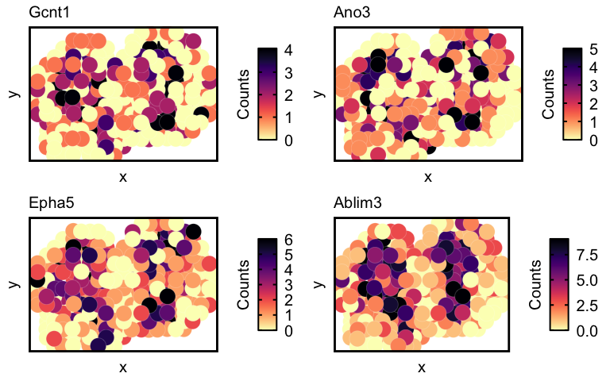

In this tutorial, we will walk through some of the main functionalities
of `STdeconvolve`.

``` r
library(STdeconvolve)
```

Given a counts matrix from pixel-resolution spatial transcriptomics data
where each spatially resolved measurement may represent mixtures from
potentially multiple cell-types, STdeconvolve infers the putative
transcriptomic profiles of cell-types and their proportional
representation within each multi-cellular spatially resolved pixel. Such
a pixel-resolution spatial transcriptomics dataset of the mouse
olfactory bulb is built in and can be loaded.

``` r
data(mOB)
pos <- mOB$pos ## x and y positions of each pixel
cd <- mOB$counts ## matrix of gene counts in each pixel
annot <- mOB$annot ## annotated tissue layers assigned to each pixel
```

`STdeconvolve` first feature selects for genes most likely to be
relevant for distinguishing between cell-types by looking for highly
overdispersed genes across ST pixels. Pixels with too few genes or genes
with too few reads can also be removed.

``` r
## remove pixels with too few genes
counts <- cleanCounts(counts = cd,
                      min.lib.size = 100,
                      min.reads = 1,
                      min.detected = 1,
                      verbose = TRUE)
```

    ## Converting to sparse matrix ...

    ## Filtering matrix with 262 cells and 15928 genes ...

    ## Resulting matrix has 260 cells and 14828 genes



``` r
## feature select for genes
corpus <- restrictCorpus(counts,
                         removeAbove = 1.0,
                         removeBelow = 0.05,
                         alpha = 0.05,
                         plot = TRUE,
                         verbose = TRUE)
```

    ## [1] "Removing 124 genes present in 100% or more of pixels..."
    ## [1] "14704 genes remaining..."
    ## [1] "Removing 3009 genes present in 5% or less of pixels..."
    ## [1] "11695 genes remaining..."
    ## [1] "Restricting to overdispersed genes with alpha = 0.05..."
    ## [1] "Calculating variance fit ..."
    ## [1] "Using gam with k=5..."
    ## [1] "232 overdispersed genes ... "



    ##  Using top 1000 overdispersed genes. 
    ##  number of top overdispersed genes available: 232



`STdeconvolve` then applies latent Dirichlet allocation (LDA), a
generative statistical model commonly used in natural language
processing, to discover `K` latent cell-types. `STdeconvolve` fits a
range of LDA models to inform the choice of an optimal `K`.

``` r
## Note: the input corpus needs to be an integer count matrix of pixels x genes
ldas <- fitLDA(t(as.matrix(corpus)), Ks = seq(2, 9, by = 1),
               perc.rare.thresh = 0.05,
               plot=TRUE,
               verbose=TRUE)
```

    ## Warning in serialize(data, node$con): 'package:stats' may not be available when
    ## loading

    ## Warning in serialize(data, node$con): 'package:stats' may not be available when
    ## loading

    ## Warning in serialize(data, node$con): 'package:stats' may not be available when
    ## loading

    ## Warning in serialize(data, node$con): 'package:stats' may not be available when
    ## loading

    ## Warning in serialize(data, node$con): 'package:stats' may not be available when
    ## loading

    ## Warning in serialize(data, node$con): 'package:stats' may not be available when
    ## loading

    ## Warning in serialize(data, node$con): 'package:stats' may not be available when
    ## loading

    ## [1] "Time to fit LDA models was 0.44mins"
    ## [1] "Computing perplexity for each fitted model..."

    ## Warning in serialize(data, node$con): 'package:stats' may not be available when
    ## loading

    ## Warning in serialize(data, node$con): 'package:stats' may not be available when
    ## loading

    ## Warning in serialize(data, node$con): 'package:stats' may not be available when
    ## loading

    ## Warning in serialize(data, node$con): 'package:stats' may not be available when
    ## loading

    ## Warning in serialize(data, node$con): 'package:stats' may not be available when
    ## loading

    ## Warning in serialize(data, node$con): 'package:stats' may not be available when
    ## loading

    ## Warning in serialize(data, node$con): 'package:stats' may not be available when
    ## loading

    ## [1] "Time to compute perplexities was 0.17mins"
    ## [1] "Getting predicted cell-types at low proportions..."
    ## [1] "Time to compute cell-types at low proportions was 0mins"
    ## [1] "Plotting..."



In this example, we will use the model with the lowest model perplexity.

The shaded region indicates where a fitted model for a given K had an
`alpha` \> 1. `alpha` is an LDA parameter that is solved for during
model fitting and corresponds to the shape parameter of a symmetric
Dirichlet distribution. In the model, this Dirichlet distribution
describes the cell-type proportions in the pixels. A symmetric Dirichlet
with alpha \> 1 would lead to more uniform cell-type distributions in
the pixels and difficulty identifying distinct cell-types. Instead, we
want models with alphas \< 1, resulting in sparse distributions where
only a few cell-types are represented in a given pixel.

The resulting `theta` matrix can be interpreted as the proportion of
each deconvolved cell-type across each spatially resolved pixel. The
resulting `beta` matrix can be interpreted as the putative gene
expression profile for each deconvolved cell-type normalized to a
library size of 1. This `beta` matrix can be scaled by a depth factor
(ex. 1000) for interpretability.

``` r
## select model with minimum perplexity
optLDA <- optimalModel(models = ldas, opt = "min")

## extract pixel cell-type proportions (theta) and cell-type gene expression profiles (beta) for the given dataset
## we can also remove cell-types from pixels that contribute less than 5% of the pixel proportion
## and scale the deconvolved transcriptional profiles by 1000 
results <- getBetaTheta(optLDA,
                        perc.filt = 0.05,
                        betaScale = 1000)
```

    ## Filtering out cell-types in pixels that contribute less than 0.05 of the pixel proportion.

``` r
deconProp <- results$theta
deconGexp <- results$beta
```

We can now visualize the proportion of each deconvolved cell-type across
the original spatially resolved pixels.

``` r
vizAllTopics(deconProp, pos, 
             groups = annot, 
             group_cols = rainbow(length(levels(annot))),
             r=0.4)
```

    ## Plotting scatterpies for 260 pixels with 8 cell-types...this could take a while if the dataset is large.



We can also visualize the top marker genes for each deconvolved
cell-type. We will use deconvolved cell-types `5` and `1` as examples
here. We will define the top marker genes here as genes highly expressed
in the deconvolved cell-type (count \> 5) that also have the top 4
highest log2(fold change) when comparing the deconvolved cell-type’s
expression profile to the average of all other deconvolved cell-types’
expression profiles.

``` r
celltype <- 5
## highly expressed in cell-type of interest
highgexp <- names(which(deconGexp[celltype,] > 5))
## high log2(fold-change) compared to other deconvolved cell-types
log2fc <- sort(log2(deconGexp[celltype,highgexp]/colMeans(deconGexp[-celltype,highgexp])), decreasing=TRUE)
markers <- names(log2fc)[1:4]

# -----------------------------------------------------
## visualize the transcriptional profile
dat <- data.frame(values = as.vector(log2fc), genes = names(log2fc), order = seq(length(log2fc)))
# Hide all of the text labels.
dat$selectedLabels <- ""
dat$selectedLabels[1:4] <- markers

plt <- ggplot2::ggplot(data = dat) +
  ggplot2::geom_col(ggplot2::aes(x = order, y = values,
                                 fill = factor(selectedLabels == ""),
                                 color = factor(selectedLabels == "")), width = 1) +
  
  ggplot2::scale_fill_manual(values = c(STdeconvolve::transparentCol("darkblue", percent = 0),
                                        STdeconvolve::transparentCol("darkblue", percent = 0)
                                        )) +
  ggplot2::scale_color_manual(values = c(STdeconvolve::transparentCol("darkblue", percent = 0),
                                         STdeconvolve::transparentCol("darkblue", percent = 0)
                                         )) +
  
  ggplot2::scale_y_continuous(expand = c(0, 0), limits = c(min(log2fc) - 0.3, max(log2fc) + 0.3)) +
  ggplot2::scale_x_continuous(expand = c(0, 0), limits = c(-2, NA)) +
  
  ggplot2::labs(title = "Deconvolved cell-type X5 transcriptional profile",
                x = "Gene expression rank",
                y = "log2(FC)") +
  
  ggplot2::geom_text(ggplot2::aes(x = order, y = values, label = selectedLabels), color = "red") +
  
  ggplot2::theme_classic() +
  ggplot2::theme(axis.text.x = ggplot2::element_text(size=15, color = "black"),
                 axis.text.y = ggplot2::element_text(size=15, color = "black"),
                 axis.title.y = ggplot2::element_text(size=15, color = "black"),
                 axis.title.x = ggplot2::element_text(size=15, color = "black"),
                 axis.ticks.x = ggplot2::element_blank(),
                 plot.title = ggplot2::element_text(size=15),
                 legend.text = ggplot2::element_text(size = 15, colour = "black"),
                 legend.title = ggplot2::element_text(size = 15, colour = "black", angle = 90),
                 panel.background = ggplot2::element_blank(),
                 plot.background = ggplot2::element_blank(),
                 panel.grid.major.y = ggplot2::element_line(size = 0.3, colour = STdeconvolve::transparentCol("gray80", percent = 0)),
                 axis.line = ggplot2::element_line(size = 1, colour = "black"),
                 legend.position="none"
                 )
plt
```



Now lets visualize the spatial expression of the top 4 genes.

``` r
## visualize spatial expression of top genes
df <- merge(as.data.frame(pos), 
            as.data.frame(t(as.matrix(counts[markers,]))), 
            by = 0)
ps <- lapply(markers, function(marker) {
  vizGeneCounts(df = df,
              gene = marker,
              # groups = annot,
              # group_cols = rainbow(length(levels(annot))),
              size = 7, stroke = 0.1,
              plotTitle = marker,
              winsorize = 0.05,
              showLegend = TRUE) +
    
    ## remove the pixel "groups", which is the color aesthetic for the pixel borders
    ggplot2::guides(colour = FALSE) +
    
    ## change some plot aesthetics
    ggplot2::theme(axis.text.x = ggplot2::element_text(size=0, color = "black", hjust = 0, vjust = 0.5),
                   axis.text.y = ggplot2::element_text(size=0, color = "black"),
                   axis.title.y = ggplot2::element_text(size=15),
                   axis.title.x = ggplot2::element_text(size=15),
                   plot.title = ggplot2::element_text(size=15),
                   legend.text = ggplot2::element_text(size = 15, colour = "black"),
                   legend.title = ggplot2::element_text(size = 15, colour = "black", angle = 90),
                   panel.background = ggplot2::element_blank(),
                   ## border around plot
                   panel.border = ggplot2::element_rect(fill = NA, color = "black", size = 2),
                   plot.background = ggplot2::element_blank()
                   ) +
    ggplot2::guides(fill = ggplot2::guide_colorbar(title = "Counts",
                                                   title.position = "left",
                                                   title.hjust = 0.5,
                                                   ticks.colour = "black",
                                                   ticks.linewidth = 2,
                                                   frame.colour= "black",
                                                   frame.linewidth = 2,
                                                   label.hjust = 0
                                                   ))
})
```

    ## Warning: `guides(<scale> = FALSE)` is deprecated. Please use `guides(<scale> =
    ## "none")` instead.

    ## Warning: `guides(<scale> = FALSE)` is deprecated. Please use `guides(<scale> =
    ## "none")` instead.

    ## Warning: `guides(<scale> = FALSE)` is deprecated. Please use `guides(<scale> =
    ## "none")` instead.

    ## Warning: `guides(<scale> = FALSE)` is deprecated. Please use `guides(<scale> =
    ## "none")` instead.

``` r
gridExtra::grid.arrange(
  grobs = ps,
  layout_matrix = rbind(c(1, 2),
                        c(3, 4))
)
```



And now for cell-type 1:

``` r
celltype <- 1
## highly expressed in cell-type of interest
highgexp <- names(which(deconGexp[celltype,] > 5))
## high log2(fold-change) compared to other deconvolved cell-types
log2fc <- sort(log2(deconGexp[celltype,highgexp]/colMeans(deconGexp[-celltype,highgexp])), decreasing=TRUE)
markers <- names(log2fc)[1:4]

# -----------------------------------------------------
## visualize the transcriptional profile
dat <- data.frame(values = as.vector(log2fc), genes = names(log2fc), order = seq(length(log2fc)))
# Hide all of the text labels.
dat$selectedLabels <- ""
dat$selectedLabels[1:4] <- markers

plt <- ggplot2::ggplot(data = dat) +
  ggplot2::geom_col(ggplot2::aes(x = order, y = values,
                                 fill = factor(selectedLabels == ""),
                                 color = factor(selectedLabels == "")), width = 1) +
  
  ggplot2::scale_fill_manual(values = c(STdeconvolve::transparentCol("darkblue", percent = 0),
                                        STdeconvolve::transparentCol("darkblue", percent = 0)
                                        )) +
  ggplot2::scale_color_manual(values = c(STdeconvolve::transparentCol("darkblue", percent = 0),
                                         STdeconvolve::transparentCol("darkblue", percent = 0)
                                         )) +
  
  ggplot2::scale_y_continuous(expand = c(0, 0), limits = c(min(log2fc) - 0.3, max(log2fc) + 0.3)) +
  ggplot2::scale_x_continuous(expand = c(0, 0), limits = c(-2, NA)) +
  
  ggplot2::labs(title = "Deconvolved cell-type X5 transcriptional profile",
                x = "Gene expression rank",
                y = "log2(FC)") +
  
  ggplot2::geom_text(ggplot2::aes(x = order, y = values, label = selectedLabels), color = "red") +
  
  ggplot2::theme_classic() +
  ggplot2::theme(axis.text.x = ggplot2::element_text(size=15, color = "black"),
                 axis.text.y = ggplot2::element_text(size=15, color = "black"),
                 axis.title.y = ggplot2::element_text(size=15, color = "black"),
                 axis.title.x = ggplot2::element_text(size=15, color = "black"),
                 axis.ticks.x = ggplot2::element_blank(),
                 plot.title = ggplot2::element_text(size=15),
                 legend.text = ggplot2::element_text(size = 15, colour = "black"),
                 legend.title = ggplot2::element_text(size = 15, colour = "black", angle = 90),
                 panel.background = ggplot2::element_blank(),
                 plot.background = ggplot2::element_blank(),
                 panel.grid.major.y = ggplot2::element_line(size = 0.3, colour = STdeconvolve::transparentCol("gray80", percent = 0)),
                 axis.line = ggplot2::element_line(size = 1, colour = "black"),
                 legend.position="none"
                 )
plt
```



And the spatial expression of the top genes:

``` r
## visualize spatial expression of top genes
df <- merge(as.data.frame(pos), 
            as.data.frame(t(as.matrix(counts[markers,]))), 
            by = 0)
ps <- lapply(markers, function(marker) {
  vizGeneCounts(df = df,
              gene = marker,
              # groups = annot,
              # group_cols = rainbow(length(levels(annot))),
              size = 7, stroke = 0.1,
              plotTitle = marker,
              winsorize = 0.05,
              showLegend = TRUE) +
    
    ## remove the pixel "groups", which is the color aesthetic for the pixel borders
    ggplot2::guides(colour = FALSE) +
    
    ## change some plot aesthetics
    ggplot2::theme(axis.text.x = ggplot2::element_text(size=0, color = "black", hjust = 0, vjust = 0.5),
                   axis.text.y = ggplot2::element_text(size=0, color = "black"),
                   axis.title.y = ggplot2::element_text(size=15),
                   axis.title.x = ggplot2::element_text(size=15),
                   plot.title = ggplot2::element_text(size=15),
                   legend.text = ggplot2::element_text(size = 15, colour = "black"),
                   legend.title = ggplot2::element_text(size = 15, colour = "black", angle = 90),
                   panel.background = ggplot2::element_blank(),
                   ## border around plot
                   panel.border = ggplot2::element_rect(fill = NA, color = "black", size = 2),
                   plot.background = ggplot2::element_blank()
                   ) +
    ggplot2::guides(fill = ggplot2::guide_colorbar(title = "Counts",
                                                   title.position = "left",
                                                   title.hjust = 0.5,
                                                   ticks.colour = "black",
                                                   ticks.linewidth = 2,
                                                   frame.colour= "black",
                                                   frame.linewidth = 2,
                                                   label.hjust = 0
                                                   ))
})
```

    ## Warning: `guides(<scale> = FALSE)` is deprecated. Please use `guides(<scale> =
    ## "none")` instead.

    ## Warning: `guides(<scale> = FALSE)` is deprecated. Please use `guides(<scale> =
    ## "none")` instead.

    ## Warning: `guides(<scale> = FALSE)` is deprecated. Please use `guides(<scale> =
    ## "none")` instead.

    ## Warning: `guides(<scale> = FALSE)` is deprecated. Please use `guides(<scale> =
    ## "none")` instead.

``` r
gridExtra::grid.arrange(
  grobs = ps,
  layout_matrix = rbind(c(1, 2),
                        c(3, 4))
)
```


