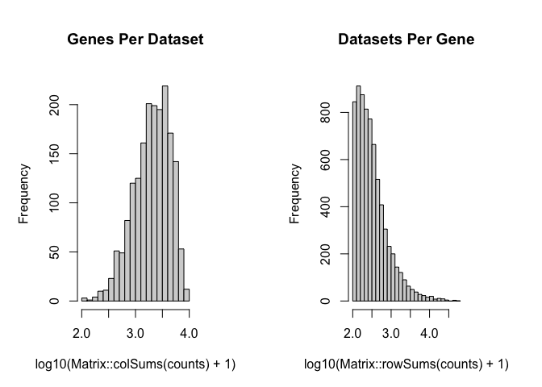
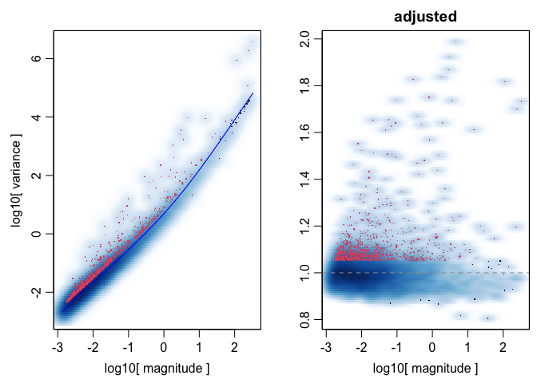
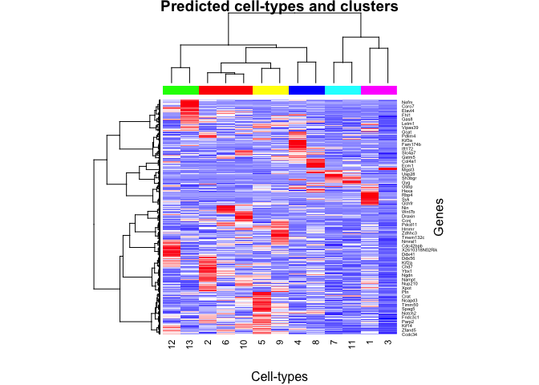
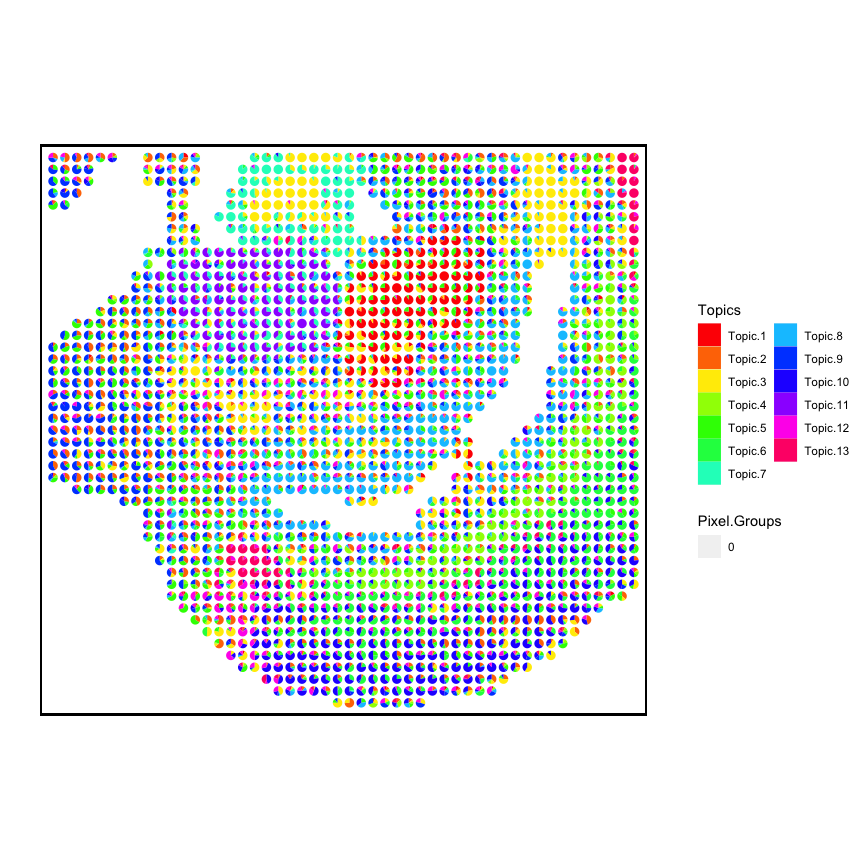

The following code demonstrates how to create the DBiT-seq input matrix
for `STdeconvolve`, which was used for analyses in the `STdeconvolve`
paper.

This was based on the GSM4364242 dataset of a mouse E11 lower embryo and
tail section.

``` r
library(STdeconvolve)
```

## Process raw data

``` r
dbit_e11_counts <- read.csv("../GSE137986_RAW/GSM4364242_E11-1L.tsv",
                            sep = "\t",
                            row.names = 1)

## 20849 genes by 1837 pixels
dbit_e11_counts <- as(t(dbit_e11_counts), "dgCMatrix")
dbit_e11_counts
```

    ## 20849 x 1837 sparse Matrix of class "dgCMatrix"

    ##    [[ suppressing 34 column names '10x35', '10x34', '10x33' ... ]]
    ##    [[ suppressing 34 column names '10x35', '10x34', '10x33' ... ]]

    ##                                                                                   
    ## Rp1     . . . . . . . . . . . . . . . . . . . . . . . . . . . . . . . . . . ......
    ## Sox17   . . . . . . . . . . . . . . 1 . . . . . . . . . . . . . . . . . . . ......
    ## Gm37587 . . . . . . . . . . . . . . . . . . . . . . . . . . . . . . . . . . ......
    ## Gm7357  . . . . . . . . . . . . . . . . . . . . . . . . . . . . . . . . . . ......
    ## Gm7369  . . . . . . . . . . . . . . . . . . . . . . . . . . . . . . . . . . ......
    ## Gm6085  . . . 2 . 3 1 2 . . 3 3 . . . . . . . 2 . . . 1 . . . . . . . . . . ......
    ## Gm6123  . . . . . . . . . . . . . . . . . . . . . . . . . . . . . . . . . . ......
    ## Gm37144 . . . . . . . . . . . . . . . . . . . . . . . . . . . . . . . . . . ......
    ## Mrpl15  . 1 . . . . . . . . . . . . . 1 . . 1 . . 1 . . . 1 . . . . . . . . ......
    ## Lypla1  . . . . . . . . . . . . . . . . . 1 . . . . . . . . . . . . . . . . ......
    ## Gm6104  . . . . . . . . . . . . . . . . . . . . . . . . . . . . . . . . . . ......
    ## Tcea1   . 1 . . . 2 1 1 . 1 . 1 1 . . . . . . . . . . . . . . . . . . . . . ......
    ## Gm17100 . . . . . . . . . . . . . . . . . . . . . . . . . . . . . . . . . . ......
    ## Rgs20   . . . . . . . . . . . . . . . . . . . . . . . . . . . . . . . . . . ......
    ## Atp6v1h . . . . . . . . . . . . . . . . . . . . . 1 1 . . . . . . . . . . . ......
    ## 
    ##  ..............................
    ##  ........suppressing 1803 columns and 20820 rows in show(); maybe adjust 'options(max.print= *, width = *)'
    ##  ..............................

    ##    [[ suppressing 34 column names '10x35', '10x34', '10x33' ... ]]

    ##                                                                                     
    ## mt.Ts1  . . . . .  . . . .  . . . . . . . . . . . . . . . . . . . . . . . . . ......
    ## mt.Td   . . . . .  . . . .  . . . . . . . . . . . . . . . . . . . . . . . . . ......
    ## mt.Co2  3 2 2 2 3  4 4 1 2  6 1 2 1 2 1 1 . . . 1 3 . 1 . . . . . . . . 2 . . ......
    ## mt.Atp8 . . . . .  . . . .  . . . . . . . . . . . . . . . . . . . . . . . . . ......
    ## mt.Atp6 . 2 . 2 1  3 1 3 .  1 . . 2 2 1 . . 3 1 1 1 1 . . . . . . . . . . 1 2 ......
    ## mt.Co3  4 7 5 9 5 15 7 5 6 10 8 7 7 2 5 5 2 2 7 2 . 4 3 . . . . 2 . 1 1 5 5 5 ......
    ## mt.Nd3  . . . . 1  1 . . 2  . . . . . . . . 1 . . . . . . . . . . . . . . . . ......
    ## mt.Nd4l . . . . .  . . . .  . . . . . . 1 . . . . . . . . . . . . . . . . . . ......
    ## mt.Nd4  3 . 1 1 1  2 . 2 2  1 1 . 1 . 1 . 1 . 1 3 2 3 . . . . . . . . . 1 . 3 ......
    ## mt.Nd5  . . 1 . 2  . 2 1 1  . 2 . . . . . . . 2 1 . 1 2 . . . . . . 1 . 1 . . ......
    ## mt.Nd6  . . . . .  . . . .  . . . . . . . . . . . . . . . . . . . . . . . . . ......
    ## mt.Cytb 1 1 2 5 5  4 4 5 5  1 3 1 2 2 4 2 1 2 3 1 3 3 1 . . . . . 2 . 1 1 . 2 ......
    ## mt.Tt   . . . . .  . . . .  . . . . . . . . . . . . . . . . . . . . . . . . . ......
    ## mt.Tp   . . . . .  . . . .  . . . . . . . . . . . . . . . . . . . . . . . . . ......

Note that the pixel IDs are essentially named based on their x-y
coordinates.

``` r
## remove mt genes:
dbit_e11_counts <- dbit_e11_counts[!grepl("mt.", rownames(dbit_e11_counts)), ]

dbit_e11_clean <- cleanCounts(dbit_e11_counts_filt,
                        min.lib.size = 100,
                        max.lib.size = Inf,
                        min.reads = 100,
                        min.detected = 1,
                        verbose = TRUE,
                        plot=TRUE)
```

    ## Filtering matrix with 1837 cells and 20707 genes ...

    ## Resulting matrix has 1832 cells and 7171 genes



``` r
dbit_e11_corpus <- preprocess(t(as.matrix(dbit_e11_clean)),
                       alignFile = NA,
                       extractPos = TRUE, ## extract the x-y coodiantes from the pixel IDs
                       selected.genes = NA,
                       nTopGenes = NA,
                       genes.to.remove = NA,
                       removeAbove = 0.95, ## remove genes in more than 95% pixels
                       removeBelow = 0.05, ## remove genes in less than 5% of pixels
                       min.lib.size = 100, ## keep pixels with 100+ gene counts
                       ODgenes = TRUE,
                       nTopOD = 1000, ## limit to top 1000 overdispersed genes
                       od.genes.alpha = 0.01, ## only overdispersed genes with p.adj < 0.01
                       gam.k = 5,
                       verbose = TRUE)
```

    ## Initial genes: 7171 Initial pixels: 1832 
    ## - Removing poor pixels with <= 100 reads 
    ## - Removing genes with <= 1 reads across pixels and detected in <= 1 pixels

    ##   Remaining genes: 7171 and remaining pixels: 1831 
    ## - Removed genes present in 95 % or more of pixels 
    ##   Remaining genes: 7157 
    ## - Removed genes present in 5 % or less of pixels 
    ##   Remaining genes: 6829 
    ## - Capturing only the overdispersed genes...

    ## Converting to sparse matrix ...

    ## [1] "Calculating variance fit ..."
    ## [1] "Using gam with k=5..."
    ## [1] "1023 overdispersed genes ... "



    ## - Using top 1000 overdispersed genes. 
    ## - Check that each pixel has at least 1 non-zero gene count entry.. 
    ## Final corpus: 
    ## A 1831x1000 simple triplet matrix.
    ## Extracting positions from pixel names. 
    ## Preprocess complete.

The y-axis needs to be reversed.

``` r
dbit_e11_corpus$posR <- dbit_e11_corpus$pos
dbit_e11_corpus$posR[, "y"] <- dbit_e11_corpus$posR[, "y"] * -1
```

Make gene count dataframe with positions to use with `vizGeneCounts`

``` r
geneDf_e11 <- merge(as.data.frame(dbit_e11_corpus$posR),
            as.data.frame(as.matrix(dbit_e11_corpus$corpus)),
            by = 0)
```

## LDA model fitting

``` r
## for E11, in paper there were 13 clusters.
ks <- c(13)

dbit_e11_LDAs <- fitLDA(counts = as.matrix(dbit_e11_corpus$corpus),
                        Ks = ks,
                        testSize = NULL,
                        perc.rare.thresh = 0.05,
                        seed = 0,
                        ncores = 7,
                        plot = TRUE)
```

    ## Warning in serialize(data, node$con): 'package:stats' may not be available when
    ## loading

    ## [1] "Time to fit LDA models was 4.1mins"
    ## [1] "Computing perplexity for each fitted model..."

    ## Warning in serialize(data, node$con): 'package:stats' may not be available when
    ## loading

    ## [1] "Time to compute perplexities was 0.06mins"
    ## [1] "Getting predicted cell-types at low proportions..."
    ## [1] "Time to compute cell-types at low proportions was 0mins"
    ## [1] "Plotting..."

    ## geom_path: Each group consists of only one observation. Do you need to adjust the
    ## group aesthetic?
    ## geom_path: Each group consists of only one observation. Do you need to adjust the
    ## group aesthetic?

Check the alphas of the fitted model

``` r
unlist(sapply(dbit_e11_LDAs$models, slot, "alpha"))
```

    ##        13 
    ## 0.1021903

Deconvolve the cell-types for each fitted model. Store in a list to
access

``` r
## `buildLDAobject` is a wrapper around `getBetaTheta` that will also
## cluster cell-types based on their txn profiles using `clusterTopics`.

dbit_e11_LDAsDeconv <- lapply(c(13), function(l) {
  lda <- buildLDAobject(LDAmodel = optimalModel(dbit_e11_LDAs, opt = l),
                        deepSplit = 4,
                        perc.filt = 0.05, 
                        colorScheme = "rainbow")
  lda
})
```

    ## Filtering out cell-types in pixels that contribute less than 0.05 of the pixel proportion. 
    ##  ..cutHeight not given, setting it to 1.84  ===>  99% of the (truncated) height range in dendro.
    ##  ..done.



    ## [1] "cell-types combined."
    ## [1] "cell-types combined."

``` r
names(dbit_e11_LDAsDeconv) <- as.character(c(13))
```

## Visualize K=13

``` r
m <- dbit_e11_LDAsDeconv$`13`$theta
pos <- dbit_e11_corpus$posR

p <- vizAllTopics(theta = m,
                   pos = pos,
                   topicOrder = seq(ncol(m)),
                   groups = rep("0", dim(m)[1]),
                   group_cols = c("0" = STdeconvolve::transparentCol("black", percent = 100)),
                   r = 0.4,
                   lwd = 0,
                   showLegend = TRUE,
                   plotTitle = NA) +
  ggplot2::guides(fill=ggplot2::guide_legend(ncol=2)) +
  
  ## outer border
  ggplot2::geom_rect(data = data.frame(pos),
            ggplot2::aes(xmin = min(x)-1, xmax = max(x)+1,
                         ymin = min(y)-1, ymax = max(y)+1),
            fill = NA, color = "black", linetype = "solid", size = 0.5) +
  
  ggplot2::theme(
    plot.background = ggplot2::element_blank()
  ) +
  
  ggplot2::coord_equal()
```

    ## Plotting scatterpies for 1831 pixels with 13 cell-types...this could take a while if the dataset is large.

``` r
p
```


