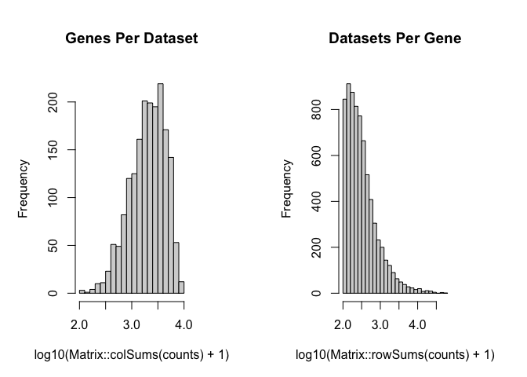
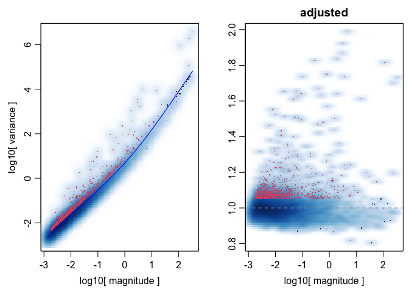
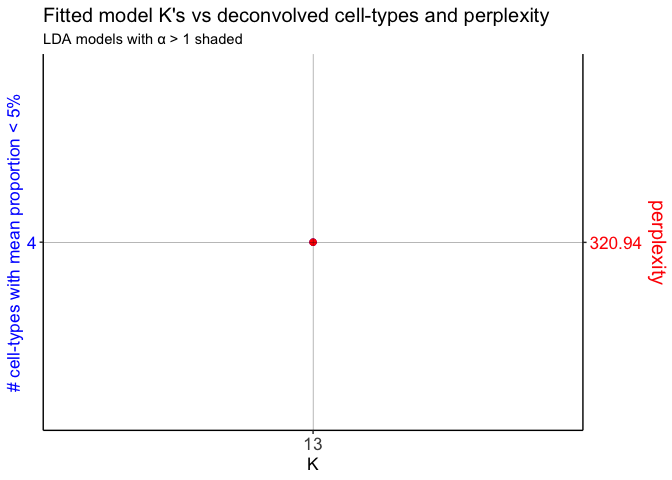
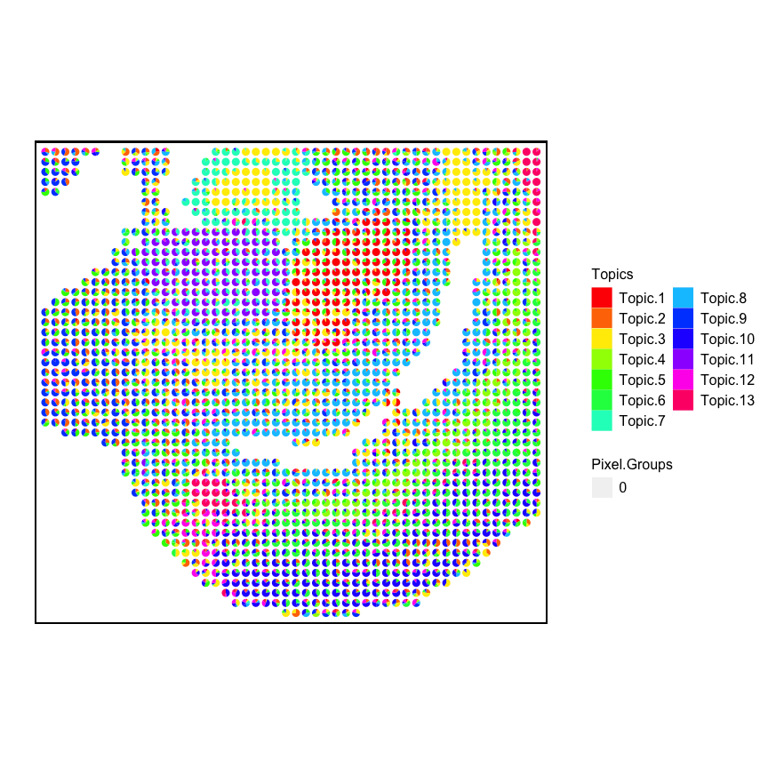

The following code demonstrates how to create the DBiT-seq input matrix
for `STdeconvolve`, which was used for analyses in the `STdeconvolve`
paper.

This was based on the GSM4364242 dataset of a mouse E11 lower embryo and
tail section.

``` r
library(STdeconvolve)
```

## Process raw data

``` r
dbit_e11_counts <- read.csv("./GSE137986_RAW/GSM4364242_E11-1L.tsv",
                            sep = "\t",
                            row.names = 1)

## 20849 genes by 1837 pixels
dbit_e11_counts <- as(t(dbit_e11_counts), "dgCMatrix")
dbit_e11_counts
```

    ## 20849 x 1837 sparse Matrix of class "dgCMatrix"

    ##    [[ suppressing 29 column names '10x35', '10x34', '10x33' ... ]]
    ##    [[ suppressing 29 column names '10x35', '10x34', '10x33' ... ]]

    ##                                                                         
    ## Rp1     . . . . . . . . . . . . . . . . . . . . . . . . . . . . . ......
    ## Sox17   . . . . . . . . . . . . . . 1 . . . . . . . . . . . . . . ......
    ## Gm37587 . . . . . . . . . . . . . . . . . . . . . . . . . . . . . ......
    ## Gm7357  . . . . . . . . . . . . . . . . . . . . . . . . . . . . . ......
    ## Gm7369  . . . . . . . . . . . . . . . . . . . . . . . . . . . . . ......
    ## Gm6085  . . . 2 . 3 1 2 . . 3 3 . . . . . . . 2 . . . 1 . . . . . ......
    ## Gm6123  . . . . . . . . . . . . . . . . . . . . . . . . . . . . . ......
    ## Gm37144 . . . . . . . . . . . . . . . . . . . . . . . . . . . . . ......
    ## Mrpl15  . 1 . . . . . . . . . . . . . 1 . . 1 . . 1 . . . 1 . . . ......
    ## Lypla1  . . . . . . . . . . . . . . . . . 1 . . . . . . . . . . . ......
    ## Gm6104  . . . . . . . . . . . . . . . . . . . . . . . . . . . . . ......
    ## Tcea1   . 1 . . . 2 1 1 . 1 . 1 1 . . . . . . . . . . . . . . . . ......
    ## Gm17100 . . . . . . . . . . . . . . . . . . . . . . . . . . . . . ......
    ## Rgs20   . . . . . . . . . . . . . . . . . . . . . . . . . . . . . ......
    ## Atp6v1h . . . . . . . . . . . . . . . . . . . . . 1 1 . . . . . . ......
    ## Oprk1   . . . . . . . . . . . . . . . . . . . . . . . . . . . . . ......
    ## Npbwr1  . . . . . . . . . . . . . . . . . . . . . . . . . . . . . ......
    ## 
    ##  ..............................
    ##  ........suppressing 1808 columns and 20815 rows in show(); maybe adjust 'options(max.print= *, width = *)'
    ##  ..............................

    ##    [[ suppressing 29 column names '10x35', '10x34', '10x33' ... ]]

    ##                                                                            
    ## mt.Tc   . . . .  .  . . . .  . . . . . . . . . . . . . . . . . . . . ......
    ## mt.Ty   . . . .  .  . . . .  . . . . . . . . . . . . . . . . . . . . ......
    ## mt.Co1  6 6 3 9 13 14 7 7 4  8 6 1 8 3 7 3 1 4 2 1 6 5 7 . . . 1 . 2 ......
    ## mt.Ts1  . . . .  .  . . . .  . . . . . . . . . . . . . . . . . . . . ......
    ## mt.Td   . . . .  .  . . . .  . . . . . . . . . . . . . . . . . . . . ......
    ## mt.Co2  3 2 2 2  3  4 4 1 2  6 1 2 1 2 1 1 . . . 1 3 . 1 . . . . . . ......
    ## mt.Atp8 . . . .  .  . . . .  . . . . . . . . . . . . . . . . . . . . ......
    ## mt.Atp6 . 2 . 2  1  3 1 3 .  1 . . 2 2 1 . . 3 1 1 1 1 . . . . . . . ......
    ## mt.Co3  4 7 5 9  5 15 7 5 6 10 8 7 7 2 5 5 2 2 7 2 . 4 3 . . . . 2 . ......
    ## mt.Nd3  . . . .  1  1 . . 2  . . . . . . . . 1 . . . . . . . . . . . ......
    ## mt.Nd4l . . . .  .  . . . .  . . . . . . 1 . . . . . . . . . . . . . ......
    ## mt.Nd4  3 . 1 1  1  2 . 2 2  1 1 . 1 . 1 . 1 . 1 3 2 3 . . . . . . . ......
    ## mt.Nd5  . . 1 .  2  . 2 1 1  . 2 . . . . . . . 2 1 . 1 2 . . . . . . ......
    ## mt.Nd6  . . . .  .  . . . .  . . . . . . . . . . . . . . . . . . . . ......
    ## mt.Cytb 1 1 2 5  5  4 4 5 5  1 3 1 2 2 4 2 1 2 3 1 3 3 1 . . . . . 2 ......
    ## mt.Tt   . . . .  .  . . . .  . . . . . . . . . . . . . . . . . . . . ......
    ## mt.Tp   . . . .  .  . . . .  . . . . . . . . . . . . . . . . . . . . ......

Note that the pixel IDs are essentially named based on their x-y
coordinates.

``` r
## remove mt genes:
dbit_e11_counts <- dbit_e11_counts[!grepl("mt.", rownames(dbit_e11_counts)), ]

dbit_e11_clean <- cleanCounts(dbit_e11_counts,
                        min.lib.size = 100,
                        max.lib.size = Inf,
                        min.reads = 100,
                        min.detected = 1,
                        verbose = TRUE,
                        plot=TRUE)
```

    ## Filtering matrix with 1837 cells and 20707 genes ...

    ## Resulting matrix has 1832 cells and 7171 genes



``` r
dbit_e11_corpus <- preprocess(t(as.matrix(dbit_e11_clean)),
                       alignFile = NA,
                       extractPos = TRUE, ## extract the x-y coodiantes from the pixel IDs
                       selected.genes = NA,
                       nTopGenes = NA,
                       genes.to.remove = NA,
                       removeAbove = 0.95, ## remove genes in more than 95% pixels
                       removeBelow = 0.05, ## remove genes in less than 5% of pixels
                       min.lib.size = 100, ## keep pixels with 100+ gene counts
                       ODgenes = TRUE,
                       nTopOD = 1000, ## limit to top 1000 overdispersed genes
                       od.genes.alpha = 0.01, ## only overdispersed genes with p.adj < 0.01
                       gam.k = 5,
                       verbose = TRUE)
```

    ## Initial genes: 7171 Initial pixels: 1832

    ## - Removing poor pixels with <= 100 reads

    ## - Removing genes with <= 1 reads across pixels and detected in <= 1 pixels

    ##   Remaining genes: 7171 and remaining pixels: 1831

    ## - Removed genes present in 95% or more of pixels
    ##  Remaining genes: 7157

    ## - Removed genes present in 5% or less of pixels
    ##  Remaining genes: 6829

    ## - Capturing only the overdispersed genes...

    ## Converting to sparse matrix ...

    ## Calculating variance fit ...

    ## Using gam with k=5...

    ## 1023 overdispersed genes ...


    ## - Using top 1000 overdispersed genes.

    ## - Check that each pixel has at least 1 non-zero gene count entry..

    ## Final corpus:

    ## A 1831x1000 simple triplet matrix.

    ## Extracting positions from pixel names.

    ## Preprocess complete.



The y-axis needs to be reversed.

``` r
dbit_e11_corpus$posR <- dbit_e11_corpus$pos
dbit_e11_corpus$posR[, "y"] <- dbit_e11_corpus$posR[, "y"] * -1
```

Make gene count dataframe with positions to use with `vizGeneCounts`

``` r
geneDf_e11 <- merge(as.data.frame(dbit_e11_corpus$posR),
            as.data.frame(as.matrix(dbit_e11_corpus$corpus)),
            by = 0)
```

## LDA model fitting

``` r
## for E11, in paper there were 13 clusters.
ks <- c(13)

dbit_e11_LDAs <- fitLDA(counts = as.matrix(dbit_e11_corpus$corpus),
                        Ks = ks,
                        perc.rare.thresh = 0.05,
                        seed = 0,
                        ncores = 7,
                        plot = TRUE)
```

    ## Warning in serialize(data, node$con): 'package:stats' may not be available
    ## when loading

    ## Time to fit LDA models was 3.94 mins

    ## Computing perplexity for each fitted model...

    ## Warning in serialize(data, node$con): 'package:stats' may not be available
    ## when loading

    ## Time to compute perplexities was 0.07 mins

    ## Getting predicted cell-types at low proportions...

    ## Time to compute cell-types at low proportions was 0 mins

    ## Plotting...

    ## geom_path: Each group consists of only one observation. Do you need to
    ## adjust the group aesthetic?
    ## geom_path: Each group consists of only one observation. Do you need to
    ## adjust the group aesthetic?



Check the alphas of the fitted models

``` r
unlist(sapply(dbit_e11_LDAs$models, slot, "alpha"))
```

    ##        13 
    ## 0.1021903

Deconvolve the cell-types for each fitted model. Store in a list to
access

``` r
optLDA <- optimalModel(models = dbit_e11_LDAs, opt = 13)
results <- getBetaTheta(lda = optLDA,
                        perc.filt = 0.05, # remove cell-types from pixels that are predicted to be present at less than 5%. Then readjust pixel proportions to 100%
                        betaScale = 1000) # scale the cell-type transcriptional profiles
```

    ## Filtering out cell-types in pixels that contribute less than 0.05 of the pixel proportion.

## Visualize K=13

``` r
m <- results$theta
pos <- dbit_e11_corpus$posR

p <- vizAllTopics(theta = m,
                   pos = pos,
                   topicOrder = seq(ncol(m)),
                   r = 0.4,
                   lwd = 0,
                   showLegend = TRUE,
                   plotTitle = NA) +
  ggplot2::guides(fill=ggplot2::guide_legend(ncol=2)) +
  
  ## outer border
  ggplot2::geom_rect(data = data.frame(pos),
            ggplot2::aes(xmin = min(x)-1, xmax = max(x)+1,
                         ymin = min(y)-1, ymax = max(y)+1),
            fill = NA, color = "black", linetype = "solid", size = 0.5) +
  
  ggplot2::theme(
    plot.background = ggplot2::element_blank()
  ) +
  
  ggplot2::coord_equal()
```

    ## Plotting scatterpies for 1831 pixels with 13 cell-types...this could take a while if the dataset is large.

    ## Coordinate system already present. Adding new coordinate system, which will replace the existing one.

``` r
p
```


