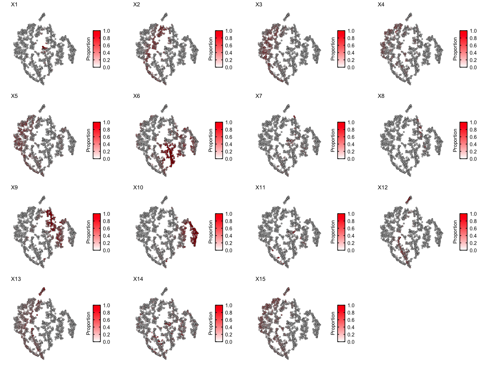

# Summary

This tutorial demonstrates an analysis workflow on 10X Visium ST data.
It includes loading the dataset, cleaning and feature selection, LDA
model fitting and visualization. Additionally, we also compare standard
transcriptional clustering of the pixels to deconvolution of latent
cell-types.

# Data

We focus on the [Visium mouse brain section (coronal)
dataset](https://www.10xgenomics.com/resources/datasets/mouse-brain-section-coronal-1-standard-1-1-0)

In particular, we are interested in the filtered count matrix and the
spatial positions of the barcodes. We can download these files into a
folder, which we will use to load them into a
[`SpatialExperiment`](https://bioconductor.org/packages/release/bioc/html/SpatialExperiment.html)
object.

First, make a directory to store the downloaded files:

``` r
f <- "visiumTutorial/"

if(!file.exists(f)){
      dir.create(f)
  }
```

Download and unzip the `Feature / barcode matrix (filtered)` and the
`Spatial imaging data`:

``` r
if(!file.exists(paste0(f, "V1_Adult_Mouse_Brain_filtered_feature_bc_matrix.tar.gz"))){
  tar_gz_file <- "http://cf.10xgenomics.com/samples/spatial-exp/1.1.0/V1_Adult_Mouse_Brain/V1_Adult_Mouse_Brain_filtered_feature_bc_matrix.tar.gz"
  download.file(tar_gz_file, 
                destfile = paste0(f, "V1_Adult_Mouse_Brain_filtered_feature_bc_matrix.tar.gz"), 
                method = "auto")
}
untar(tarfile = paste0(f, "V1_Adult_Mouse_Brain_filtered_feature_bc_matrix.tar.gz"), 
      exdir = f)

if(!file.exists(paste0(f, "V1_Adult_Mouse_Brain_spatial.tar.gz"))){
spatial_imaging_data <- "http://cf.10xgenomics.com/samples/spatial-exp/1.1.0/V1_Adult_Mouse_Brain/V1_Adult_Mouse_Brain_spatial.tar.gz"
  download.file(spatial_imaging_data, 
                destfile = paste0(f, "V1_Adult_Mouse_Brain_spatial.tar.gz"), 
                method = "auto")
}
untar(tarfile = paste0(f, "V1_Adult_Mouse_Brain_spatial.tar.gz"), 
      exdir = f)
```

Load the filtered counts and spatial barcode information into a
`SpatialExperiment`:
(Make sure to specify the `sparse` matrices so that the `counts` will be compatible with `cleanCounts()`)

``` r
se <- SpatialExperiment::read10xVisium(samples = f,
     type = "sparse",
     data = "filtered")
se
```

    ## class: SpatialExperiment 
    ## dim: 32285 2702 
    ## metadata(0):
    ## assays(1): counts
    ## rownames(32285): ENSMUSG00000051951 ENSMUSG00000089699 ...
    ##   ENSMUSG00000095019 ENSMUSG00000095041
    ## rowData names(1): symbol
    ## colnames(2702): AAACAAGTATCTCCCA-1 AAACAATCTACTAGCA-1 ...
    ##   TTGTTTCCATACAACT-1 TTGTTTGTGTAAATTC-1
    ## colData names(1): sample_id
    ## reducedDimNames(0):
    ## mainExpName: NULL
    ## altExpNames(0):
    ## spatialData names(3) : in_tissue array_row array_col
    ## spatialCoords names(2) : pxl_col_in_fullres pxl_row_in_fullres
    ## imgData names(4): sample_id image_id data scaleFactor

From here, the count matrix can be accessed and setup for feature
selection in `STdeconvolve` via:

``` r
## this is the genes x barcode sparse count matrix
cd <- se@assays@data@listData$counts
```

“x” and “y” coordinates of the barcodes can be obtained via:

``` r
pos <- SpatialExperiment::spatialCoords(se)

## change column names to x and y
## for this dataset, we will visualize barcodes using "pxl_col_in_fullres" = "y" coordinates, and "pxl_row_in_fullres" = "x" coordinates
colnames(pos) <- c("y", "x")
```

# Cleaning and feature selection

Poor genes and barcodes will be removed from the count matrix

``` r
counts <- cleanCounts(cd, min.lib.size = 100, min.reads = 10)
```


And then we can feature select for overdispersed genes that are present
in less than 100% of the barcodes and more than 5%.

We will also use the top 1000 most significant overdispersed genes by
default.

``` r
corpus <- restrictCorpus(counts, removeAbove=1.0, removeBelow = 0.05, nTopOD = 1000)
```

    ## Removing 21 genes present in 100% or more of pixels...

    ## 17429 genes remaining...

    ## Removing 4472 genes present in 5% or less of pixels...

    ## 12957 genes remaining...

    ## Restricting to overdispersed genes with alpha = 0.05...

    ## Calculating variance fit ...

    ## Using gam with k=5...

    ## 2348 overdispersed genes ...

    ##  Using top 1000 overdispersed genes.

# Fit LDA models to the data

Now, we can fit several LDA models to the feature selected corpus and
pick the best one (by selecting the model with the “optimal K”, or
optimal number of latent cell-types).

Note that here, our corpus has 2702 barcodes and 1000 genes, so this
could take some time. To help speed things up, parallelization is
implemented by default such that a given LDA model can be fitted on its
own core.

``` r
ldas <- fitLDA(t(as.matrix(corpus)), Ks = c(15))
```

    ## Time to fit LDA models was 19.91 mins

    ## Computing perplexity for each fitted model...

    ## Time to compute perplexities was 0 mins

    ## Getting predicted cell-types at low proportions...

    ## Time to compute cell-types at low proportions was 0 mins

    ## Plotting...

    ## geom_path: Each group consists of only one observation. Do you need to
    ## adjust the group aesthetic?
    ## geom_path: Each group consists of only one observation. Do you need to
    ## adjust the group aesthetic?


Next, select the LDA model of interest and get the **beta** (cell-type
transcriptional profiles) and **theta** (cell-type barcode proportions)
matrices.

``` r
optLDA <- optimalModel(models = ldas, opt = 15)

results <- getBetaTheta(optLDA, perc.filt = 0.05, betaScale = 1000)
```

    ## Filtering out cell-types in pixels that contribute less than 0.05 of the pixel proportion.

``` r
deconProp <- results$theta
deconGexp <- results$beta
```

# Visualization

First, let’s visualize the barcode proportions of all the deconvolved
cell-types in the form of scatterpies:

``` r
plt <- vizAllTopics(theta = deconProp,
                   pos = pos,
                   r = 45,
                   lwd = 0,
                   showLegend = TRUE,
                   plotTitle = NA) +
  ggplot2::guides(fill=ggplot2::guide_legend(ncol=2)) +
  
  ## outer border
  ggplot2::geom_rect(data = data.frame(pos),
            ggplot2::aes(xmin = min(x)-90, xmax = max(x)+90,
                         ymin = min(y)-90, ymax = max(y)+90),
            fill = NA, color = "black", linetype = "solid", size = 0.5) +
  
  ggplot2::theme(
    plot.background = ggplot2::element_blank()
  ) +
  
  ## remove the pixel "groups", which is the color aesthetic for the pixel borders
  ggplot2::guides(colour = "none")
```

    ## Plotting scatterpies for 2702 pixels with 15 cell-types...this could take a while if the dataset is large.

``` r
plt
```


We can also use `vizTopic()` for faster plotting. Let’s visualize each
deconvolved cell-type separately:

``` r
ps <- lapply(colnames(deconProp), function(celltype) {
  
  vizTopic(theta = deconProp, pos = pos, topic = celltype, plotTitle = paste0("X", celltype),
         size = 2, stroke = 1, alpha = 0.5,
         low = "white",
         high = "red") +
    
    ## remove the pixel "Groups", which is the color aesthetic for the pixel borders
    ggplot2::guides(colour = "none")
  
})
gridExtra::grid.arrange(
  grobs = ps,
  layout_matrix = rbind(c(1, 2, 3, 4),
                        c(5, 6, 7, 8),
                        c(9, 10, 11, 12),
                        c(13, 14, 15, 16))
)
```


Let’s visualize some marker genes for each deconvolved cell-type using
the deconvolved transcriptional profiles in the **beta** matrix
(`deconGexp`).

We will define the top marker genes here as genes highly expressed in
the deconvolved cell-type (count \> 2) that also have the highest
log2(fold change) when comparing the deconvolved cell-type’s expression
profile to the average of all other deconvolved cell-types’ expression
profiles.

First, let’s convert the gene ENSEMBL IDs to Gene Symbols:

``` r
geneSymbols <- se@rowRanges@elementMetadata$symbol
names(geneSymbols) <- names(se@rowRanges)
geneSymbols[1:5]
```

    ## ENSMUSG00000051951 ENSMUSG00000089699 ENSMUSG00000102331 
    ##             "Xkr4"           "Gm1992"          "Gm19938" 
    ## ENSMUSG00000102343 ENSMUSG00000025900 
    ##          "Gm37381"              "Rp1"

``` r
colnames(deconGexp) <- geneSymbols[colnames(deconGexp)]
deconGexp[1:5,1:5]
```

    ##           Hcrt         Ttr       Pmch         Tac2          Avp
    ## 1 0.0004215068 745.6130724 0.15579893 4.279703e-09 0.0025853966
    ## 2 0.0558873607   0.8638861 0.06944716 4.854540e-01 0.0002897860
    ## 3 0.0323369785   5.2950099 0.52119242 4.964383e-02 0.0179151567
    ## 4 0.0214080751   2.6083053 0.07572332 9.550938e-07 0.0001541264
    ## 5 0.1585215791   1.8399128 0.20456415 2.260985e-01 0.0068843261

Now, let’s get the differentially expressed genes for each deconvolved
cell-type transcriptional profile and label the top expressed genes for
each cell-type:

``` r
ps <- lapply(colnames(deconProp), function(celltype) {
  
  celltype <- as.numeric(celltype)
  ## highly expressed in cell-type of interest
  highgexp <- names(which(deconGexp[celltype,] > 3))
  ## high log2(fold-change) compared to other deconvolved cell-types
  log2fc <- sort(log2(deconGexp[celltype,highgexp]/colMeans(deconGexp[-celltype,highgexp])), decreasing=TRUE)
  markers <- names(log2fc)[1] ## label just the top gene
  
  # -----------------------------------------------------
  ## visualize the transcriptional profile
  dat <- data.frame(values = as.vector(log2fc), genes = names(log2fc), order = seq(length(log2fc)))
  # Hide all of the text labels.
  dat$selectedLabels <- ""
  dat$selectedLabels[1] <- markers
  
  plt <- ggplot2::ggplot(data = dat) +
    ggplot2::geom_col(ggplot2::aes(x = order, y = values,
                                   fill = factor(selectedLabels == ""),
                                   color = factor(selectedLabels == "")), width = 1) +
    
    ggplot2::scale_fill_manual(values = c("darkblue",
                                          "darkblue"
                                          )) +
    ggplot2::scale_color_manual(values = c("darkblue",
                                          "darkblue"
                                          )) +
    
    ggplot2::scale_y_continuous(expand = c(0, 0), limits = c(min(log2fc) - 0.3, max(log2fc) + 0.3)) +
    # ggplot2::scale_x_continuous(expand = c(0, 0), limits = c(-2, NA)) +
    
    ggplot2::labs(title = paste0("X", celltype),
                  x = "Gene expression rank",
                  y = "log2(FC)") +
    
    ## placement of gene symbol labels of top genes
    ggplot2::geom_text(ggplot2::aes(x = order+1, y = values-0.1, label = selectedLabels), color = "red") +
    
    ggplot2::theme_classic() +
    ggplot2::theme(axis.text.x = ggplot2::element_text(size=15, color = "black"),
                   axis.text.y = ggplot2::element_text(size=15, color = "black"),
                   axis.title.y = ggplot2::element_text(size=15, color = "black"),
                   axis.title.x = ggplot2::element_text(size=15, color = "black"),
                   axis.ticks.x = ggplot2::element_blank(),
                   plot.title = ggplot2::element_text(size=15),
                   legend.text = ggplot2::element_text(size = 15, colour = "black"),
                   legend.title = ggplot2::element_text(size = 15, colour = "black", angle = 90),
                   panel.background = ggplot2::element_blank(),
                   plot.background = ggplot2::element_blank(),
                   panel.grid.major.y = ggplot2::element_line(size = 0.3, colour = "gray80"),
                   axis.line = ggplot2::element_line(size = 1, colour = "black"),
                   legend.position="none"
                   )
  plt
})
gridExtra::grid.arrange(
  grobs = ps,
  layout_matrix = rbind(c(1, 2, 3, 4),
                        c(5, 6, 7, 8),
                        c(9, 10, 11, 12),
                        c(13, 14, 15, 16))
)
```


Let’s visualize the expression of some of these genes with
`vizGeneCounts()`.

``` r
## first, combine the positions and the cleaned counts matrix
c <- counts
rownames(c) <- geneSymbols[rownames(c)]
df <- merge(as.data.frame(pos), 
            as.data.frame(t(as.matrix(c))), 
            by = 0)

## collect the top genes for subsequent visualization
markerGenes <- unlist(lapply(colnames(deconProp), function(celltype) {
  
  celltype <- as.numeric(celltype)
  ## highly expressed in cell-type of interest
  highgexp <- names(which(deconGexp[celltype,] > 3))
  ## high log2(fold-change) compared to other deconvolved cell-types
  log2fc <- sort(log2(deconGexp[celltype,highgexp]/colMeans(deconGexp[-celltype,highgexp])), decreasing=TRUE)
  markers <- names(log2fc)[1] ## label just the top gene
  ## collect name of top gene for each cell-type
  markers
}))
  

## now visualize top genes for each deconvolved cell-type
ps <- lapply(markerGenes, function(marker) {
  vizGeneCounts(df = df,
              gene = marker,
              # groups = annot,
              # group_cols = rainbow(length(levels(annot))),
              size = 2, stroke = 0.1,
              plotTitle = marker,
              winsorize = 0.05,
              showLegend = TRUE) +
    
    ## remove the pixel "groups", which is the color aesthetic for the pixel borders
    ggplot2::guides(colour = "none") +
    
    ## change some plot aesthetics
    ggplot2::theme(axis.text.x = ggplot2::element_text(size=0, color = "black", hjust = 0, vjust = 0.5),
                   axis.text.y = ggplot2::element_text(size=0, color = "black"),
                   axis.title.y = ggplot2::element_text(size=15),
                   axis.title.x = ggplot2::element_text(size=15),
                   plot.title = ggplot2::element_text(size=15),
                   legend.text = ggplot2::element_text(size = 15, colour = "black"),
                   legend.title = ggplot2::element_text(size = 15, colour = "black", angle = 90),
                   panel.background = ggplot2::element_blank(),
                   ## border around plot
                   panel.border = ggplot2::element_rect(fill = NA, color = "black", size = 2),
                   plot.background = ggplot2::element_blank()
                   ) +
    ggplot2::guides(fill = ggplot2::guide_colorbar(title = "Counts",
                                                   title.position = "left",
                                                   title.hjust = 0.5,
                                                   ticks.colour = "black",
                                                   ticks.linewidth = 2,
                                                   frame.colour= "black",
                                                   frame.linewidth = 2,
                                                   label.hjust = 0
                                                   ))
})
gridExtra::grid.arrange(
  grobs = ps,
  layout_matrix = rbind(c(1, 2, 3, 4),
                        c(5, 6, 7, 8),
                        c(9, 10, 11, 12),
                        c(13, 14, 15, 16))
)
```


# Compare to transcriptional clustering

Now, let’s see how the deconvolved cell-types compare in terms of
clustering the barcodes transcriptionally into 15 clusters.

First, let’s perform dimensionality reduction on the `counts` matrix:

``` r
pcs.info <- stats::prcomp(t(log10(as.matrix(counts)+1)), center=TRUE)
nPcs <- 7 ## let's take the top 5 PCs
pcs <- pcs.info$x[,1:nPcs]
```

Next, let’s generate a 2D t-SNE embedding:

``` r
emb <- Rtsne::Rtsne(pcs,
             is_distance=FALSE,
             perplexity=30,
             num_threads=1,
             verbose=FALSE)$Y
rownames(emb) <- rownames(pcs)
colnames(emb) <- c("x", "y")
```

Finally, let’s use louvian clustering to assign the barcodes into 15
communities.

``` r
k <- 35
com <- MERINGUE::getClusters(pcs, k, weight=TRUE, method = igraph::cluster_louvain)
```

Let’s visualize the communities in terms of the spatial positions of the
barcodes:

``` r
tempCom <- com

dat <- data.frame("emb1" = pos[,"x"],
                  "emb2" = pos[,"y"],
                  "Cluster" = tempCom)

plt <- ggplot2::ggplot(data = dat) +
  ggplot2::geom_point(ggplot2::aes(x = emb1, y = emb2,
                                   color = Cluster), size = 0.8) +
  
  ggplot2::scale_color_manual(values = rainbow(n = length(levels(tempCom)))) +
  
  # ggplot2::scale_y_continuous(expand = c(0, 0), limits = c( min(dat$emb2)-1, max(dat$emb2)+1)) +
  # ggplot2::scale_x_continuous(expand = c(0, 0), limits = c( min(dat$emb1)-1, max(dat$emb1)+1) ) +
  
  ggplot2::labs(title = "",
                x = "x",
                y = "y") +
  
  ggplot2::theme_classic() +
  ggplot2::theme(axis.text.x = ggplot2::element_text(size=15, color = "black"),
                 axis.text.y = ggplot2::element_text(size=15, color = "black"),
                 axis.title.y = ggplot2::element_text(size=15),
                 axis.title.x = ggplot2::element_text(size=15),
                 axis.ticks.x = ggplot2::element_blank(),
                 plot.title = ggplot2::element_text(size=15),
                 legend.text = ggplot2::element_text(size = 12, colour = "black"),
                 legend.title = ggplot2::element_text(size = 15, colour = "black", angle = 0, hjust = 0.5),
                 panel.background = ggplot2::element_blank(),
                 plot.background = ggplot2::element_blank(),
                 panel.grid.major.y =  ggplot2::element_blank(),
                 axis.line = ggplot2::element_line(size = 1, colour = "black")
                 # legend.position="none"
                 ) +
  
  ggplot2::guides(colour = ggplot2::guide_legend(override.aes = list(size=2), ncol = 2)
                  ) +
  
  ggplot2::coord_equal()

plt
```


and on the 2D embedding:

``` r
tempCom <- com

dat <- data.frame("emb1" = emb[,1],
                  "emb2" = emb[,2],
                  "Cluster" = tempCom)

## cluster labels
cent.pos <- do.call(rbind, tapply(1:nrow(emb), tempCom, function(ii) apply(emb[ii,,drop=F],2,median)))
cent.pos <- as.data.frame(cent.pos)
colnames(cent.pos) <- c("x", "y")
cent.pos$cluster <- rownames(cent.pos)
cent.pos <- na.omit(cent.pos)

plt <- ggplot2::ggplot(data = dat) +
  ggplot2::geom_point(ggplot2::aes(x = emb1, y = emb2,
                                   color = Cluster), size = 0.01) +
  
  ggplot2::scale_color_manual(values = rainbow(n = length(levels(tempCom)))) +
  
  ggplot2::scale_y_continuous(expand = c(0, 0), limits = c( min(dat$emb2)-1, max(dat$emb2)+1)) +
  ggplot2::scale_x_continuous(expand = c(0, 0), limits = c( min(dat$emb1)-1, max(dat$emb1)+1) ) +
  
  ggplot2::labs(title = "",
                x = "t-SNE 1",
                y = "t-SNE 2") +
  
  ggplot2::theme_classic() +
  ggplot2::theme(axis.text.x = ggplot2::element_text(size=15, color = "black"),
                 axis.text.y = ggplot2::element_text(size=15, color = "black"),
                 axis.title.y = ggplot2::element_text(size=15),
                 axis.title.x = ggplot2::element_text(size=15),
                 axis.ticks.x = ggplot2::element_blank(),
                 plot.title = ggplot2::element_text(size=15),
                 legend.text = ggplot2::element_text(size = 12, colour = "black"),
                 legend.title = ggplot2::element_text(size = 15, colour = "black", angle = 0, hjust = 0.5),
                 panel.background = ggplot2::element_blank(),
                 plot.background = ggplot2::element_blank(),
                 panel.grid.major.y =  ggplot2::element_blank(),
                 axis.line = ggplot2::element_line(size = 1, colour = "black")
                 # legend.position="none"
                 ) +
  
  ggplot2::geom_text(data = cent.pos,
                     ggplot2::aes(x = x,
                                  y = y,
                                  label = cluster),
                     fontface = "bold") +
  
  ggplot2::guides(colour = ggplot2::guide_legend(override.aes = list(size=2), ncol = 2)
                  ) +
  
  ggplot2::coord_equal()

plt
```


Let’s see the proportions of each deconvolved cell-type across the
embedding

``` r
ps <- lapply(colnames(deconProp), function(celltype) {
  
  vizTopic(theta = deconProp, pos = emb, topic = celltype, plotTitle = paste0("X", celltype),
         size = 1, stroke = 0.5, alpha = 0.5,
         low = "white",
         high = "red") +
    
    ## remove the pixel "Groups", which is the color aesthetic for the pixel borders
    ggplot2::guides(colour = "none")
  
})
gridExtra::grid.arrange(
  grobs = ps,
  layout_matrix = rbind(c(1, 2, 3, 4),
                        c(5, 6, 7, 8),
                        c(9, 10, 11, 12),
                        c(13, 14, 15, 16))
)
```



Some clusters are highly enriched in one cell-type, like cluster 8 and
cell-type X6. But other clusters contain multiple cell-types, or some
cell-types are present in more than one cluster.

We can summarize the proportional correlations to try and quantitate
these observations using `getCorrMtx()` and `correlationPlot()`.

First let’s create a proxy “theta” matrix, which indicates the community
each barcode was assigned to.

``` r
# proxy theta for the txn clusters
com_proxyTheta <- model.matrix(~ 0 + com)
rownames(com_proxyTheta) <- names(com)
# fix names
colnames(com_proxyTheta) <- unlist(lapply(colnames(com_proxyTheta), function(x) {
  unlist(strsplit(x, "com"))[2]
}))
com_proxyTheta <- as.data.frame.matrix(com_proxyTheta)
com_proxyTheta[1:5,1:5]
```

    ##                    1 2 3 4 5
    ## AAACAAGTATCTCCCA-1 1 0 0 0 0
    ## AAACAATCTACTAGCA-1 0 1 0 0 0
    ## AAACACCAATAACTGC-1 0 0 1 0 0
    ## AAACAGAGCGACTCCT-1 1 0 0 0 0
    ## AAACCGGGTAGGTACC-1 0 0 0 1 0

Then we can build a correlation matrix of the correlations between the
proportions of each cell-type and the transcriptional communities of the
barcodes.

``` r
corMat_prop <- STdeconvolve::getCorrMtx(m1 = as.matrix(com_proxyTheta),
                                        m2 = deconProp,
                                        type = "t")
```

    ## cell-type correlations based on 2702 shared pixels between m1 and m2.

``` r
rownames(corMat_prop) <- paste0("com_", seq(nrow(corMat_prop)))
colnames(corMat_prop) <- paste0("decon_", seq(ncol(corMat_prop)))

## order the cell-types rows based on best match (highest correlation) with each community 
pairs <- STdeconvolve::lsatPairs(corMat_prop)
m <- corMat_prop[pairs$rowix, pairs$colsix]

STdeconvolve::correlationPlot(mat = m,
                              colLabs = "Transcriptional clusters",
                              rowLabs = "STdeconvolve") +
  ggplot2::theme(
    axis.text.x = ggplot2::element_text(angle = 90)
)
```


